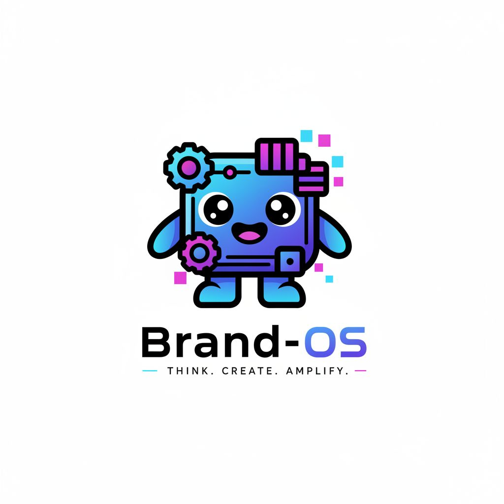
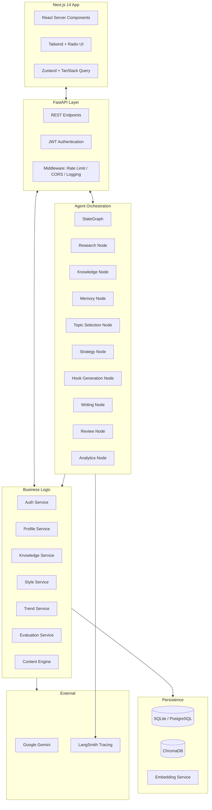
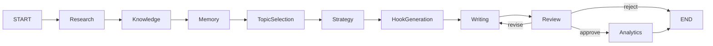

# BrandOS

**The operating system for technical personal branding.**

BrandOS is an AI-powered platform that helps engineers and technical professionals transform their expertise into authentic, high-quality content. It combines a multi-agent LangGraph pipeline, a vector knowledge base, and a style-learning engine to produce writing that sounds like you—not a language model.

<p align="center">
  
</p>

<p align="center">
  <a href="#"></a>
  <a href="#"></a>
  <a href="#"></a>
  <a href="#"></a>
  <a href="#"></a>
  <a href="#"></a>
  <a href="#"></a>
</p>

---

## What is BrandOS?

Most AI writing tools produce generic content. They have no memory of who you are, what you know, or how you write. The result is a feed of indistinguishable posts that erode credibility rather than build it.

BrandOS was built to solve a specific problem: **technical professionals need to publish consistently without sacrificing authenticity.**

The platform operates as a full-stack AI operating system for personal branding:

- A **LangGraph pipeline** orchestrates nine specialized agents that research, plan, write, review, and refine content.
- A **vector knowledge base** stores what you know, what you have written, and what your audience cares about.
- A **style fingerprinting engine** learns your voice from your existing writing and applies it to every draft.

The output is content that reads like you wrote it—because the system is built on your knowledge, your style, and your strategic choices.

---

## Core Philosophy

**Knowledge-first AI.** Content quality depends on knowledge quality. The system ingests your expertise first, generates from it second.

**Authentic writing.** The style engine learns from your actual writing samples. Every draft is reviewed against your established patterns—tone, vocabulary, sentence structure, and framing preferences.

**Human-in-the-loop.** No content is published without review. The pipeline surfaces strategic decisions (topic selection, angle, hook) for human input before generating full drafts.

**AI-assisted, not AI-replaced.** The system handles research, structuring, and drafting. The human handles strategic direction, editorial judgment, and final approval.

**Workflow over prompts.** Rather than engineering individual prompts, BrandOS engineers a complete workflow—research, knowledge retrieval, strategy, writing, review, analytics—with specialized agents at each step.

**Trust through transparency.** Every agent run is logged. Every decision is auditable. Every draft traces back to source material and model parameters.

---

## Features

### Research
Multi-source trend detection with signal clustering, topic scoring, and automated discovery. The system ingests signals from RSS, GitHub, and other sources, clusters them by relevance, and surfaces topics aligned with your expertise.

### Knowledge
A vector-backed knowledge base that stores your source material, notes, and reference content. Knowledge entries are embedded and retrieved at generation time, so every draft incorporates what you actually know.

### Style
The style fingerprinting engine analyzes your writing across 12+ dimensions—vocabulary richness, sentence length distribution, hedging frequency, structural patterns, and more. It learns from every rating and edit you make.

### Writing
A nine-stage LangGraph pipeline that researches, retrieves knowledge, selects topics, plans strategy, generates hooks, composes drafts, reviews quality, and delivers analytics. Each stage uses the most appropriate tool—some deterministic, some LLM-driven.

### Review
Multi-dimensional quality evaluation with heuristic scoring, style consistency checks, and LLM-based review. Every draft receives a quality score, specific feedback, and actionable improvement suggestions.

### History
Complete audit trail of every generated post, revision, and rating. Full provenance tracking from source material through pipeline stages to final output.

### Workspace
A unified dashboard for managing content, tracking trends, exploring knowledge, and monitoring style evolution across sessions.

### Pipeline Extensions
The LangGraph pipeline is designed for extension. Custom nodes can be inserted at any stage. Alternative models, external APIs, and human approval gates are first-class constructs.

---

## Product Walkthrough


The workflow begins when a user provides a topic (or lets the system pick one from trending signals). From there, the pipeline executes autonomously, presenting strategic decision points where human input improves outcomes.

---

## Architecture



### Frontend
Next.js 14 with the App Router, Server Components by default, and Client Components only where interactivity is required. Zustand manages client state; TanStack Query handles server state and caching. Tailwind CSS with Radix UI primitives provides the design system.

### API Layer
FastAPI with async endpoints, Pydantic v2 validation, JWT-based authentication (access + refresh token rotation), and middleware for rate limiting, CORS, request ID tracing, and structured logging.

### Agent Orchestration
LangGraph StateGraph with nine nodes connected in a linear pipeline with conditional branching at the review stage. Each node is a self-contained function with typed inputs and outputs. The graph supports checkpointing via `MemorySaver`, enabling pause/resume and human-in-the-loop interventions.

### Business Logic
Stateless service classes that encapsulate domain operations: authentication, profile management, knowledge base CRUD and search, style fingerprinting and analysis, trend detection and clustering, content quality evaluation, and ingestion pipelines.

### Persistence
SQLAlchemy 2.0 async ORM with SQLite for development and PostgreSQL for production. ChromaDB provides vector storage for knowledge embeddings, content embeddings, and style vectors. The embedding service uses `BAAI/bge-small-en-v1.5` (sentence-transformers) for all vectorization.

### External APIs
Google Gemini (`gemini-2.0-flash`) serves as the default LLM for all agent nodes that require generation. LangSmith provides tracing and observability across graph executions. n8n is available for workflow automation extensions.

---

## AI Pipeline

The content pipeline is a LangGraph `StateGraph[ContentState]` with nine nodes:

| Node | Type | Description |
|------|------|-------------|
| Research | Deterministic | Fetches trending topics from the TrendService, filters by relevance to the user's domain |
| Knowledge | Deterministic | Queries ChromaDB for knowledge entries relevant to the selected topic |
| Memory | Deterministic | Placeholder for session-scoped context and cross-session memory |
| Topic Selection | Deterministic | Ranks available topics using signal strength, knowledge coverage, and user preferences |
| Strategy | LLM | Generates content strategy: angle, structure, target tone, key messaging |
| Hook Generation | LLM | Produces 3-5 hook alternatives for the selected strategy |
| Writing | LLM | Composes the full draft following the strategy, hooks, and style profile |
| Review | LLM + Heuristic | Scores quality, checks style consistency, classifies as approve/revise/reject |
| Analytics | Deterministic | Assigns final quality label, extracts metrics, stores run telemetry |

The review node introduces a conditional edge: approved drafts proceed to analytics and completion; drafts needing revision loop back to the writing node (up to two revision cycles); rejected drafts terminate with feedback.



The pipeline is designed for extension. New nodes can be added at any position. The `ContentState` schema supports arbitrary additional fields via step-specific output containers.

---

## Tech Stack

| Category | Technology | Purpose |
|----------|-----------|---------|
| **Language (Backend)** | Python 3.12 | Async-native ecosystem, strong typing via Pydantic, mature AI/ML tooling |
| **Framework (Backend)** | FastAPI 0.115 | Async-first, automatic OpenAPI docs, Pydantic v2 integration, excellent performance |
| **Agent Framework** | LangGraph 0.2 | State graph abstraction with checkpointing, conditional branching, and LangSmith observability |
| **LLM Provider** | Google Gemini 2.0 Flash | Low-latency, 1M-token context window, competitive pricing, strong reasoning |
| **Embeddings** | BAAI/bge-small-en-v1.5 | Lightweight (33M params), strong retrieval performance, CPU-deployable |
| **Vector Store** | ChromaDB 0.5 | Embedded, persistent, zero external dependencies for development; supports HTTP mode in production |
| **Database** | SQLAlchemy 2.0 + SQLite/PostgreSQL | Async ORM with migration support (Alembic), same codebase for dev and prod |
| **Language (Frontend)** | TypeScript 5.7 | Full-stack type safety, Zod schema sharing between client and server |
| **Framework (Frontend)** | Next.js 14 (App Router) | Server Components, streaming, React 19 support, standalone output |
| **Styling** | Tailwind CSS 3.4 + Radix UI | Utility-first CSS with accessible, unstyled UI primitives |
| **State Management** | TanStack Query 5 + Zustand 5 | Server state caching with automatic invalidation, client state with persistence |
| **Validation** | Zod 3 | Runtime type checking, schema inference, shared types with backend |
| **Authentication** | Custom JWT (HS256) | Access + refresh token rotation, bcrypt password hashing, no external auth dependency |
| **Logging** | Loguru | Structured JSON logging, file rotation, zero-config setup |
| **Containerization** | Docker + Compose | Multi-stage builds, non-root user, health-checked services |
| **CI/CD** | GitHub Actions | Parallel lint, test, typecheck, and build pipelines |

---

## Repository Structure

```
brandos/
├── backend/
│   ├── api/v1/              # REST endpoints (auth, content, knowledge, style, trends, profile)
│   ├── application/graph/   # LangGraph state graph and 9 agent nodes
│   ├── core/                # Config, LLM client, embeddings, security, middleware, logging
│   ├── database/            # Async SQLAlchemy engine, session factory
│   ├── models/              # SQLAlchemy ORM models (14 tables)
│   ├── prompts/             # 22 prompt templates (loaded from disk, never hardcoded)
│   ├── repositories/        # Data access layer with typed queries
│   ├── schemas/             # Pydantic request/response schemas
│   ├── services/            # Business logic (auth, content, knowledge, style, trends, evaluation)
│   └── tests/               # 29 test files (pytest, async)
├── frontend/
│   ├── app/                 # Next.js App Router pages and layouts
│   ├── features/            # Feature-based modules (content, knowledge, style, trends, auth, ui)
│   ├── lib/                 # API client, Zustand stores, Zod validators, Supabase config
│   └── public/              # Static assets
├── docs/                    # Product requirements, architecture, API spec, database schema
├── .github/workflows/       # CI pipeline definition
├── docker-compose.yml       # Backend, frontend, ChromaDB, n8n orchestration
└── CLAUDE.md                # Engineering rules and agent conventions
```

### Key Directories

**`backend/application/graph/`** contains the LangGraph state machine. Each node is a self-contained file with a single entrypoint function. The graph builder composes them into a runnable `StateGraph` with conditional edges.

**`backend/prompts/`** stores all LLM prompts as standalone markdown files. The `PromptService` loads and interpolates them at runtime. No prompt strings exist in source code.

**`backend/services/`** implements domain logic as stateless service classes. Each service receives its dependencies through constructor injection, making them independently testable.

**`frontend/features/`** organizes code by domain, not by type. Each feature directory contains its own components, hooks, and API bindings. Shared UI primitives live in `features/ui/`.

**`docs/`** contains the full product specification: PRD, system architecture, low-level design, API specification (OpenAPI), database schema, and implementation plan.

---

## Installation

### Prerequisites

- Python 3.12+
- Node.js 20+
- Docker (optional, for ChromaDB)

### Clone

```bash
git clone https://github.com/your-org/brandos.git
cd brandos
```

### Backend

```bash
cd backend
python -m venv .venv
source .venv/bin/activate  # or .venv\Scripts\activate on Windows
pip install -e ".[dev]"
cp .env.example .env
# Edit .env with your Gemini API key
alembic upgrade head
uvicorn main:app --reload
```

The backend runs at `http://localhost:8000`. API documentation is available at `/docs`.

### Frontend

```bash
cd frontend
npm install
cp .env.example .env.local
npm run dev
```

The frontend runs at `http://localhost:3000`.

### Docker

```bash
docker compose up --build
```

This starts four services: backend (`:8000`), frontend (`:3000`), ChromaDB (`:8001`), and n8n (`:5678`).

---

## Configuration

The backend is configured through environment variables prefixed with `BRANDOS_`.

| Variable | Default | Required | Description |
|----------|---------|----------|-------------|
| `BRANDOS_ENV` | `development` | No | Runtime environment (`development` or `production`) |
| `BRANDOS_DATABASE_URL` | `sqlite+aiosqlite:///app/data/brandos.db` | No | Database connection string. Use `postgresql+asyncpg://...` in production |
| `BRANDOS_JWT_SECRET` | `dev-secret-...` | Yes** | HMAC secret for JWT signing. Must be 32+ characters in production |
| `BRANDOS_JWT_ACCESS_TTL_MINUTES` | `15` | No | Access token expiration |
| `BRANDOS_JWT_REFRESH_TTL_DAYS` | `7` | No | Refresh token expiration |
| `BRANDOS_GEMINI_API_KEY` | `` | Yes | Google Gemini API key |
| `BRANDOS_DEFAULT_LLM_MODEL` | `gemini-2.0-flash` | No | Model identifier for all LLM calls |
| `BRANDOS_EMBEDDING_MODEL` | `BAAI/bge-small-en-v1.5` | No | Sentence-transformers model for embeddings |
| `BRANDOS_CHROMADB_HOST` | `localhost` | No | ChromaDB host address |
| `BRANDOS_CHROMADB_PORT` | `8001` | No | ChromaDB HTTP port |
| `BRANDOS_CORS_ORIGINS` | `["http://localhost:3000"]` | No | Allowed CORS origins |
| `BRANDOS_RATE_LIMIT_DEFAULT` | `100/minute` | No | Default rate limit for unauthenticated endpoints |
| `BRANDOS_RATE_LIMIT_CONTENT_GENERATE` | `10/minute` | No | Rate limit for content generation endpoints |
| `BRANDOS_LANGCHAIN_API_KEY` | `` | No | LangSmith API key for pipeline tracing |
| `BRANDOS_LANGCHAIN_PROJECT` | `brandos-content-pipeline` | No | LangSmith project name |

**Required in production. The production validator rejects default secrets.

```bash
# .env example
BRANDOS_ENV=development
BRANDOS_DATABASE_URL=sqlite+aiosqlite:///app/data/brandos.db
BRANDOS_JWT_SECRET=your-secret-key-change-in-production
BRANDOS_GEMINI_API_KEY=your-gemini-api-key
BRANDOS_CHROMADB_HOST=localhost
BRANDOS_CORS_ORIGINS=["http://localhost:3000"]
BRANDOS_RATE_LIMIT_ENABLED=true
BRANDOS_LANGCHAIN_API_KEY=your-langsmith-key
```

---

## Development Workflow

### Coding Standards

- **Python:** Ruff (line-length 100, strict rules), MyPy (strict mode), type hints required on all functions
- **TypeScript:** Strict mode, no `any`, Zod schemas for all API boundaries
- **Testing:** pytest (async), `coverage fail_under=90`, all tests must pass before merge

### Architecture Guidelines

- Services receive dependencies through constructor injection
- Repositories encapsulate all database access
- Agent nodes are pure functions—no side effects outside their scope
- Prompts are never hardcoded—always stored in `backend/prompts/`

### Branching Strategy

- `main` is the stable branch. All commits must pass CI.
- Feature branches use `feat/description` naming.
- Bug fixes use `fix/description` naming.
- Pull requests require passing lint, typecheck, and test jobs.

### Testing

```bash
# Backend
cd backend
pytest --cov --cov-report=term-missing

# Frontend
cd frontend
npm run test -- --coverage
```

---

## Roadmap

### Near-term (Q3 2026)

- [ ] Content scheduling and multi-platform publishing
- [ ] Onboarding wizard with style import from existing content
- [ ] Knowledge base management UI (CRUD, tagging, search)
- [ ] History detail view with full provenance tree

### Mid-term (Q4 2026)

- [ ] Collaborative workspaces for team content pipelines
- [ ] Custom agent node SDK for third-party extensions
- [ ] Analytics dashboard with content performance metrics
- [ ] RSS and GitHub integration for automated trend ingestion
- [ ] PostgreSQL migration guide and production helm chart

### Long-term (2027)

- [ ] Multi-LLM routing (Claude, GPT-4o, local models via Ollama)
- [ ] Federated knowledge bases across workspaces
- [ ] A/B testing for content strategy variants
- [ ] API-first mode for headless content pipeline operations

---

## Performance

**Caching.** TanStack Query provides client-side cache with automatic invalidation. The backend uses in-memory caching for style profiles and trend data with TTL-based expiration.

**Embeddings.** The `BAAI/bge-small-en-v1.5` model runs on CPU with an average inference time of ~50ms per document. Embeddings are computed at ingestion time and stored in ChromaDB for sub-50ms retrieval.

**Retrieval.** ChromaDB queries use cosine similarity search with configurable top-k thresholds. Knowledge retrieval is scoped to the user's namespace, reducing the search space linearly.

**Prompt management.** All prompts are loaded from disk at startup and cached in memory. No filesystem reads occur during pipeline execution.

**Streaming.** The LangGraph pipeline executes each node synchronously within the graph, but the overall architecture supports future streaming via FastAPI's `StreamingResponse` and LangGraph's streaming modes.

**Modularity.** Each agent node, service, and repository is independently instantiable. The dependency injection pattern in `api/deps.py` allows replacing any component without modifying its consumers.

---

## Security

**Rate limiting.** The API uses `slowapi` with per-endpoint rate limits. Content generation is limited to 10 requests per minute. Authentication endpoints are limited to 20 requests per minute.

**Input validation.** All API inputs are validated through Pydantic v2 schemas. The middleware enforces a 1MB maximum request body size. SQL injection is prevented by SQLAlchemy's parameterized queries.

**Secrets management.** JWT secrets, API keys, and database credentials are configured through environment variables. The production validator rejects default secrets and SQLite configurations.

**Audit logging.** Loguru captures structured JSON logs with request IDs, user IDs, and execution telemetry. Agent runs are persisted in the `agent_runs` table with full input/output snapshots.

**Architecture.** The backend uses a zero-trust model: authentication is required for all endpoints except registration and login. Tokens have a 15-minute access window with 7-day refresh rotation. Passwords are hashed with bcrypt (12 rounds).

**Future authentication.** OAuth2 integration (GitHub, LinkedIn) is designed at the interface level. The `AuthService` accepts any credential provider that implements the expected contract.

---

## Contributing

Contributions are organized around the architecture layers defined in this document.

- **Agent nodes** should follow the existing pattern: a single entrypoint function, typed state access, no side effects.
- **Services** should receive dependencies through constructor injection and maintain no global state.
- **Prompts** should be added as markdown files in `backend/prompts/` and loaded through the `PromptService`.
- **UI components** should follow the feature-based organization in `frontend/features/`.

All contributions require passing CI, test coverage above 90% for new code, and adherence to the project's type hint conventions. Architectural changes should be discussed before implementation.

---

## License

MIT License

Copyright (c) 2026 BrandOS

Permission is hereby granted, free of charge, to any person obtaining a copy of this software and associated documentation files (the "Software"), to deal in the Software without restriction, including without limitation the rights to use, copy, modify, merge, publish, distribute, sublicense, and/or sell copies of the Software, and to permit persons to whom the Software is furnished to do so, subject to the following conditions:

The above copyright notice and this permission notice shall be included in all copies or substantial portions of the Software.

THE SOFTWARE IS PROVIDED "AS IS", WITHOUT WARRANTY OF ANY KIND, EXPRESS OR IMPLIED, INCLUDING BUT NOT LIMITED TO THE WARRANTIES OF MERCHANTABILITY, FITNESS FOR A PARTICULAR PURPOSE AND NONINFRINGEMENT. IN NO EVENT SHALL THE AUTHORS OR COPYRIGHT HOLDERS BE LIABLE FOR ANY CLAIM, DAMAGES OR OTHER LIABILITY, WHETHER IN AN ACTION OF CONTRACT, TORT OR OTHERWISE, ARISING FROM, OUT OF OR IN CONNECTION WITH THE SOFTWARE OR THE USE OR OTHER DEALINGS IN THE SOFTWARE.

---

BrandOS is building the operating system for technical personal branding: helping engineers transform their expertise into authentic content that compounds over time. Not another AI wrapper. Not another content mill. An AI-native system engineered from first principles—where knowledge drives writing, style is learned not configured, and the human remains the author.
