# System Architecture: BrandOS

## Document Info

| Field | Value |
|-------|-------|
| **Author** | Architecture Team |
| **Status** | Draft |
| **Created** | 2026-07-14 |
| **Last Updated** | 2026-07-14 |
| **Stack** | Firebase + Vercel + Open-Source AI |
| **Target Release** | Q4 2026 |

---

## Table of Contents

- [Architectural Principles](#1-architectural-principles)
- [Technology Decisions](#2-technology-decisions)
- [High Level Architecture](#3-high-level-architecture)
- [Component Architecture](#4-component-architecture)
- [Content Generation Pipeline](#5-content-generation-pipeline)
- [Sequence Diagrams](#6-sequence-diagrams)
- [Memory Architecture](#7-memory-architecture)
- [Knowledge Flow](#8-knowledge-flow)
- [Security Architecture](#9-security-architecture)
- [Caching Strategy](#10-caching-strategy)
- [Deployment Architecture](#11-deployment-architecture)
- [Scalability Path](#12-scalability-path)
- [Cost Analysis](#13-cost-analysis)
- [Decision Log](#14-decision-log)

---

## 1. Architectural Principles

### 1.1 Core Principles

| Principle | Rationale |
|-----------|-----------|
| **Clean Architecture** | Domain logic is independent of Firebase, Vercel, and AI providers. Content engine, style learner, and knowledge base are pure TypeScript with injected adapters. |
| **Event-Driven Core** | Content generation, brief creation, and analytics are async workflows triggered by Firestore events or Cloud Tasks. Synchronous only for user-facing CRUD (profiles, drafts, settings). |
| **Human-in-the-Loop** | AI never publishes without explicit human approval. Content pipeline produces drafts; humans approve. This is enforced at the application layer, not the UI layer. |
| **Provider Abstraction** | LLM providers (Groq, Mistral, future) are behind a common interface. Selection is configurable per user and per task. No coupling to any single provider. |
| **Data as Moat** | User style profiles, voice fingerprints, and knowledge graphs are the defensible asset. Stored in Firestore under the user's document. Never used for model training. |
| **Platform-Agnostic Core** | Content engine produces canonical content objects. Platform adapters (LinkedIn, X, blog) convert to platform-specific formats. Adding a platform means one adapter file. |
| **Serverless by Default** | Every function scales independently. No long-running servers. Firestore triggers replace polling. Cloud Tasks replace cron workers. |
| **Minimal Dependencies** | Each Cloud Function has a specific purpose. No shared state between function invocations. Stateless design enables independent scaling. |

### 1.2 Key Architectural Decisions

| Decision | Choice | Rationale |
|----------|--------|-----------|
| **Backend Runtime** | Firebase Cloud Functions (TypeScript) | Serverless, scales to zero, integrated with Firestore and Auth. No server management. Free tier: 2M invocations/month on Blaze. TypeScript gives type safety for LLM data contracts. |
| **Frontend** | Next.js 14+ (App Router) → Vercel | SSR for content-rich pages. Firebase Client SDK for auth/firestore. Vercel AI SDK for streaming LLM responses. Existing frontend stack is already Next.js. |
| **Primary Database** | Firestore (NoSQL) | Serverless, real-time capable, integrates with Cloud Functions triggers. Subcollections match our data hierarchy (user → knowledge → drafts → schedule). No managed DB server. |
| **Vector Store** | Supabase pgvector | Already has Supabase client installed. pgvector provides HNSW indexing for sub-100ms similarity search. Free tier: 500MB database, 5K rows. Separate from Firestore for independent scaling. |
| **Auth** | Firebase Auth | Built-in support for email/password, Google, GitHub OAuth. Handles token lifecycle, refresh, session management. Free tier: 50K MAU. |
| **Object Storage** | Firebase Cloud Storage | Serverless file storage with Firestore integration. Blaze plan: 5GB free, then $0.026/GB. Used for draft history exports, user uploads. |
| **LLM Inference** | Groq API (free tier) | Llama 3.3 70B, Qwen3 32B, Llama 4 Scout 17B, DeepSeek R1 Distill 70B. All open-source. Free tier: 30 RPM, 14.4K RPD, no credit card required. OpenAI-compatible API — drop-in with Vercel AI SDK. |
| **Embeddings API** | Mistral AI (free tier) | `mistral-embed` model. 1B tokens/month free. OpenAI-compatible. No credit card required. Cheaper and simpler than running local ONNX models in Cloud Functions. |
| **Async Jobs** | Firebase Cloud Tasks + `onSchedule` Functions | Cloud Tasks handle retries, backoff, and scheduling for content generation jobs. `firebase-functions` v2 `onSchedule` replaces cron for daily briefs. |
| **Secrets Management** | Firebase Cloud Secret Manager (via `defineSecret`) | Managed secrets for Groq API key, Mistral API key, LinkedIn OAuth client secret. Auto-injected into function environment. |

### 1.3 Why Not...

| Option | Why Not |
|--------|---------|
| **Python FastAPI backend** | Requires managing a server (Render, Fly, K8s). Cloud Functions eliminate server management. TypeScript lets frontend+backend share types. |
| **PostgreSQL directly** | Serverless PostgreSQL (Neon, Supabase) would work, but Firestore's real-time triggers, Auth integration, and security rules reduce backend code by ~40%. |
| **SQLite** | Single-file database doesn't scale beyond single-server. Cloud Functions are stateless — no local file persistence between invocations. |
| **ChromaDB** | Requires running a separate process. Supabase pgvector has a free tier and integrates with PostgreSQL queries for hybrid search. |
| **Anthropic/OpenAI** | Paid per-token. Groq's LPU hardware provides faster inference than cloud GPUs for most open-source models — at zero API cost on the free tier. |
| **Redis for cache** | Firestore's built-in caching via `getCountFromServer`, `getAggregateFromServer`, and client-side caching with `{source: 'cache'}` eliminates the need for a separate cache layer at MVP scale. Add Redis-only if latency becomes an issue for brief retrieval. |
| **Server-side session** | Firebase Auth handles sessions client-side with ID tokens. No server-side session store needed. |
| **Monolith service layer** | Cloud Functions are naturally function-grained. Encapsulating logic into a few well-structured functions avoids function sprawl while staying deployable. |

---

## 2. Technology Decisions

### 2.1 Firebase vs. Alternative Backend

| Requirement | Firebase | Alternative (FastAPI + Render) |
|-------------|----------|-------------------------------|
| **Auth** | Built-in (50K MAU free) | Auth0 or Clerk ($200-500/mo at scale) |
| **Database** | Firestore (NoSQL, triggers) | Managed Postgres ($15-50/mo) |
| **Compute** | Cloud Functions (2M invocations free) | Render web service ($7-25/mo) |
| **Storage** | Cloud Storage (5GB free, Blaze) | S3-compatible ($0.023/GB) |
| **Async Jobs** | Cloud Tasks + onSchedule | Celery/Arq + Redis ($15-30/mo) |
| **Operational Cost (MVP)** | ~$0/mo (Blaze with free usage) | ~$30-100/mo |
| **Scaling** | Automatic, serverless | Manual scaling or auto-scaling groups |
| **Cold Start** | ~500ms-2s for Node.js functions | N/A (always-on server) |
| **Migration Path** | Firestore → Firestore (same) | SQLite → Postgres (schema migration) |

Firebase wins for MVP because **operational cost is near-zero** while delivering auth, database, compute, and storage in one platform. The trade-off is Firestore's NoSQL query limitations and cold start latency — both addressed through careful schema design and function warmup.

### 2.2 Groq vs. Other Free AI Providers

| Provider | Free Tier | Models | Limits | Credit Card |
|----------|-----------|--------|--------|-------------|
| **Groq** | Yes | Llama 3.3 70B, Qwen3 32B, Llama 4 Scout 17B, DeepSeek R1 Distill 70B, Mixtral 8x7B | 30 RPM, 6K TPM, ~14.4K RPD | No |
| **Mistral AI** | Yes | Mistral Small/Large, `mistral-embed` (1B tok/mo) | 1B tokens/month (all models) | No |
| **Together AI** | No | Llama 3.3, Mixtral, DeepSeek | $5 minimum deposit | Yes |
| **OpenRouter** | Yes | 30+ free models (limited RPM) | Varies per model | No |
| **Cloudflare Workers AI** | Yes | Llama 3.1 8B, Qwen 1.5, embeddings | 10K neurons/day | No |
| **GitHub Models** | Yes | Llama 3, Phi-3, Mistral | 50-150 requests/day | No |
| **Google Gemini API** | Yes | Gemini 1.5 Flash/Pro | 60 RPM (Flash), 1M context | No |

**Decision:** Groq for generation (best latency with LPU hardware, generous rate limits) + Mistral AI for embeddings (1B tokens/month free, dedicated embedding model). Both are OpenAI-compatible, so Vercel AI SDK works with zero adapter code.

### 2.3 Firestore vs. Postgres for Content Data

Firestore is chosen over Postgres for the primary data layer because:

1. **Serverless triggers** — Cloud Functions fire on Firestore document writes. This eliminates the need for a message queue for many workflows: "when user saves knowledge item → generate embedding" is a Firestore trigger, not a separate job.
2. **Real-time by default** — `onSnapshot` listeners on the client mean the dashboard, brief queue, and content calendar update in real-time without WebSocket infrastructure.
3. **Security Rules** — Access control is declarative at the document level. "User can only read their own drafts" is a 5-line rules file, not middleware code.
4. **No schema migrations** — NoSQL schemas evolve with the application. New fields are added on write, not via ALTER TABLE.

The cost: complex queries (JOINs, GROUP BY, aggregate reporting) require Cloud Functions or a separate analytics pipeline. This is acceptable for MVP — simple queries go to Firestore directly; complex analytics use a nightly aggregation function.

### 2.4 Supabase pgvector for Embeddings

Firestore lacks native vector similarity search. Supabase pgvector fills this gap:

- **Integration** — Supabase client is already installed in the frontend (`@supabase/supabase-js`). Cloud Functions use it server-side with service role key.
- **Free tier** — 500MB database, row-level security, API auto-generated from schema.
- **Cross-reference** — pgvector stores a `user_id` column alongside each embedding vector. This enables user-scoped vector search without per-user indexes.
- **Hybrid search** — Supabase integrates pgvector with Postgres full-text search for keyword + semantic hybrid retrieval (RRF).

Data flow: Firestore triggers a Cloud Function → Mistral Embeddings API → pgvector upsert.

---

## 3. High Level Architecture

### 3.1 System Context

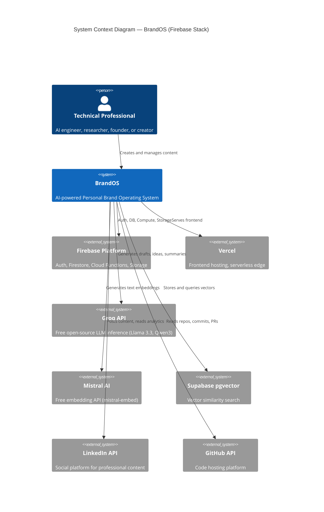

### 3.2 Container Architecture

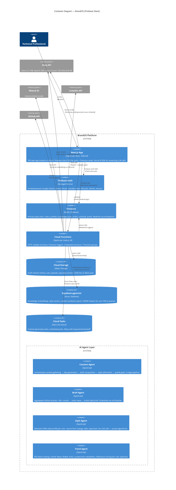

### 3.3 Cloud Function Groups

```mermaid
flowchart TB
  subgraph HTTP["HTTP-Callable Functions (onCall)"]
    PROFILE["profile\n· get/set profile\n· preferences\n· expertise areas"]
    KB["knowledgeBase\n· CRUD items\n· hybrid search\n· tags"]
    CONTENT["content\n· generate ideas\n· generate draft\n· schedule post\n· rate/approve"]
    PUBLISH["publish\n· post to LinkedIn\n· schedule\n· history"]
    ANALYTICS["analytics\n· overview\n· engagement\n· audience growth"]
    BRIEF["brief\n· get today's brief\n· list history"]
  end

  subgraph TRIGGER["Firestore Triggers (onDocumentWritten)"]
    KB_EMBED["onKbItemWrite\n· generate embedding\n· upsert to pgvector"]
    SCHEDULE_PUB["onScheduleWrite\n· enqueue publish job\n· validate tokens"]
    STYLE_UPDATE["onDraftRating\n· update style profile\n· EMA recalculation"]
  end

  subgraph SCHEDULED["Scheduled Functions (onSchedule)"]
    DAILY_BRIEF["generateDailyBriefs\n· every 6 hours\n· batch all active users"]
    GITHUB_SYNC["syncGitHubActivity\n· every 6 hours\n· poll repos for active users"]
    TREND_SYNC["syncTrendingTopics\n· every 3 hours\n· RSS + HN + Reddit"]
    LI_ANALYTICS["syncLinkedInAnalytics\n· every 12 hours\n· poll engagement data"]
    CLEANUP["cleanupExpiredTokens\n· every 24 hours\n· revoke stale tokens"]
  end

  subgraph TASKS["Cloud Tasks (Async Jobs)"]
    GEN_DRAFT["generateDraftTask\n· 30s timeout\n· 3 retries"]
    PUBLISH_POST["publishPostTask\n· 15s timeout\n· 5 retries, exponential backoff"]
    ANALYZE_STYLE["analyzeStyleTask\n· 10s timeout\n· 1 retry"]
  end

  PROFILE --> firestore[(Firestore)]
  KB --> firestore
  KB -->|hybrid search| vectors[(Supabase pgvector)]
  CONTENT --> firestore
  CONTENT -->|enqueue| GEN_DRAFT
  CONTENT -->|style profile| STYLE_UPDATE
  PUBLISH -->|enqueue| PUBLISH_POST
  PUBLISH --> firestore
  ANALYTICS --> firestore
  BRIEF -->|read cached| firestore

  KB_EMBED --> mistral_api[Mistral Embeddings API]
  KB_EMBED --> vectors

  GEN_DRAFT --> groq_api[Groq API]
  PUBLISH_POST --> linkedin_api[LinkedIn API]

  DAILY_BRIEF --> GEN_DRAFT
  DAILY_BRIEF --> firestore
  GITHUB_SYNC --> github_api[GitHub API]
  GITHUB_SYNC --> firestore
  TREND_SYNC -->|RSS feeds| firestore
  LI_ANALYTICS --> linkedin_api
  LI_ANALYTICS --> firestore
```

### 3.4 Layer Architecture

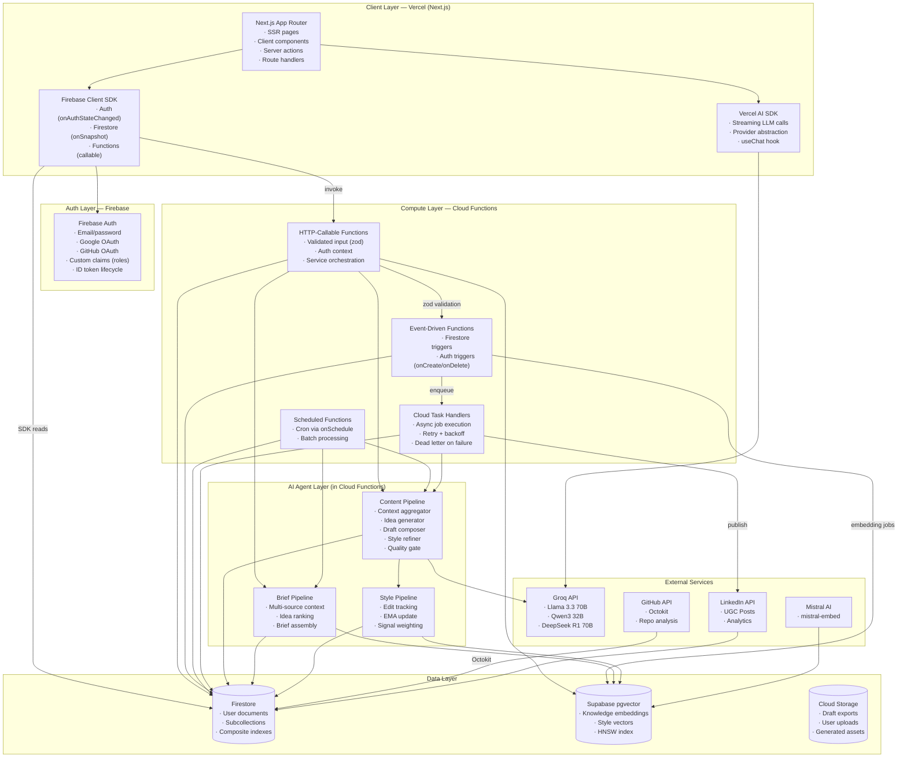

---

## 4. Component Architecture

### 4.1 Cloud Function Package Structure

```
functions/
  src/
    profile/       # User profile CRUD
    knowledge/     # Knowledge base CRUD + embedding trigger
    content/       # Content generation pipeline
    publish/       # Platform publishing (LinkedIn)
    analytics/     # Analytics aggregation
    briefs/        # Daily brief generation
    github/        # GitHub sync
    trend/         # Trending topic discovery
    style/         # Style profile learning
    common/        # Shared utilities, types, middleware
```

### 4.2 Content Engine — Pipeline Architecture

The Content Engine is a 5-stage pipeline. Each stage is a pure function with typed inputs and outputs. The orchestrator runs them sequentially with timeouts and retry policies.

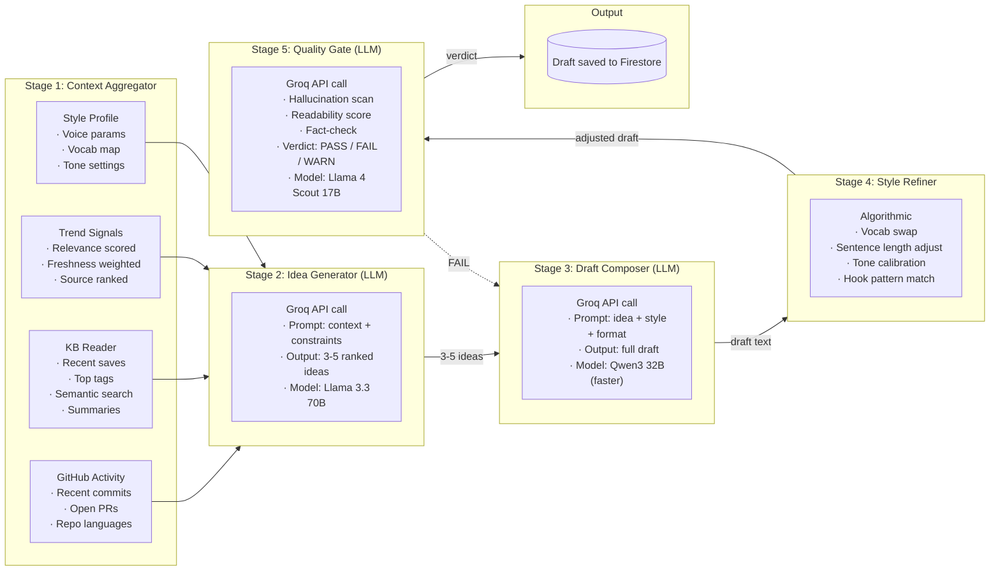

**Stage Model Selection Rationale:**

| Stage | Model | Why |
|-------|-------|-----|
| Idea Generator | Llama 3.3 70B | Best reasoning for novel idea synthesis from diverse context |
| Draft Composer | Qwen3 32B | Faster inference (LPU), good technical writing quality |
| Quality Gate | Llama 4 Scout 17B | Strong instruction following for structured evaluation, cheapest |

### 4.3 Style Service — Voice Fingerprint

Style learning is **algorithmic**, not LLM-based. No API calls needed per style update.

```mermaid
flowchart TB
  subgraph INPUTS["Style Signal Sources"]
    RATINGS["· User ratings (1-5)"
             "· Per-dimension scores"
             "· Comment/text feedback"]
    EDITS["· User edits on drafts"
             "· Diff tracking"
             "· Acceptance rate per suggestion"]
    APPROVALS["· Approved vs rejected"
                "· Regenerate triggers"
                "· Manual rewrites count"]
    IMPORTS["· Imported LinkedIn posts"
              "· Historical content"
              "· User-provided examples"]
  end

  subgraph ANALYSIS["Style Analysis (Algorithmic)"]
    LEXICAL["Lexical Analyzer"
             "· Term frequency"
             "· Technical ratios"
             "· Filler word density"]
    SYNTACTIC["Syntactic Analyzer"
               "· Avg sentence length"
               "· Paragraph structure"
               "· Hook type detection"]
    TONAL["Tonal Analyzer"
           "· Formality score"
           "· Confidence markers"
           "· Opinion strength"]
  end

  subgraph PROFILE["Style Profile (per-user)"]
    PARAMS["Parameter Map"
            "· tone: formal|conversational|balanced"
            "· depth: tutorial|opinion|insight|news"
            "· avg_length: short|medium|long"
            "· hook_style: question|stat|quote|story|none"
            "· vocab: {preferred_terms, avoided_terms}"
            "· formality: 0.0–1.0"]
  end

  RATINGS --> LEXICAL
  EDITS --> LEXICAL
  APPROVALS --> LEXICAL
  IMPORTS --> LEXICAL
  RATINGS --> SYNTACTIC
  EDITS --> SYNTACTIC
  APPROVALS --> SYNTACTIC
  IMPORTS --> SYNTACTIC
  RATINGS --> TONAL
  EDITS --> TONAL
  APPROVALS --> TONAL
  IMPORTS --> TONAL

  LEXICAL --> PARAMS
  SYNTACTIC --> PARAMS
  TONAL --> PARAMS
```

**Exponential Moving Average Update:**

```
new_profile = learning_rate * latest_signal + (1 - learning_rate) * current_profile
```

- `learning_rate` starts at 0.3 (converges fast in first 10 interactions)
- After 50 interactions, decays to 0.1 (gradual drift)
- Stored in Firestore as a map under `users/{userId}/styleProfile`
- Style vectors stored in pgvector for similarity-based style matching (future: recommend style templates)

---

## 5. Content Generation Pipeline

### 5.1 Pipeline Stages Detail

| Stage | Type | Timeout | Retries | Cacheable |
|-------|------|---------|---------|-----------|
| Context Aggregator | Algorithmic | 5s | 0 | Per-user/per-day |
| Idea Generator | LLM (Llama 3.3 70B) | 20s | 1 | No |
| Draft Composer | LLM (Qwen3 32B) | 30s | 2 | No |
| Style Refiner | Algorithmic | 3s | 0 | No |
| Quality Gate | LLM (Llama 4 Scout 17B) | 15s | 1 | No |

### 5.2 Model Mapping

| Task | Recommended Model | Fallback Model | Groq Free Tier Limit |
|------|------------------|----------------|--------------------- |
| Content idea generation | Llama 3.3 70B | DeepSeek R1 Distill 70B | 30 RPM / 6K TPM |
| Draft writing | Qwen3 32B | Llama 4 Scout 17B | 30 RPM / 6K TPM |
| Style refinement | (Algorithmic) | — | — |
| Quality gate | Llama 4 Scout 17B | Mixtral 8x7B | 30 RPM / 6K TPM |
| Embeddings | Mistral Embed (via Mistral AI) | — | 1B tokens/month |

### 5.3 Groq Rate Limit Management

With 30 RPM and ~14.4K requests/day on Groq's free tier, we allocate:

| Use Case | Requests/User/Day | Users | Total/Day |
|----------|-------------------|-------|-----------|
| Daily brief generation | 2 (ideas + draft) | 500 | 1,000 |
| User-initiated drafts | 3 | 500 | 1,500 |
| Quality gate | 1 per draft | — | 2,500 |
| Style analysis import | 1 (initial) | — | 500 |
| **Total** | | | **5,500** |

At 5,500 requests/day, we stay well within Groq's ~14,400 daily limit at 500 users.

**Queue Strategy:** Content generation requests are enqueued via Cloud Tasks with a rate limiter that respects Groq's 30 RPM limit. If the queue backs up, users see a "generation in progress" state with real-time status via Firestore.

---

## 6. Sequence Diagrams

### 6.1 Daily Content Brief Generation

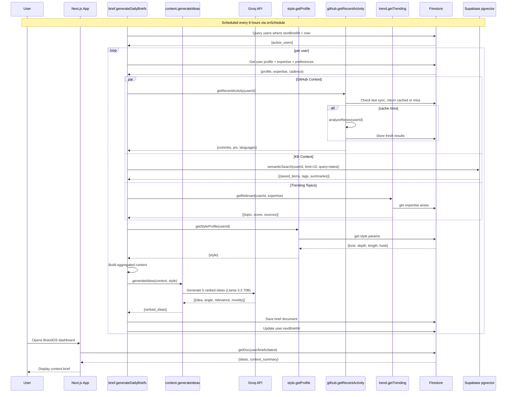

### 6.2 User Draft Generation (Interactive)

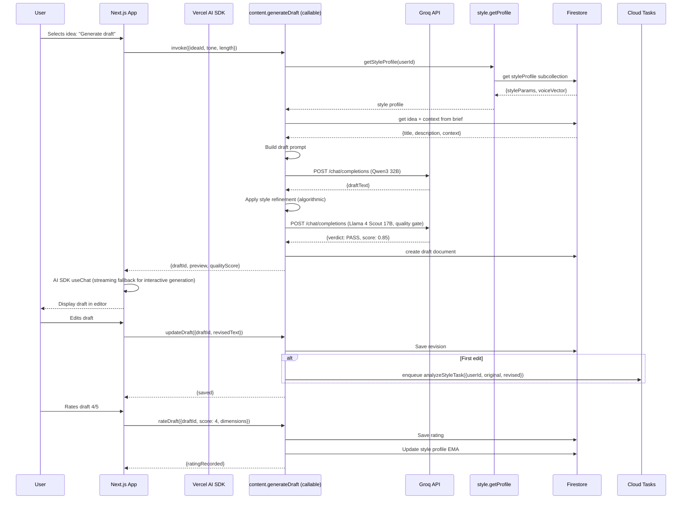

### 6.3 LinkedIn Publish (Async via Cloud Tasks)

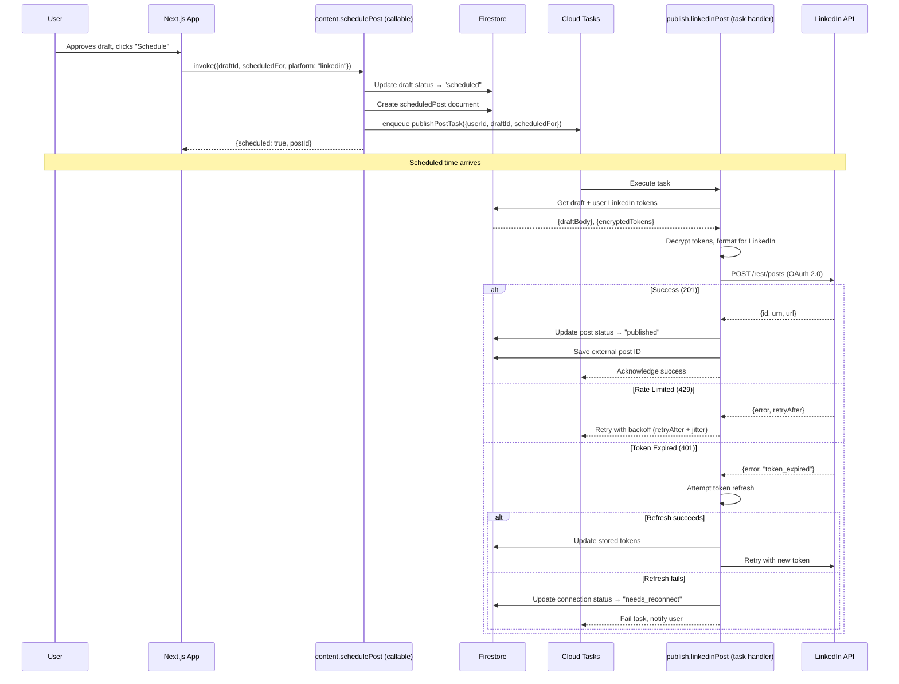

---

## 7. Memory Architecture

BrandOS uses Firestore as the primary memory store. Different memory types map to different access patterns.

### 7.1 Memory Types

| Type | Duration | Store | Access Pattern |
|------|----------|-------|----------------|
| **User Profile** | Permanent | Firestore doc | Frequent reads, rare writes |
| **Style Profile** | Permanent | Firestore doc (EMA) | Written per interaction, read per generation |
| **Knowledge Base** | Permanent | Firestore subcollection + pgvector | Written by user, read by agents |
| **Content Drafts** | 90 days | Firestore subcollection + Storage (exports) | Written by pipeline, read by user |
| **Schedule** | Until published | Firestore subcollection | Written by user, read by scheduler |
| **Briefs** | 7 days | Firestore subcollection | Written by agent, read by user |
| **Session** | Browser session | Client memory + Firestore cache | No server-side session |

### 7.2 Firestore Document Size Budget

Firestore limits: 1 MiB per document, 20 levels of subcollections, 1 write/second per document (burst up to 500).

| Document | Estimated Size | Growth Pattern | Concern? |
|----------|---------------|----------------|----------|
| `users/{id}` | 5-10 KB | Grows with style profile + preferences | No |
| `users/{id}/knowledge/{item}` | 50-200 KB | 1 per saved link/note. Summary + extracted text drive size | Extract text > 100KB → store in Cloud Storage, reference by path |
| `users/{id}/drafts/{draft}` | 10-50 KB | 1 per generated draft. Body + revisions > 50KB | Revisions over 10 → archive to Storage, keep latest 3 in Firestore |
| `users/{id}/briefs/{brief}` | 5-15 KB | 1 per daily brief. 3-5 ideas with context | No |
| `trendingTopics/{id}` | 2-5 KB | ~50 topics total | No |

**Mitigation Strategy:** Any field exceeding 50KB (extracted text, full draft history) is stored in Cloud Storage with a reference path in Firestore.

---

## 8. Knowledge Flow

### 8.1 Knowledge Ingestion Pipeline

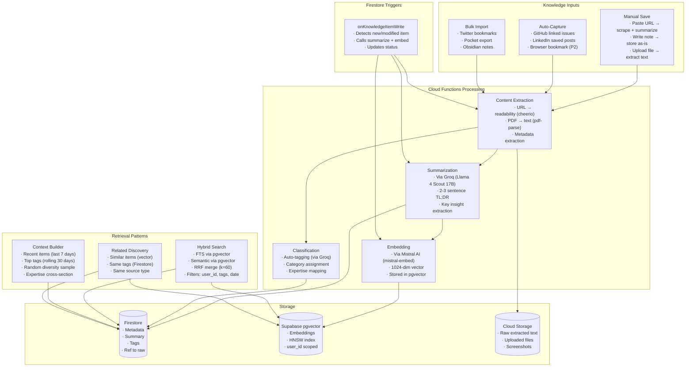

### 8.2 Hybrid Search Implementation

```typescript
interface SearchResult {
  itemId: string;
  text: string;
  score: number;
  source: 'keyword' | 'semantic';
}

// RRF merge of keyword + semantic results
function hybridSearch(userId: string, query: string, limit: number = 10) {
  // 1. Full-text search via pgvector's built-in TSVector
  const keywordResults = await supabase.rpc('fts_search', {
    user_id: userId,
    query_text: query,
    result_limit: limit * 2
  });

  // 2. Semantic search via pgvector
  const embedding = await generateEmbedding(query);
  const semanticResults = await supabase.rpc('vector_search', {
    user_id: userId,
    query_embedding: embedding,
    match_threshold: 0.7,
    match_count: limit * 2
  });

  // 3. RRF merge with k=60
  return reciprocalRankFusion(keywordResults, semanticResults, limit, 60);
}
```

---

## 9. Security Architecture

### 9.1 Authentication Flow

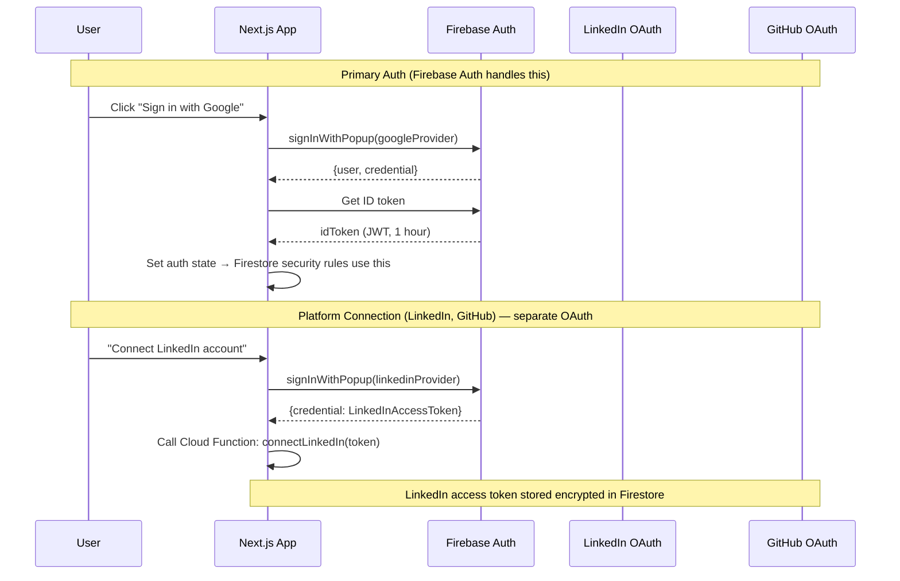

### 9.2 Security Layers

| Layer | Mechanism |
|-------|-----------|
| **Auth** | Firebase Auth (Google, GitHub, email/password). 50K MAU free. |
| **API Auth** | Cloud Functions `onCall` automatically verifies Firebase ID tokens. `context.auth` is populated for every call. |
| **Data Access** | Firestore Security Rules enforce per-user access. "Read own drafts only" is declarative, not code. |
| **LinkedIn Tokens** | Encrypted at rest in Firestore using Cloud KMS via Cloud Functions. Decrypted only in memory during publish tasks. |
| **API Keys (Groq, Mistral)** | Stored in Firebase Secret Manager. `defineSecret()` injects into function environment. Never logged. |
| **CORS** | Cloud Functions `onCall` enforces CORS implicitly. No manual CORS headers. |
| **Rate Limiting** | Implemented per-user at the function level. Warmup cache in Firestore (last request timestamp + count). |
| **Input Validation** | All function inputs validated with Zod schemas. Malformed input → rejected before processing. |

### 9.3 Firestore Security Rules

```
rules_version = '2';
service cloud.firestore {
  match /databases/{database}/documents {
    // User documents: owner only
    match /users/{userId}/{document=**} {
      allow read, write: if request.auth != null && request.auth.uid == userId;
    }

    // Trending topics: readable by all authenticated users
    match /trendingTopics/{topic} {
      allow read: if request.auth != null;
      allow write: if false; // Admin only via Cloud Functions
    }

    // Briefs: owner only
    match /users/{userId}/briefs/{briefId} {
      allow read: if request.auth != null && request.auth.uid == userId;
      allow write: if false; // Write-only via Cloud Functions
    }
  }
}
```

---

## 10. Caching Strategy

| Data | Cache Strategy | TTL | Implementation |
|------|---------------|-----|----------------|
| **User Profile** | Firestore SDK client cache | Session | Firebase SDK `{source: 'cache'}` for reads |
| **Style Profile** | Firestore SDK client cache | 5 minutes | Explicit read with `{source: 'server'}` on generation |
| **Content Brief** | Firestore document | 6 hours | Regenerated by scheduled function, stored as document |
| **Trending Topics** | Firestore document | 3 hours | Separate collection, updated by scheduled sync |
| **GitHub Activity** | Firestore document | 6 hours | Stored per-user, timestamp-tracked |
| **Draft Preview** | None | — | Generated on demand, user expects latest |
| **Analytics Dashboard** | Firestore aggregated document | 12 hours | Pre-computed by scheduled function |
| **LLM Responses** | None (MVP) | — | Content is unique per user+context. Cache considered for identical prompts in Phase 2. |

No separate Redis or CDN cache layer is needed for MVP. Firestore's server-side caching and the client SDK's persistence layer provide adequate read performance. If analytics dashboard queries become slow, pre-compute aggregations by a scheduled function into a dedicated cache document.

---

## 11. Deployment Architecture

### 11.1 Deployment Diagram

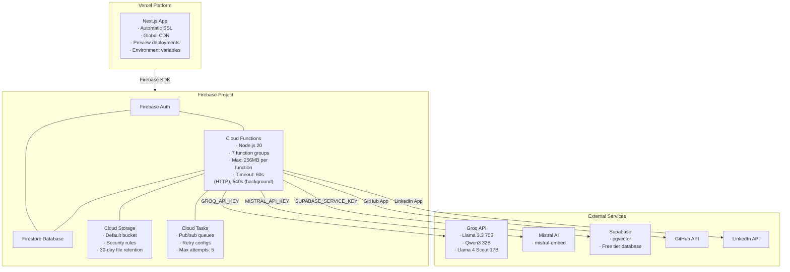

### 11.2 CI/CD Pipeline

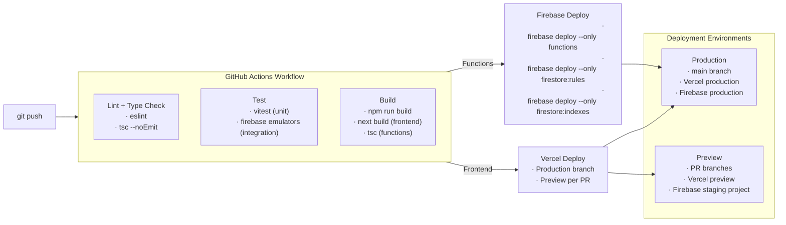

---

## 12. Scalability Path

| Metric | MVP Target (500 users) | Phase 2 (5K users) | Phase 3 (50K users) |
|--------|----------------------|--------------------|---------------------|
| **Auth** | Firebase Auth (50K MAU free) | Same | Same |
| **Firestore** | Native mode, single region | Same | Nam5 → multi-region |
| **Cloud Functions** | 2M invocations/mo (free) | ~10M/mo (~$0.40/M) | ~100M/mo (~$0.40/M) |
| **Cloud Storage** | 5GB (free on Blaze) | ~10GB ($0.026/GB) | ~50GB ($0.026/GB) |
| **Groq API** | Free tier (14.4K RPD) | Paid tier ($0.10-0.30/M tokens) | Reserved capacity |
| **Supabase pgvector** | Free tier (500MB) | Pro tier ($25/mo, 8GB) | Team tier ($599/mo) |
| **LinkedIn API** | Free tier | Same | Same |

### 12.1 Bottleneck Predictions

| Bottleneck | When It Hits | Mitigation |
|------------|-------------|------------|
| **Firestore write limits** | ~500 concurrent users writing simultaneously | Distribute writes across subcollections. Use batched writes. Reduce revision writes to a scheduled compaction. |
| **Groq rate limits** | ~1,500 daily active users | Upgrade to Groq paid tier ($0.15/M tokens for Llama 3.3 70B). Or add Mistral AI Large as secondary generator. |
| **Cloud Function cold starts** | Any scale | Use minimum instances (1-2) for latency-sensitive functions (content generation, brief retrieval). 10 instances free, then $0.000005/instance/s. |
| **pgvector performance** | >100K vectors per user, >100 users | Add IVFFlat index (faster index build, higher recall). Partition by user_id. Upgrade Supabase. |

---

## 13. Cost Analysis

### 13.1 Monthly Operating Cost (MVP, 500 users)

| Service | Component | Estimated Cost |
|---------|-----------|---------------|
| **Firebase** | Auth (50K MAU) | $0 (free tier) |
| **Firebase** | Firestore (1GB storage, 50K reads/day, 20K writes/day) | $0 (free tier) |
| **Firebase** | Cloud Functions (2M invocations/month) | $0 (free on Blaze) |
| **Firebase** | Cloud Storage (5GB) | $0 (free on Blaze) |
| **Firebase** | Cloud Tasks | $0 (free tier) |
| **Vercel** | Next.js hosting (Pro plan) | $20/mo |
| **Groq API** | 165K requests/month average | $0 (free tier) |
| **Mistral AI** | Embeddings (50M tokens/month) | $0 (free tier, 1B/mo cap) |
| **Supabase** | pgvector (500MB) | $0 (free tier) |
| **LinkedIn API** | OAuth + UGC Posts | $0 |
| **GitHub API** | Octokit (5K requests/hour) | $0 |
| **Custom Domain** | Vercel custom domain | $0 (Vercel Pro includes custom domain) |
| **Total** | | **~$20/mo** |

### 13.2 Scale Costs (Phase 2, 5K users)

| Service | Cost |
|---------|------|
| Firebase (beyond free tier) | ~$25/mo |
| Vercel Pro | $20/mo |
| Groq paid tier (~5M tokens/mo) | ~$0.75-2.25/mo |
| Supabase Pro | $25/mo |
| **Total** | **~$75/mo** |

---

## 14. Decision Log

| # | Decision | Date | Rationale |
|---|----------|------|-----------|
| 1 | Firestore over PostgreSQL | 2026-07-14 | Serverless triggers, real-time via onSnapshot, security rules, zero-config. NoSQL document model fits user-centric data hierarchy. Cloud Functions fill the query gap for complex aggregations. |
| 2 | Cloud Functions over FastAPI | 2026-07-14 | Eliminates server management. Scales to zero. Integrated with Firebase Auth + Firestore triggers. TypeScript enables shared types with frontend. Free tier covers MVP. |
| 3 | Groq over Anthropic/OpenAI | 2026-07-14 | Open-source models only per requirement. Groq's LPU hardware provides faster inference than cloud GPUs. Free tier (14.4K RPD) covers MVP with no credit card required. |
| 4 | Mistral over @xenova/transformers for embeddings | 2026-07-14 | 1B tokens/month free tier. No cold start impact (running ONNX in a Cloud Function adds ~2s cold start). Simpler code, no model bundling. |
| 5 | Supabase pgvector over Cloudflare Vectorize | 2026-07-14 | Supabase client already installed in project. pgvector enables hybrid search (keyword + vector) in one database. 500MB free tier sufficient for MVP. |
| 6 | Firestore triggers over message queue | 2026-07-14 | For MVP, Firestore document writes trigger embedding generation and other side effects. This eliminates a separate queue infrastructure. Cloud Tasks used only for scheduled posts and long-running content generation. |
| 7 | No Redis/Separate cache layer | 2026-07-14 | Firestore's client SDK caching and server-side read-after-write consistency are sufficient for MVP. If brief retrieval latency exceeds 500ms, add a Cloud Storage cache document. |
| 8 | Style learning is algorithmic, not LLM-driven | 2026-07-14 | Style profile is updated via exponential moving average of edit signals, ratings, and approvals. No LLM calls needed per update. This saves ~100K LLM calls/month at 500 users. |
| 9 | Single Firebase project, not multiple | 2026-07-14 | One project for all Firebase services. Separate staging project for preview deploys. No multi-region or project-per-service complexity at MVP scale. |
| 10 | Same-model pipeline (all Groq) instead of model-per-stage | 2026-07-14 | All pipeline stages use Groq (different models within Groq: Llama 3.3 70B for ideas, Qwen3 32B for drafts, Llama 4 Scout 17B for quality). Single API provider simplifies auth, error handling, and retry logic. |

---

*This document describes the target architecture. See 07_IMPLEMENTATION_PLAN.md for the phased migration from the current FastAPI/SQLite/ChromaDB stack to Firebase/Firestore/Groq.*
