# System Architecture: BrandOS

## Document Info

| Field | Value |
|-------|-------|
| **Author** | Architecture Team |
| **Status** | Draft |
| **Created** | 2026-06-26 |
| **Last Updated** | 2026-06-26 |
| **Target Release** | Q4 2026 |

---

## Table of Contents

- [Architectural Principles](#1-architectural-principles)
- [High Level Architecture](#2-high-level-architecture)
- [Component Architecture](#3-component-architecture)
- [Sequence Diagrams](#4-sequence-diagrams)
- [Request Flow](#5-request-flow)
- [Data Flow](#6-data-flow)
- [Agent Flow](#7-agent-flow)
- [Memory Flow](#8-memory-flow)
- [Knowledge Flow](#9-knowledge-flow)
- [Database Flow](#10-database-flow)
- [API Flow](#11-api-flow)
- [Future Extension Points](#12-future-extension-points)
- [Scalability](#13-scalability)
- [Caching Strategy](#14-caching-strategy)
- [Security Architecture](#15-security-architecture)
- [Deployment Architecture](#16-deployment-architecture)
- [Monitoring & Observability](#17-monitoring--observability)
- [Failure Handling](#18-failure-handling)

---

## 1. Architectural Principles

### 1.1 Core Principles

| Principle | Rationale |
|-----------|-----------|
| **Clean Architecture** | Domain logic is independent of frameworks, databases, and external APIs. The content engine, style learner, and knowledge base are pure business logic with injected adapters. |
| **Event-Driven Core** | Content generation, brief creation, and analytics are async workflows. Synchronous only for user-facing CRUD (profiles, drafts, settings). |
| **Human-in-the-Loop** | AI never publishes without explicit human approval. The content pipeline produces drafts; humans approve. This is non-negotiable and baked into the flow, not bolted on. |
| **Provider Abstraction** | LLM providers (Anthropic, OpenAI) are behind a common interface. Selection is configurable per user and per task. No hard coupling to any single provider. |
| **Data as Moat** | User style profiles, voice fingerprints, and knowledge graphs are the defensible asset. They live in the user's data plane and are never used for public model training without explicit opt-in. |
| **Platform-Agnostic Core** | The content engine produces canonical content objects. Platform adapters (LinkedIn, X, blog) convert to platform-specific formats. Adding a new platform means writing one adapter. |

### 1.2 Key Architectural Decisions

| Decision | Choice | Rationale |
|----------|--------|-----------|
| **Backend Runtime** | Python (FastAPI) | Dominant in AI/ML ecosystem. Native async support. Rich library ecosystem for LLM orchestration, embeddings, and data processing. |
| **Frontend** | Next.js 14+ (App Router) | SSR for content-rich pages. API routes can serve as BFF. React ecosystem for rich editing experiences. |
| **Primary Database** | PostgreSQL | Relational integrity for user profiles, content, schedules. JSONB for flexible knowledge base items. Full-text search. |
| **Vector Store** | pgvector (PostgreSQL extension) | Avoids operational complexity of a separate vector database. Sufficient for MVP scale (10K items/user). Migrate to Pinecone/Weaviate at scale. |
| **Cache & Queue** | Redis | Dual-purpose. Cache for hot data (content briefs, trending topics). Queue (via Arq) for async content generation jobs. |
| **Object Storage** | S3-compatible (AWS S3 / Cloudflare R2) | Draft history, user uploads, generated assets. R2 for egress-free multi-region. |
| **LLM Interface** | Abstraction layer (own interface) | Swap between Anthropic Claude (primary for long-form), OpenAI GPT-4o (fallback), and future models without touching business logic. |
| **Async Queue** | Arq (Redis-backed) | Python-native. Lighter than Celery. Built on asyncio which matches FastAPI's async model. |
| **Authentication** | OAuth 2.0 + JWT | Auth0 or Clerk for managed auth. LinkedIn OAuth for platform posting. GitHub OAuth for data source. Google OAuth for sign-in. |

---

## 2. High Level Architecture

### 2.1 System Context

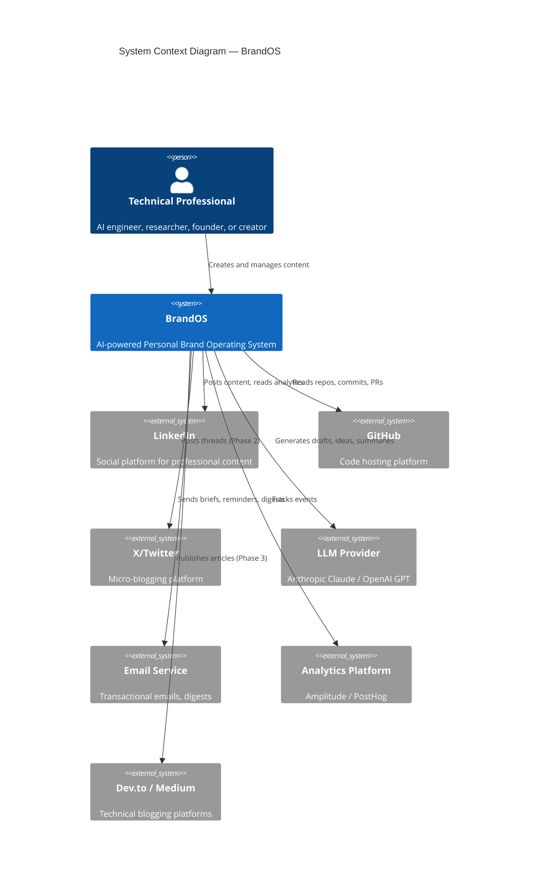

### 2.2 Container Architecture

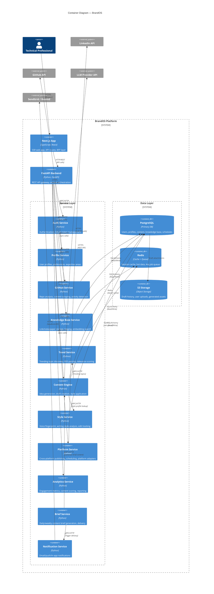

### 2.3 Layer Architecture

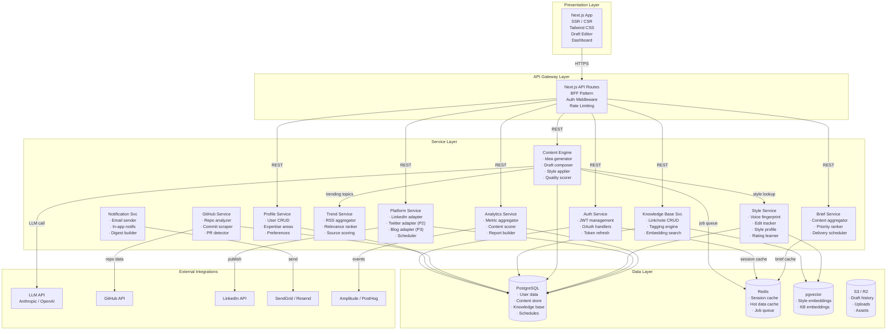

### Decision: Why FastAPI over Django

FastAPI was chosen over Django for three reasons:
1. **Async-native** — The content engine makes concurrent LLM calls, parallel data source fetches, and streaming responses. Django's async support is bolted-on and immature compared to FastAPI's native `asyncio`.
2. **Type-driven** — Pydantic models provide compile-time contract validation for every API boundary. This matters when orchestrating 11+ services with strict data contracts.
3. **Lightweight** — Django brings an ORM, admin panel, templating engine, and forms system — only the ORM is relevant. FastAPI + SQLAlchemy is a leaner fit.

### Decision: Why Next.js over a pure SPA

Content creation involves writing, editing, previewing, and managing drafts — all of which benefit from SSR for SEO (public profile pages, shared content), faster initial page loads, and better perceived performance. Next.js API routes also serve as a BFF layer, eliminating the need for a separate gateway microservice at MVP scale.

### Decision: Why pgvector over a dedicated vector database

At MVP scale (< 10K items per user, < 500 users), pgvector eliminates the operational cost of a separate Pinecone/Weaviate/Chroma cluster. Vector search performance in PostgreSQL with an HNSW index is sufficient for sub-100ms queries at this scale. Migration path: when we exceed 10M vectors, extract to a dedicated vector DB behind the same repository interface.

---

## 3. Component Architecture

### 3.1 Content Engine — Internal Architecture

The Content Engine is the most architecturally significant component. It is not a single monolith but a pipeline of specialized sub-components.

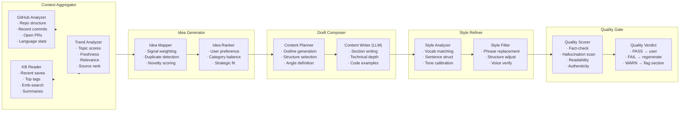

### Decision: Pipeline, not monolithic generation

Content generation is decomposed into 5 sequential stages with explicit data contracts between them. This provides:
1. **Observability** — Each stage emits metrics. If quality scores drop, we know which stage is degrading.
2. **Swapability** — The LLM is only in the "Content Writer" sub-stage. The Context Aggregator and Style Refiner are deterministic or use small models. We can change LLM providers without touching the pipeline structure.
3. **Caching granularity** — Context aggregations can be cached per-user per-day. Idea maps can be cached per-session. Only the writer stage needs to hit the LLM.

### 3.2 Style Service — Voice Fingerprint Architecture

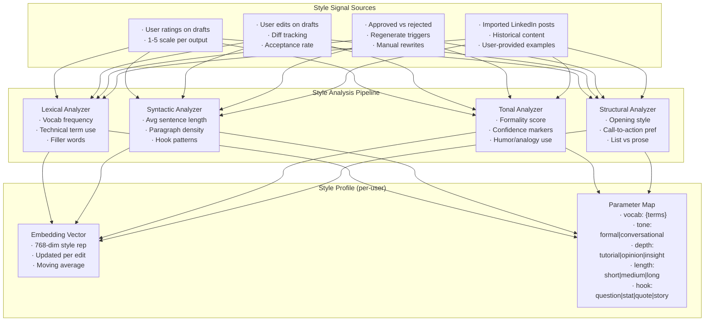

### Decision: Moving-average style profile

The style profile uses an exponential moving average (EMA) of style signals rather than a point-in-time snapshot. This means:
- **Early convergence** — After 5-10 rated drafts, the style profile is already directionally correct.
- **Gradual drift** — As the user's writing evolves naturally, the style profile follows without abrupt jumps.
- **No retraining** — No batch retraining cycles. Every edit and rating immediately influences the profile with a configurable learning rate.

---

## 4. Sequence Diagrams

### 4.1 Daily Content Brief Generation

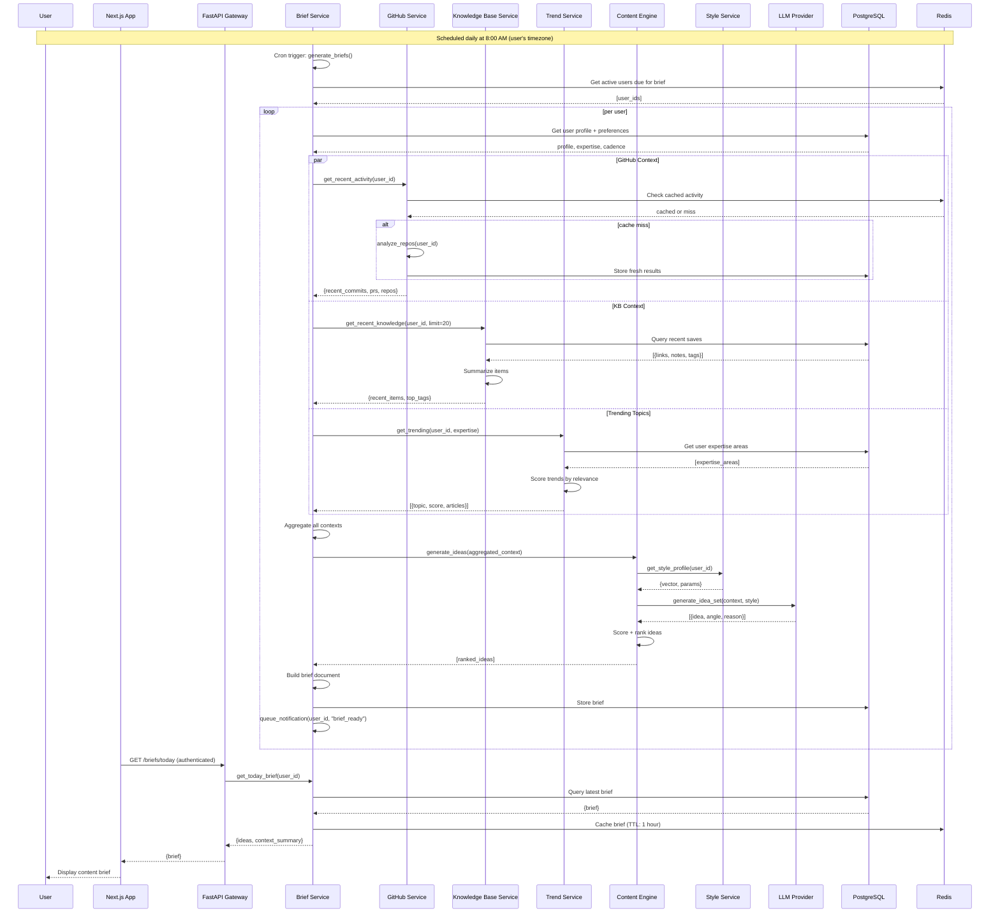

### Decision: Cron-triggered brief generation, not real-time

Briefs are generated on a fixed schedule (user-configurable time) rather than on-demand for two reasons:
1. **Cost efficiency** — Generating a brief requires 3-10 LLM calls per user. Doing this on every page load would be prohibitively expensive. Batch generation reduces LLM costs by 80%+.
2. **User habit** — A predictable delivery time (morning brief) builds habit. The brief arriving at the same time every day becomes a ritual, which the PRD identifies as critical for retention.

### 4.2 Full Content Lifecycle

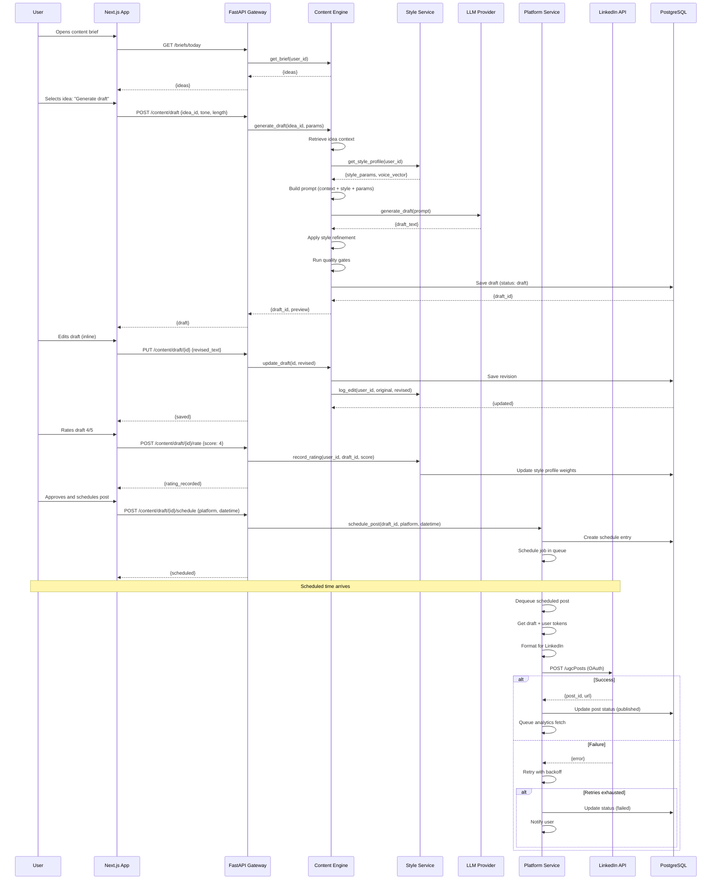

### Decision: Draft saved before user edits

The draft is persisted to the database immediately after generation, before the user makes any edits. This ensures:
1. **No data loss** — If the user closes the tab, the generated draft is recoverable.
2. **Edit tracking** — The Service layer can diff the original vs. edited version to extract style learning signals.
3. **Comparison** — Users can revert to the original AI-generated version at any point.

---

## 5. Request Flow

### 5.1 API Request Lifecycle

```mermaid
flowchart LR
  subgraph CLIENT["Client"]
    B["Browser (Next.js SPA)"]
  end

  subgraph EDGE["Edge / CDN"]
    CF["Cloudflare / Vercel Edge
        · TLS termination
        · DDoS protection
        · Cache static assets
        · Bot detection"]
  end

  subgraph BFF["BFF Layer (Next.js API Routes)"]
    ROUTER["· Route matching
            · Auth cookie parsing
            · Session validation
            · Request transformation"]
  end

  subgraph GATEWAY["API Gateway (FastAPI)"]
    MIDDLEWARE["Middleware Stack
               1. Request ID injection
               2. Rate limiter check
               3. JWT verification
               4. Tenant resolution
               5. Request logging"]
    ROUTES["Route Handler
            · Validate input (Pydantic)
            · Authorize action
            · Route to service"]
  end

  subgraph SERVICES["Service Layer"]
    SRV["Business Logic
        · Pure domain logic
        · No HTTP concerns
        · Emit domain events"]
  end

  subgraph DATA["Data Layer"]
    DB[(Database)]
    CACHE[(Cache)]
  end

  B -->|"HTTPS"| EDGE
  EDGE -->|"Cache miss"| BFF
  BFF -->|"REST"| GATEWAY
  MIDDLEWARE --> ROUTES
  ROUTES --> SRV
  SRV --> DB
  SRV --> CACHE
  CACHE -.->|"Cache hit bypasses service"| SRV
```

### 5.2 Request Types and Routing

| Request Type | Example | BFF | Gateway | Service | Caching | Async |
|-------------|---------|-----|---------|---------|---------|-------|
| **Synchronous CRUD** | GET /profiles/me | Parse cookie | Auth + route | Profile Service | User profile: TTL 5min | No |
| **Content Generation** | POST /content/draft | Redirect | Auth + route | Content Engine | No (unique per request) | Yes (Arq) |
| **Brief Fetch** | GET /briefs/today | Redirect | Auth + route | Brief Service | Brief: TTL 1hr | No |
| **Platform Publish** | POST /content/publish | Redirect | Auth + route | Platform Service | No | Yes (Arq) |
| **OAuth Handshake** | GET /auth/linkedin/callback | Handle redirect | Auth Service | Token storage | No | No |
| **Analytics Query** | GET /analytics/overview | Redirect | Auth + route | Analytics Service | Aggregated: TTL 6hr | No |

---

## 6. Data Flow

### 6.1 Data Ingestion Flow

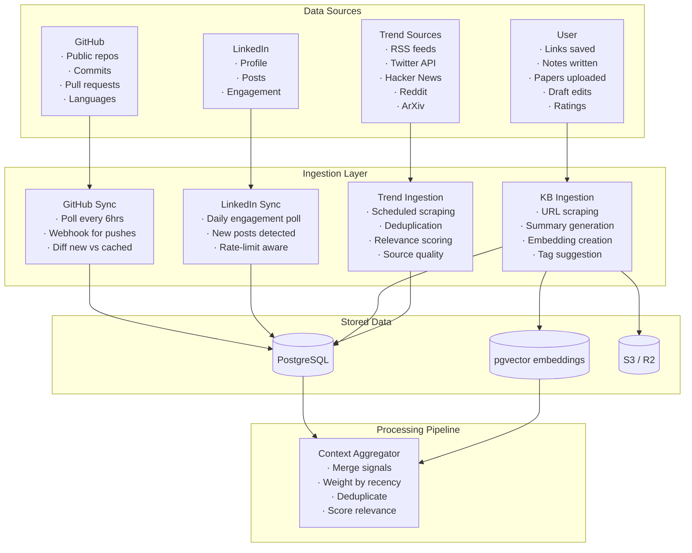

### Decision: Poll-based sync with webhooks as optimization

GitHub and LinkedIn use polling for MVP because they are read-only data sources — the data doesn't need to be real-time. A 6-hour poll interval is sufficient: users don't expect content briefs to reflect commits made 10 minutes ago. Webhooks are a Phase 2 optimization that reduces API calls and improves freshness. Trend sources are inherently poll-based (RSS, periodic scrapes).

---

## 7. Agent Flow

The Content Engine operates through a series of internal agents — not autonomous AI agents, but deterministic orchestrators that manage the generation pipeline stages.

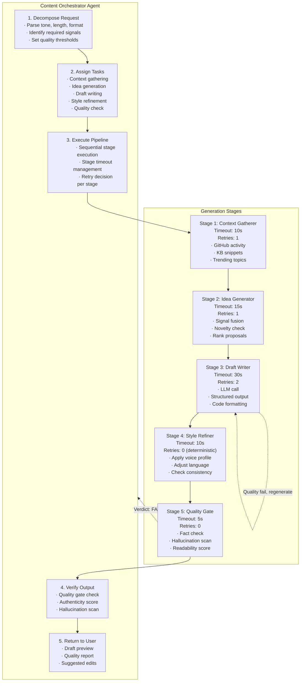

### Decision: Deterministic orchestrator, not autonomous agent

The Content Orchestrator is a deterministic state machine, not an autonomous AI agent. This is intentional:
1. **Predictable latency** — Each stage has a fixed timeout. No infinite loops.
2. **Debugable** — Every stage transition is logged. We can replay a failed generation.
3. **Cost control** — We control exactly how many LLM calls happen per generation (1-3, depending on retries).
4. **Testable** — The orchestrator can be unit tested with mocked stages.

---

## 8. Memory Flow

BrandOS maintains multiple memory stores with different persistence characteristics.

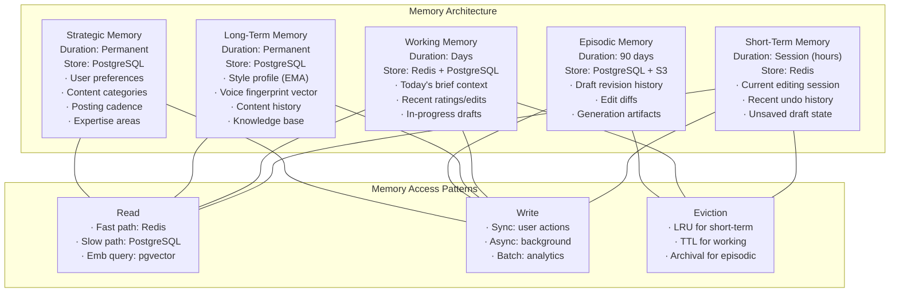

### Decision: Five-memory architecture

This is inspired by cognitive architecture research (Atkinson-Shiffrin + Nuxoll & Laird's episodic memory for Soar agents). The key insight: different memory types have different access patterns, durability requirements, and data structures. Storing them in the same system would force trade-offs. By separating them:

- **Short-Term** uses Redis (fast, volatile, TTL-based)
- **Working** uses Redis with PostgreSQL persistence (fast reads, durable when promoted)
- **Long-Term** uses PostgreSQL (ACID, relational, queryable)
- **Episodic** uses PostgreSQL + S3 (relational metadata, blob storage for diffs)
- **Strategic** uses PostgreSQL (rarely written, frequently read, relational)

---

## 9. Knowledge Flow

The Knowledge Base is the user's curated signal repository. It feeds the Content Engine and improves with every interaction.

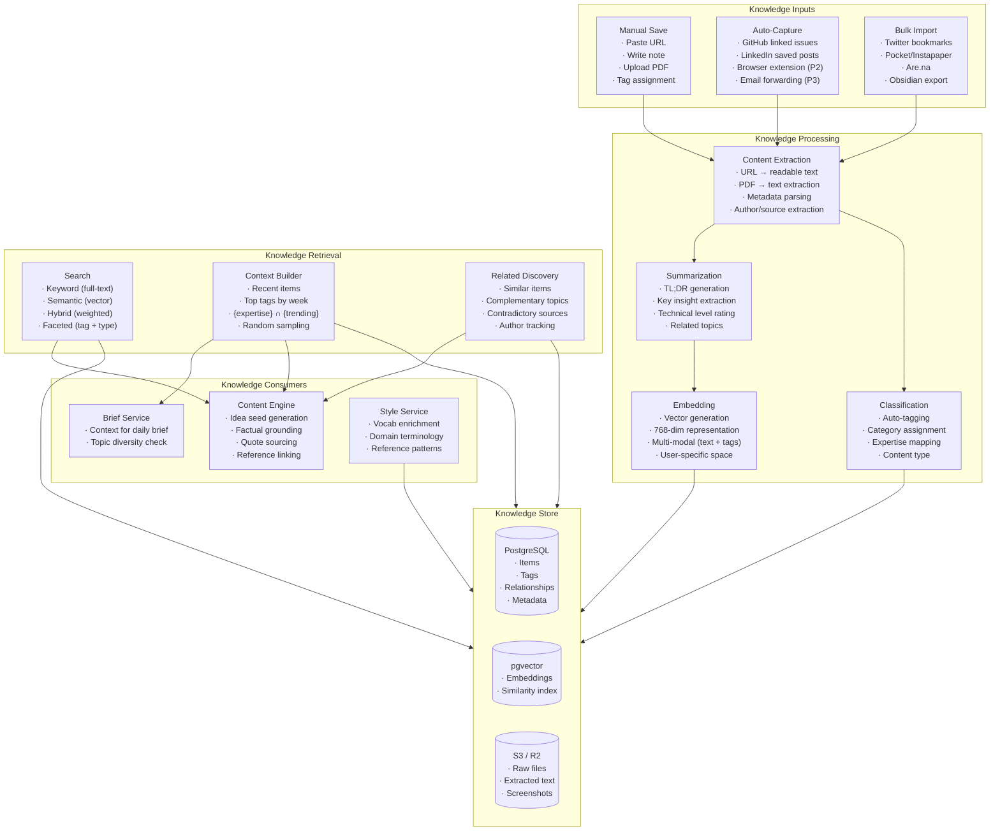

### Decision: Hybrid search (full-text + vector)

Knowledge retrieval uses a hybrid approach: PostgreSQL full-text search for keyword queries (tag search, title search) combined with pgvector for semantic similarity. The hybrid search query weights both scores with a configurable ratio (default 0.3 keyword + 0.7 vector). This handles both "find the article I saved about attention" (keyword) and "find articles similar to this concept" (vector).

---

## 10. Database Flow

### 10.1 Entity Relationship Diagram

```mermaid
erDiagram
  User ||--o{ UserAuth : has
  User ||--o{ UserProfile : has
  User ||--o{ UserPreference : configures
  User ||--o{ ExpertiseArea : defines
  User ||--o{ StyleProfile : owns
  User ||--o{ KnowledgeItem : curates
  User ||--o{ ContentDraft : creates
  User ||--o{ ScheduledPost : schedules
  User ||--o{ ContentBrief : receives
  User ||--o{ PlatformConnection : connects
  User ||--o{ NotificationLog : receives
  User ||--o{ Rating : gives

  PlatformConnection ||--o{ PlatformToken : stores

  KnowledgeItem ||--o{ KnowledgeTag : tagged_with
  KnowledgeItem ||--o{ KnowledgeEmbedding : has

  ContentDraft ||--o{ DraftRevision : has
  ContentDraft ||--o{ Rating : receives
  ContentDraft ||--o{ ScheduledPost : scheduled_as

  ScheduledPost ||--o{ PublishLog : logged

  StyleProfile ||--o{ StyleSignal : built_from

  ContentBrief ||--o{ BriefIdea : contains

  User {
    uuid id PK
    string email UK
    string display_name
    timestamp created_at
    timestamp last_active_at
  }

  UserProfile {
    uuid id PK
    uuid user_id FK
    string bio
    string avatar_url
    string linkedin_url
    string github_username
    jsonb expertise_areas
    timestamp updated_at
  }

  UserPreference {
    uuid id PK
    uuid user_id FK UK
    string posting_cadence
    string timezone
    int brief_hour
    string default_tone
    string default_length
    boolean digest_enabled
  }

  ExpertiseArea {
    uuid id PK
    uuid user_id FK
    string name
    string category
    int priority
    jsonb keywords
  }

  PlatformConnection {
    uuid id PK
    uuid user_id FK
    string platform
    string external_user_id
    timestamp connected_at
    timestamp last_sync_at
    boolean active
  }

  PlatformToken {
    uuid id PK
    uuid connection_id FK
    text encrypted_access_token
    text encrypted_refresh_token
    timestamp expires_at
    jsonb token_metadata
  }

  KnowledgeItem {
    uuid id PK
    uuid user_id FK
    string url
    string title
    text summary
    text extracted_text
    string source_type
    string content_type
    jsonb metadata
    int reading_time_minutes
    timestamp saved_at
    timestamp updated_at
  }

  KnowledgeTag {
    uuid id PK
    uuid knowledge_item_id FK
    string tag
    boolean auto_generated
  }

  KnowledgeEmbedding {
    uuid id PK
    uuid knowledge_item_id FK
    vector embedding
    string model_version
  }

  ContentDraft {
    uuid id PK
    uuid user_id FK
    string title
    text body
    string status
    string tone
    string length
    string content_type
    jsonb generation_metadata
    jsonb quality_scores
    uuid source_idea_id
    timestamp created_at
    timestamp updated_at
  }

  DraftRevision {
    uuid id PK
    uuid draft_id FK
    text body
    text diff
    string change_source
    timestamp created_at
  }

  ScheduledPost {
    uuid id PK
    uuid draft_id FK
    uuid user_id FK
    string platform
    timestamp scheduled_for
    string status
    string external_post_id
    timestamp published_at
  }

  PublishLog {
    uuid id PK
    uuid scheduled_post_id FK
    string platform
    string status
    jsonb response
    text error_message
    int attempt_number
    timestamp attempted_at
  }

  StyleProfile {
    uuid id PK
    uuid user_id FK
    vector voice_embedding
    jsonb style_params
    float learning_rate
    int total_ratings
    int total_edits
    timestamp updated_at
  }

  StyleSignal {
    uuid id PK
    uuid profile_id FK
    uuid source_draft_id
    string signal_type
    jsonb signal_data
    float weight
    timestamp recorded_at
  }

  Rating {
    uuid id PK
    uuid user_id FK
    uuid draft_id FK
    int score
    text comment
    jsonb dimension_scores
    timestamp created_at
  }

  ContentBrief {
    uuid id PK
    uuid user_id FK
    date brief_date
    jsonb context_summary
    timestamp generated_at
    timestamp viewed_at
  }

  BriefIdea {
    uuid id PK
    uuid brief_id FK
    string title
    text description
    string category
    float relevance_score
    float novelty_score
    uuid source_knowledge_item_id FK
  }

  NotificationLog {
    uuid id PK
    uuid user_id FK
    string notification_type
    string channel
    jsonb payload
    boolean delivered
    timestamp sent_at
  }
```

### 10.2 Migration Strategy

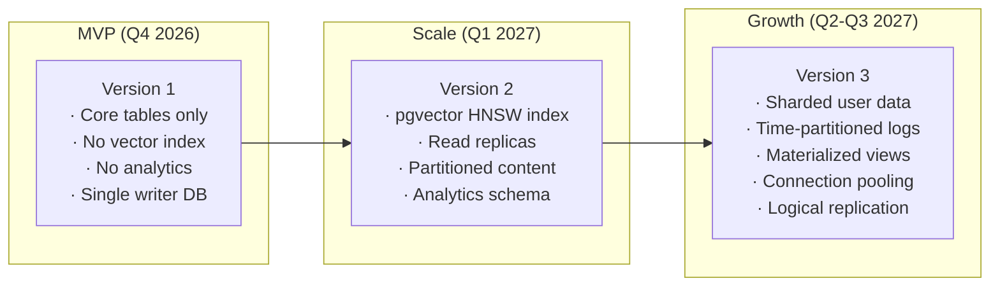

### Decision: Single database, not microservices-per-database

For MVP, all services share a single PostgreSQL database with schema-level separation (schemas: `auth`, `content`, `kb`, `analytics`). This avoids the operational complexity of per-service databases while maintaining logical separation. Migration path: when any schema exceeds 50GB or 500 rows-per-second write throughput, extract it to its own physical database.

---

## 11. API Flow

### 11.1 API Surface Map

```mermaid
flowchart TB
  subgraph API["API Surface (v1)"]
    AUTH_API["Auth API
              POST /auth/register
              POST /auth/login
              POST /auth/oauth/{provider}
              POST /auth/refresh
              GET  /auth/me"]

    USER_API["User API
              GET    /profiles/me
              PATCH  /profiles/me
              GET    /profiles/me/preferences
              PATCH  /profiles/me/preferences
              GET    /profiles/me/expertise
              POST   /profiles/me/expertise"]

    CONNECT_API["Connections API
                 POST   /connections/github
                 POST   /connections/linkedin
                 DELETE /connections/github
                 DELETE /connections/linkedin
                 GET    /connections/status"]

    KB_API["Knowledge Base API
            GET      /kb/items
            POST     /kb/items
            GET      /kb/items/{id}
            PUT      /kb/items/{id}
            DELETE   /kb/items/{id}
            GET      /kb/items/{id}/related
            POST     /kb/search
            GET      /kb/tags"]

    CONTENT_API["Content API
                 GET    /content/briefs/today
                 POST   /content/ideas/generate
                 POST   /content/drafts
                 GET    /content/drafts
                 GET    /content/drafts/{id}
                 PUT    /content/drafts/{id}
                 POST   /content/drafts/{id}/regenerate
                 POST   /content/drafts/{id}/rate
                 POST   /content/drafts/{id}/schedule
                 GET    /content/drafts/{id}/revisions
                 GET    /content/history"]

    PUBLISH_API["Publish API
                 POST   /publish/now
                 POST   /publish/schedule
                 GET    /publish/schedule
                 DELETE /publish/schedule/{id}
                 GET    /publish/history"]

    ANALYTICS_API["Analytics API
                   GET /analytics/overview
                   GET /analytics/posts
                   GET /analytics/engagement
                   GET /analytics/audience
                   GET /analytics/trends"]

    ADMIN_API["Admin API (internal)
               GET  /admin/stats
               GET  /admin/users
               GET  /admin/user/{id}
               POST /admin/force-sync/{user_id}"]
  end
```

### 11.2 API Contract Pattern

Every endpoint follows a consistent contract pattern:

```mermaid
flowchart LR
  REQ["Request
       · HTTP Method
       · Path + params
       · Auth header (JWT)
       · JSON body (if POST/PUT)
       · Idempotency-Key (mutations)"]

  VALIDATE["Validation
            · Pydantic schema
            · Type check
            · Constraint check
            · Auth scope check"]

  HANDLE["Handler
          · Extract user context
          · Rate limit check
          · Route to service
          · Transform response"]

  RESP["Response
        · 200: Success
        · 201: Created
        · 400: Validation error
        · 401: Unauthenticated
        · 403: Forbidden
        · 404: Not found
        · 409: Conflict
        · 429: Rate limited
        · 500: Internal error"]

  REQ --> VALIDATE --> HANDLE --> RESP

  RESP --> JSON["JSON envelope
                 {
                   \"data\": {...},
                   \"meta\": {
                     \"request_id\": \"req_...\",
                     \"timestamp\": \"...\"
                   }
                 }"]

  RESP --> ERR["Error envelope
                {
                  \"error\": {
                    \"code\": \"VALIDATION_ERROR\",
                    \"message\": \"...\",
                    \"details\": {...}
                  },
                  \"meta\": {...}
                }"]
```

### Decision: REST over GraphQL for MVP

The PRD listed GraphQL in the architecture overview, but REST was chosen for MVP after analysis:
1. **Cacheability** — REST responses are trivially cached at the CDN and Redis layers. GraphQL requires more complex cache normalization.
2. **Observability** — REST endpoints are naturally grouped by resource, making it easier to track error rates and latencies per resource.
3. **Client complexity** — The BrandOS frontend is a single-page app with straightforward data fetching patterns. GraphQL's over-fetching benefits don't justify the client complexity.

GraphQL will be re-evaluated when we open a public API (Phase 4).

---

## 12. Future Extension Points

The architecture is designed with explicit extension points for each planned growth vector.

```mermaid
flowchart TB
  subgraph PLATFORM["Platform Extension Points"]
    DIRECTION PLATFORM_EXT

    ADAPTER["Platform Adapter Interface
             · format_post(draft) → platform_specific
             · publish(post, tokens) → result
             · fetch_analytics(tokens) → metrics
             · validate_connection(tokens) → boolean"]

    EXISTING_ADAPTERS["MVP Adapters
                       · LinkedInAdapter
                       · ManualExportAdapter"]

    FUTURE_ADAPTERS["Future Adapters
                     · TwitterAdapter (P2)
                     · MediumAdapter (P3)
                     · DevtoAdapter (P3)
                     · HashnodeAdapter (P3)
                     · NewsletterAdapter (P3)
                     · BlogCMSAdapter (P4)"]
  end

  subgraph DATA["Data Source Extension Points"]
    DIRECTION DATA_EXT

    SOURCE["Data Source Interface
            · fetch(user_id) → signals
            · webhook_handler(payload) → update
            · rate_limit_info() → limits"]

    EXISTING_SOURCES["MVP Sources
                      · GitHubSource
                      · ManualSource
                      · LinkedInSource"]

    FUTURE_SOURCES["Future Sources
                    · StackOverflowSource
                    · TwitterSource
                    · GoogleScholarSource
                    · ArXivSource
                    · ObsidianSource
                    · NotionSource"]
  end

  subgraph LLM["LLM Provider Extension Points"]
    DIRECTION LLM_EXT

    PROVIDER["LLM Provider Interface
              · complete(prompt, config) → response
              · embed(input) → vector
              · grade(output, criteria) → score
              · cost_estimate(task) → tokens"]

    EXISTING_PROVIDERS["MVP Providers
                        · AnthropicClaudeProvider
                        · OpenAIGPTProvider"]

    FUTURE_PROVIDERS["Future Providers
                      · GoogleGeminiProvider
                      · MetaLlamaProvider
                      · MistralProvider
                      · SelfHostedProvider"]
  end

  subgraph STYLE["Style Input Extension Points"]
    DIRECTION STYLE_EXT

    SIGNAL["Style Signal Interface
            · extract(draft, edit) → signal
            · confidence(signal) → float
            · merge(existing, signal) → updated"]

    FUTURE_SIGNALS["Future Signals
                    · VoiceCloneSignal (P4)
                    · MultiLangSignal (P4)
                    · ToneProfileSignal
                    · AudienceAdaptSignal"]
  end
```

### Extension Point: Platform Adapter Pattern

```python
# Pseudocode showing the adapter interface
class PlatformAdapter(ABC):
    """Every platform adapter implements this interface."""

    @abstractmethod
    def format_post(self, draft: ContentDraft) -> PlatformPost: ...

    @abstractmethod
    def publish(self, post: PlatformPost, tokens: PlatformTokens) -> PublishResult: ...

    @abstractmethod
    def fetch_analytics(self, tokens: PlatformTokens) -> PlatformAnalytics: ...

    @abstractmethod
    def validate_connection(self, tokens: PlatformTokens) -> ConnectionStatus: ...
```

Adding X/Twitter support in Phase 2 means writing one class (`TwitterAdapter`) that implements four methods. The scheduler, the publishing queue, and the analytics pipeline all work unchanged because they depend on the interface, not the implementation.

---

## 13. Scalability

### 13.1 Scaling Strategy by Component

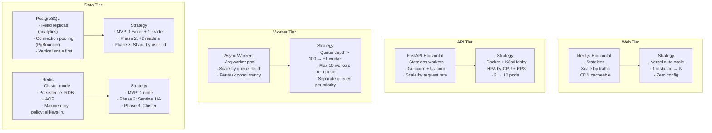

### 13.2 Bottleneck Analysis

| Bottleneck | MVP Limit | Scaling Trigger | Solution |
|-----------|-----------|----------------|----------|
| **LLM API Rate Limit** | ~500 RPM per key | > 500 requests/minute | Round-robin across API keys. Cache common prompts. Queue non-urgent generation. |
| **PostgreSQL Write TPS** | ~1,000 writes/sec | > 500 writes/sec | Connection pooling (PgBouncer). Write batching. Shard by user_id. |
| **GitHub API Rate Limit** | 5,000 req/hr per token | > 4,000 req/hr | Token pool across users. Reduce poll frequency. Cache aggressively. |
| **LinkedIn API Rate Limit** | 100,000 calls/day per app | > 80,000 calls/day | Batch analytics fetches. Reduce poll frequency to daily. |
| **Redis Memory** | < 1GB per instance | > 750MB used | Cluster mode. More aggressive TTL. Evict less-accessed keys. |
| **Async Queue** | ~1,000 jobs/min per Arq worker | > 800 jobs/min | Add workers. Priority queuing. Job deduplication. |

### Decision: Vertical scale first, horizontal second

PostgreSQL is scaled vertically first (bigger instance) before adding read replicas. The MVP data volume (500 users × 10K items = 5M rows) fits comfortably on a single large instance. Read replicas only become necessary when analytics queries (heavy aggregations) start competing with write traffic. This avoids premature distributed-system complexity.

---

## 14. Caching Strategy

### 14.1 Cache Layers

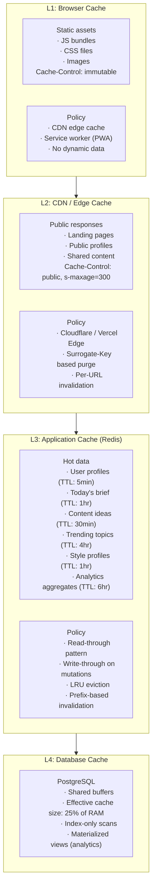

### 14.2 Cache Invalidation Strategy

| Cache Key | Write Trigger | Invalidation | Stale-while-revalidate |
|-----------|--------------|--------------|----------------------|
| `user:{id}:profile` | Profile update | Immediate (`DEL`) | 60s |
| `user:{id}:brief:{date}` | New brief generated | Immediate (`DEL`) | 300s |
| `user:{id}:style` | Rating or edit | Delayed (30s debounce) | 600s |
| `global:trending` | Trend poll | TTL expiration | N/A |
| `user:{id}:analytics:overview` | Daily analytics poll | TTL expiration | 3600s |
| `user:{id}:kb:recent` | KB item added | Immediate (`DEL`) | 120s |

### Decision: Write-through for user mutations, TTL for everything else

When a user updates their profile or saves a knowledge item, the cache is invalidated immediately (write-through). When analytics aggregates or trending topics are cached, they simply expire after a TTL and are refreshed on the next read. This avoids the complexity of write-behind or eventual consistency issues for data that doesn't need real-time freshness.

---

## 15. Security Architecture

```mermaid
flowchart TB
  subgraph EDGE_SEC["Edge Security"]
    DDOS["DDoS Protection
          · Cloudflare / AWS Shield
          · Rate limiting per IP
          · WAF rules"]
    TLS["TLS Termination
         · TLS 1.3 only
         · HSTS preload
         · Certificate automation"]
  end

  subgraph AUTH_SEC["Authentication & Authorization"]
    OAUTH["OAuth 2.0
           · GitHub (data source)
           · LinkedIn (publishing)
           · Google (identity)
           · PKCE flow for SPA"]
    JWT["JWT Management
         · Access token: 15min TTL
         · Refresh token: 7-day TTL (rotating)
         · RS256 signing
         · Token binding"]
    MFA["MFA
         · TOTP (authenticator app)
         · Optional on login
         · Enforced for admin"]
  end

  subgraph API_SEC["API Security"]
    RATE["Rate Limiting
          · Per-user: 100 req/min
          · Per-IP: 30 req/min (unauthenticated)
          · LLM endpoints: 5 req/min/user
          · Publish endpoints: 10 req/min/user"]
    VALIDATE["Input Validation
              · All inputs: Pydantic
              · SQL injection: ORM (no raw queries)
              · XSS: Output encoding
              · File upload: size + type validation"]
    IDEMPOTENCY["Idempotency
                 · Idempotency-Key header required for mutations
                 · Key stored in Redis (TTL: 24hr)
                 · Same key + same body → cached response
                 · Different body → 409 Conflict"]
  end

  subgraph DATA_SEC["Data Security"]
    ENCRYPT["Encryption
             · At rest: AES-256 (RDS encryption)
             · In transit: TLS 1.3
             · Platform tokens: AES-256-GCM envelope
             · Envelope key: KMS"]
    TOKEN_STORE["Token Storage
                 · OAuth tokens encrypted at rest
                 · Never logged
                 · Auto-refresh via refresh tokens
                 · Revocation on disconnect"]
    PII["PII Handling
         · Minimal PII collected
         · GDPR right to deletion
         · Data export available
         · No ML training without consent"]
  end

  subgraph LLM_SEC["LLM Security"]
    PROMPT_INJECTION["Prompt Protection
                      · User content isolated from system prompts
                      · Input sanitization
                      · Output validation
                      · No raw user input in system context"]
    RATE_LLM["Cost Control
              · Per-user daily LLM budget
              · Hard cap on generation attempts
              · Anomaly detection (sudden spike)"]
    DATA_ISOLATION["Data Isolation
                    · No cross-user context leakage
                    · Clear session per generation
                    · No persistent model training"]
  end

  EDGE_SEC --> AUTH_SEC
  AUTH_SEC --> API_SEC
  API_SEC --> DATA_SEC
  API_SEC --> LLM_SEC
```

### Decision: OAuth token encryption with envelope encryption

Platform tokens (LinkedIn, GitHub) are the most sensitive credentials in the system. They are encrypted using AES-256-GCM with a key-encryption-key (KEK) stored in AWS KMS or equivalent. The data key is generated per-token and wrapped by the KEK. This means:
1. The application never has raw cryptographic keys.
2. Token decryption is audited in KMS logs.
3. Key rotation doesn't require re-encrypting all tokens.

---

## 16. Deployment Architecture

### 16.1 Infrastructure Layout

```mermaid
flowchart TB
  subgraph PROD["Production Environment"]
    DNS["DNS: Cloudflare / Route53"]
    CDN["CDN: Cloudflare / Vercel Edge
         · Static assets
         · Public pages
         · API caching"]
    WAF["WAF: Cloudflare
         · DDoS protection
         · Rate limiting
         · Bot management"]

    subgraph COMPUTE["Compute Plane (Vercel + K8s / Hobby)"]
      WEB["Next.js App
           · Vercel serverless
           · Auto-scaling
           · Edge functions"]
      API["FastAPI Backend
           · 2-6 pods (HPA)
           · Gunicorn + Uvicorn
           · 4 workers per pod"]
      WORKER["Async Workers
              · Arq worker pods
              · 2-4 pods
              · Auto-scale by queue depth"]
      CRON["Scheduled Jobs
            · Brief generation
            · GitHub sync
            · LinkedIn analytics"
            · Trend scraping]
    end

    subgraph DATA_PLANE["Data Plane (RDS / ElastiCache / S3)"]
      PG_Master[(PostgreSQL Primary
                  · Writer instance
                  · db.r6g.large MVP
                  · 100GB gp3 storage)]
      PG_Replica[(PostgreSQL Read Replica
                   · Reader instance
                   · Analytics queries
                   · Brief generation)]
      REDIS_CLUSTER[(Redis
                      · Cache + Queue
                      · 1 node MVP
                      · 2GB memory)]
      S3_STORE[(S3 / R2
                 · Draft history
                 · User uploads
                 · Generated assets)]
    end

    subgraph EXTERNAL["External Services"]
      LLM_PROV["LLM API
                · Anthropic
                · OpenAI"]
      GH_API["GitHub API"]
      LI_API["LinkedIn API"]
      EMAIL_SVC["SendGrid / Resend"]
      ANALYTICS["Amplitude / PostHog"]
      MONITORING["Datadog / Grafana"]
    end
  end

  subgraph STAGING["Staging Environment"]
    STG_WEB["Next.js (Vercel Preview)"]
    STG_API["FastAPI (1 pod)"]
    STG_PG[(PostgreSQL
            · db.r6g.large
            · Anonymized data)]
    STG_REDIS[(Redis
               · 1GB)]
  end

  subgraph DEV["Development"]
    DEV_ENV["Local
             · Docker Compose
             · PostgreSQL
             · Redis
             · MinIO (S3 mock)
             · ngrok for webhooks"]
  end

  DNS --> CDN
  CDN --> WAF
  WAF --> WEB
  WEB --> API
  API --> PG_Master
  API --> REDIS_CLUSTER
  API --> S3_STORE
  API --> WORKER
  WORKER --> REDIS_CLUSTER
  API --> PG_Replica
  CRON --> API
  CRON --> PG_Master
  CRON --> WORKER

  API --> LLM_PROV
  API --> GH_API
  API --> LI_API
  WORKER --> LLM_PROV
  WORKER --> LI_API
  WORKER --> GH_API
  CRON --> GH_API
  CRON --> LI_API

  WEB --> ANALYTICS
  API --> EMAIL_SVC
  API --> MONITORING
  WORKER --> MONITORING
```

### 16.2 CI/CD Pipeline

```mermaid
flowchart LR
  subgraph CI["Continuous Integration"]
    GIT["git push → branch"]
    LINT["Lint
          · ruff (Python)
          · eslint (TS)
          · mypy type check"]
    TEST["Test
          · pytest (Python)
          · vitest (JS)
          · Integration tests"]
    BUILD["Build
           · Docker image
           · Next.js build
           · Static analysis"]
  end

  subgraph CD["Continuous Deployment"]
    STAGING["Deploy to Staging
             · Vercel Preview (web)
             · Docker deploy (API)
             · Run migration
             · Smoke tests"]
    E2E["E2E Tests
         · Playwright
         · API contract tests
         · Performance benchmarks"]
    APPROVE["Approval Gate
             · Manual approval
             · PR review done
             · Staging tests pass"]
    PROD_DEPLOY["Deploy to Production
                 · Blue-green API deploy
                 · Vercel production (web)
                 · Sequential migration
                 · Health check"]
  end

  GIT --> LINT
  LINT --> TEST
  TEST --> BUILD
  BUILD --> STAGING
  STAGING --> E2E
  E2E --> APPROVE
  APPROVE --> PROD_DEPLOY
```

---

## 17. Monitoring & Observability

### 17.1 Observability Stack

```mermaid
flowchart TB
  subgraph LOGS["Log Aggregation"]
    APP_LOGS["Application Logs
              · Structured JSON logging
              · request_id on every log
              · Log level: INFO (prod)
              · Log level: DEBUG (staging)"]
    LLM_LOGS["LLM Interaction Logs
              · Prompt (truncated)
              · Response (truncated)
              · Token count
              · Latency
              · Model used
              · Cost estimate"]
    AUDIT_LOGS["Audit Logs
                · User actions (publish, delete, export)
                · Token refresh
                · Permission changes
                · Immutable append-only"]
  end

  subgraph METRICS["Metrics (Prometheus + Datadog/Grafana)"]
    APP_METRICS["Application Metrics
                 · Request rate (by endpoint)
                 · Response latency (p50, p95, p99)
                 · Error rate (by status code)
                 · Active users"]
    BUS_METRICS["Business Metrics
                 · Drafts generated
                 · Posts published
                 · Briefs delivered
                 · Style ratings collected
                 · Knowledge items saved"]
    INFRA_METRICS["Infrastructure Metrics
                   · CPU / Memory / Disk
                   · Connection pool usage
                   · Queue depth
                   · Cache hit ratio"]
    LLM_METRICS["LLM Metrics
                 · Tokens per request
                 · Cost per user
                 · Latency per model
                 · Retry rate"]
  end

  subgraph TRACES["Distributed Tracing"]
    TRACE["Trace Context
           · OpenTelemetry
           · request_id propagated
           · Span per service call
           · Span per pipeline stage"]
  end

  subgraph ALERTS["Alerting"]
    PAGER["P0 Alerts
           · Service down > 2min
           · P95 latency > 5s
           · Error rate > 5%
           · Queue backlog > 1000"]
    WARN["P1 Alerts
          · P95 latency > 2s
          · Error rate > 1%
          · LLM budget 80% used
          · Cache hit ratio < 50%"]
    INFO["P2 Alerts
          · Cost anomaly
          · User-reported issues
          · API rate limit approaching
          · Migration pending"]
  end

  subgraph DASHBOARDS["Dashboards (Grafana)"]
    OVERVIEW["System Overview
              · RPS, latency, errors
              · Active users
              · Queue depth
              · Cache hit ratio"]
    BUSINESS["Business Health
              · Drafts created/day
              · Posts published/day
              · Approval rate
              · Style learning velocity"]
    LLM_DASH["LLM Cost & Usage
              · Cost per user per day
              · Token usage by model
              · Retry/failure rate
              · Prompt size distribution"]
    USER_SCOPE["Per-User Debug
                · Filter by user_id
                · Recent draft generations
                · LLM cost per user
                · Error timeline"]
  end

  APP_LOGS --> LOGS
  LLM_LOGS --> LOGS
  AUDIT_LOGS --> LOGS
  APP_METRICS --> METRICS
  BUS_METRICS --> METRICS
  INFRA_METRICS --> METRICS
  LLM_METRICS --> METRICS
  TRACE --> TRACES

  METRICS --> ALERTS
  LOGS --> DASHBOARDS
  METRICS --> DASHBOARDS
  TRACES --> DASHBOARDS
```

### 17.2 Key Dashboards

| Dashboard | Purpose | Key Panels |
|-----------|---------|------------|
| **System Overview** | At-a-glance health | RPS, error rate, p95 latency, active users, queue depth |
| **Content Health** | Content pipeline status | Drafts generated (trend), approval rate, generation duration, quality score distribution |
| **LLM Cost** | Cost governance | Cost per user/day, cost per generation, token usage by model, remaining budget |
| **User Engagement** | Product metrics | DAU/WAU/MAU, brief view rate, draft approval rate, publish rate, NPS trend |
| **Per-User Debug** | Support triage | User's recent drafts, generation errors, LLM cost, platform connection status |

### Decision: request_id propagation everywhere

Every request gets a unique `request_id` at the edge that propagates through BFF, API Gateway, service calls, LLM calls, and database queries. This single identifier ties together logs, traces, and metrics for any user action. It is the primary debugging tool for the content generation pipeline, where a single user action may trigger calls across 5+ services and an LLM provider.

---

## 18. Failure Handling

### 18.1 Failure Scenarios and Responses

```mermaid
flowchart TB
  subgraph FAILURES["Failure Scenarios"]
    LLM_DOWN["LLM Provider Down
              · HTTP 503 from provider
              · Timeout > 30s
              · Rate limit exceeded"]
    DB_DOWN["Database Down
             · Connection refused
             · Replication lag > 10s
             · Deadlock"]
    PLATFORM_DOWN["Platform API Down
                   · LinkedIn API 503
                   · GitHub API rate limit
                   · OAuth token expired"]
    WORKER_DOWN["Worker Process Down
                 · OOM
                 · Unhandled exception
                 · Crash loop"]
  end

  subgraph RESPONSES["Failure Responses"]
    LLM_RESP["LLM Failure
              · Retry with exponential backoff (3x)
              · Fallback to alternative provider
              · Degrade: serve cached content
              · Return error to user with context"]
    DB_RESP["Database Failure
             · Read replica failover
             · Connection pool recovery
             · Circuit breaker (write path)
             · Return 503 with retry-after"]
    PLATFORM_RESP["Platform Failure
                   · Queue for retry (max 3 attempts)
                   · Exponential backoff (1min → 5min → 30min)
                   · Notify user of pending post
                   · Fallback to "copy to clipboard""]
    WORKER_RESP["Worker Failure
                 · Job re-queued with retry count
                 · Dead letter queue after 3 failures
                 · Alert on retry threshold
                 · Isolate failing jobs"]
  end

  LLM_DOWN --> LLM_RESP
  DB_DOWN --> DB_RESP
  PLATFORM_DOWN --> PLATFORM_RESP
  WORKER_DOWN --> WORKER_RESP
```

### 18.2 Graceful Degradation Matrix

| Component | Healthy | Degraded (non-critical) | Degraded (critical) |
|-----------|---------|------------------------|---------------------|
| **LLM Provider** | Full generation | Show cached briefs, disable draft generation | Fallback to secondary provider |
| **GitHub Integration** | Real-time activity | Show last cached activity (stale timestamp) | Disable GitHub-sourced ideas, use KB only |
| **LinkedIn Publishing** | Direct publish | Queue posts, show "pending" status | Show "copy to clipboard" fallback |
| **Trend Service** | Fresh trends | Use cached trends (stale timestamp) | Disable trend-based ideas |
| **Knowledge Base Search** | Full search | Keyword-only (no vector search) | Show recent items only |
| **Analytics** | Live metrics | Show cached metrics with "last updated" | Hide analytics section, show placeholder |

### Decision: Fallback chains, not hard dependencies

Every external dependency has a fallback chain:

```
LLM Call → Provider A → (timeout) → Provider B → (timeout) → Cache → (miss) → Error to user
GitHub Sync → Cache → (miss) → Stale DB → (empty) → Skip GitHub signals
LinkedIn Publish → API call → (fail) → Queue → (retry exhausted) → Notify user + copy fallback
```

This prevents any single provider outage from rendering the entire system unusable. The most critical path (draft generation) can fall back to a different LLM provider or serve pre-generated content from the cache.

---

## Appendix: Glossary

| Term | Definition |
|------|------------|
| **Content Engine** | The pipeline responsible for generating content ideas and drafts from user context |
| **Style Profile** | Per-user representation of writing style, including vocabulary, sentence structure, tone, and technical depth |
| **Voice Fingerprint** | The embedding vector representing a user's unique writing style |
| **Platform Adapter** | A pluggable component that converts canonical BrandOS content into platform-specific formats |
| **Content Brief** | A daily or weekly summary of suggested post topics generated from the user's GitHub activity, knowledge base, and trending topics |
| **BFF** | Backend For Frontend — an API layer that serves frontend-specific data shapes |
| **Arq** | An async Redis-backed job queue for Python, used for background content generation tasks |
| **pgvector** | A PostgreSQL extension that adds vector similarity search capabilities |

---

## Change History

| Version | Date | Author | Changes |
|---------|------|--------|---------|
| 0.1 | 2026-06-26 | Architecture Team | Initial draft |

---

*This document captures the architectural decisions for BrandOS. Every decision includes the rationale and context to ensure future architects understand why the system is designed this way. All diagrams use Mermaid syntax and render in any Mermaid-compatible viewer.*
