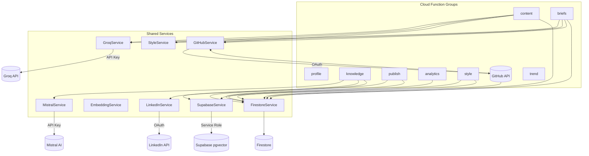

# Low Level Design: BrandOS (Firebase Stack)

## Document Info

| Field | Value |
|-------|-------|
| **Author** | Architecture Team |
| **Status** | Draft |
| **Created** | 2026-07-14 |
| **Last Updated** | 2026-07-14 |
| **Stack** | Firebase Cloud Functions (TypeScript) + Next.js + Groq |

---

## 1. Design Principles

| Principle | Application |
|-----------|-------------|
| **Single Responsibility** | Each Cloud Function serves exactly one purpose. No "god functions" that handle multiple domains. |
| **Typed Contracts** | Every function has a Zod input schema and a typed output interface. No `any` or raw `unknown` across boundaries. |
| **Stateless Handlers** | Cloud Functions are stateless. All state lives in Firestore, pgvector, or Cloud Storage. No in-memory caching between invocations. |
| **Fail Fast** | Input validation is the first step in every function. Invalid input → rejected before any Side effect. |
| **Observable by Default** | Every function logs: invocation, input hash (no PII), duration, errors. Structured logging with severity levels. |
| **Provider-Independent AI** | LLM and Embedding providers are behind adapter interfaces. Swapping Groq for another provider requires changing one file. |
| **Composable Pipeline** | The content pipeline is a sequence of pure functions with typed intermediate states. Each stage can be tested, cached, or skipped independently. |

---

## 2. Shared Data Contracts

### 2.1 Common Types

```typescript
// File: functions/src/common/types.ts

// ── Core Identifiers ──
type UserId = string;       // Firebase Auth UID
type DraftId = string;      // Firestore document ID
type BriefId = string;
type KnowledgeId = string;
type ConnectionId = string;

// ── Content Types ──
type ContentTone = 'conversational' | 'professional' | 'technical' | 'opinionated';
type ContentLength = 'short' | 'medium' | 'long';
type ContentType = 'tutorial' | 'opinion' | 'project_update' | 'paper_summary' | 'industry_commentary';
type PostStatus = 'draft' | 'approved' | 'scheduled' | 'published' | 'failed';

// ── Style Profile ──
interface StyleProfile {
  tone: ContentTone;
  depth: 'tutorial' | 'opinion' | 'insight' | 'news';
  averageLength: ContentLength;
  hookStyle: 'question' | 'stat' | 'quote' | 'story' | 'none';
  formality: number;             // 0.0 (casual) – 1.0 (formal)
  technicalDepth: number;        // 0.0 (beginner) – 1.0 (expert)
  preferredTerms: string[];      // Vocabulary the user favors
  avoidedTerms: string[];        // Vocabulary the user avoids
  sentenceLength: number;        // Average words per sentence
  paragraphLength: number;       // Average sentences per paragraph
}

// ── Context Aggregation ──
interface ContentContext {
  recentCommits: CommitInfo[];
  recentPRs: PRInfo[];
  topLanguages: string[];
  topTags: string[];
  recentKnowledge: KnowledgeItem[];
  trendingTopics: TrendingTopic[];
  expertiseAreas: string[];
}

// ── Cloud Function Response Envelope ──
interface FunctionResponse<T> {
  success: boolean;
  data?: T;
  error?: {
    code: string;
    message: string;
    details?: unknown;
  };
}

// ── Pagination ──
interface PaginatedRequest {
  limit?: number;      // default 10, max 50
  cursor?: string;     // Firestore document ID for cursor pagination
}

interface PaginatedResponse<T> {
  items: T[];
  nextCursor?: string;
  hasMore: boolean;
}
```

### 2.2 Cloud Function Input Schemas (Zod)

```typescript
// File: functions/src/common/schemas.ts

import { z } from 'zod';

// ── Profile ──
export const UpdateProfileSchema = z.object({
  displayName: z.string().min(1).max(100).optional(),
  bio: z.string().max(1000).optional(),
  photoURL: z.string().url().optional(),
  expertiseAreas: z.array(z.object({
    name: z.string().min(1).max(50),
    category: z.string().max(30),
    priority: z.number().int().min(0).max(10),
    keywords: z.array(z.string().max(30)).max(20),
  })).max(10).optional(),
});

export const UpdatePreferencesSchema = z.object({
  postingCadence: z.enum(['daily', '3x_week', 'weekly', 'custom']).optional(),
  timezone: z.string().optional(),
  briefHour: z.number().int().min(0).max(23).optional(),
  defaultTone: z.enum(['conversational', 'professional', 'technical', 'opinionated']).optional(),
  defaultLength: z.enum(['short', 'medium', 'long']).optional(),
  digestEnabled: z.boolean().optional(),
});

// ── Knowledge Base ──
export const CreateKnowledgeItemSchema = z.object({
  url: z.string().url().optional(),
  title: z.string().min(1).max(500),
  note: z.string().max(5000).optional(),
  tags: z.array(z.string().max(30)).max(20).default([]),
  sourceType: z.enum(['link', 'note', 'paper', 'code', 'video', 'podcast']).default('link'),
});

export const SearchKnowledgeSchema = z.object({
  query: z.string().min(1).max(200),
  limit: z.number().int().min(1).max(50).default(10),
  cursor: z.string().optional(),
  tags: z.array(z.string().max(30)).max(20).optional(),
  sourceTypes: z.array(z.enum(['link', 'note', 'paper', 'code', 'video', 'podcast'])).optional(),
});

// ── Content ──
export const GenerateIdeasSchema = z.object({
  briefId: z.string().optional(),
  count: z.number().int().min(1).max(10).default(5),
  tone: z.enum(['conversational', 'professional', 'technical', 'opinionated']).optional(),
  length: z.enum(['short', 'medium', 'long']).optional(),
  categories: z.array(z.enum(['tutorial', 'opinion', 'project_update', 'paper_summary', 'industry_commentary'])).optional(),
});

export const GenerateDraftSchema = z.object({
  idea: z.object({
    title: z.string().min(1).max(200),
    description: z.string().min(1).max(2000),
    category: z.enum(['tutorial', 'opinion', 'project_update', 'paper_summary', 'industry_commentary']),
    contextSources: z.array(z.string()).optional(),
  }),
  tone: z.enum(['conversational', 'professional', 'technical', 'opinionated']).optional(),
  length: z.enum(['short', 'medium', 'long']).optional(),
});

export const UpdateDraftSchema = z.object({
  draftId: z.string().min(1),
  body: z.string().min(1).max(10000),
});

export const RateDraftSchema = z.object({
  draftId: z.string().min(1),
  score: z.number().int().min(1).max(5),
  dimensions: z.object({
    accuracy: z.number().int().min(1).max(5).optional(),
    readability: z.number().int().min(1).max(5).optional(),
    authenticity: z.number().int().min(1).max(5).optional(),
    engagement: z.number().int().min(1).max(5).optional(),
  }).optional(),
  comment: z.string().max(1000).optional(),
});

export const SchedulePostSchema = z.object({
  draftId: z.string().min(1),
  platform: z.enum(['linkedin']),  // expand: 'twitter', 'blog'
  scheduledFor: z.string().datetime(),  // ISO 8601
});

// ── Connections ──
export const ConnectLinkedInSchema = z.object({
  code: z.string().min(1),  // OAuth authorization code
  redirectUri: z.string().url(),
});

export const ConnectGitHubSchema = z.object({
  code: z.string().min(1),  // OAuth authorization code
});
```

---

## 3. Cloud Function Interfaces

### 3.1 Profile Functions

```typescript
// File: functions/src/profile/index.ts

import { onCall } from 'firebase-functions/v2/https';
import { z } from 'zod';
import { UpdateProfileSchema, UpdatePreferencesSchema } from '../common/schemas';
import { HttpsError } from 'firebase-functions/v2/https';

// ── getMyProfile ──
// Returns the authenticated user's profile document.
export const getMyProfile = onCall(async (request) => {
  // auth automatically verified by onCall
  const uid = request.auth!.uid;

  const profile = await getFirestore()
    .collection('users').doc(uid)
    .get();

  if (!profile.exists) {
    throw new HttpsError('not-found', 'Profile not found. User may not be onboarded.');
  }

  return {
    success: true,
    data: profile.data(),
  };
});

// ── updateMyProfile ──
// Updates profile fields. Merges into existing document.
export const updateMyProfile = onCall(async (request) => {
  const uid = request.auth!.uid;
  const input = UpdateProfileSchema.parse(request.data);

  await getFirestore()
    .collection('users').doc(uid)
    .update({
      ...input,
      updatedAt: FieldValue.serverTimestamp(),
    });

  return { success: true };
});

// ── updateMyPreferences ──
// Updates user preferences (posting cadence, timezone, defaults).
export const updateMyPreferences = onCall(async (request) => {
  const uid = request.auth!.uid;
  const input = UpdatePreferencesSchema.parse(request.data);

  await getFirestore()
    .collection('users').doc(uid)
    .update({
      preferences: input,
      updatedAt: FieldValue.serverTimestamp(),
    });

  return { success: true };
});
```

### 3.2 Knowledge Base Functions

```typescript
// File: functions/src/knowledge/index.ts

import { onCall } from 'firebase-functions/v2/https';
import { onDocumentCreated } from 'firebase-functions/v2/firestore';
import { CreateKnowledgeItemSchema, SearchKnowledgeSchema } from '../common/schemas';

// ── createKnowledgeItem ──
// Creates a new knowledge item. Triggers embedding generation via Firestore trigger.
export const createKnowledgeItem = onCall(async (request) => {
  const uid = request.auth!.uid;
  const input = CreateKnowledgeItemSchema.parse(request.data);

  const docRef = await getFirestore()
    .collection('users').doc(uid)
    .collection('knowledge')
    .add({
      ...input,
      userId: uid,
      embeddingStatus: 'pending',
      createdAt: FieldValue.serverTimestamp(),
      updatedAt: FieldValue.serverTimestamp(),
    });

  return { success: true, data: { id: docRef.id } };
});

// ── searchKnowledge ──
// Hybrid search (keyword + semantic) across the user's knowledge base.
export const searchKnowledge = onCall(async (request) => {
  const uid = request.auth!.uid;
  const input = SearchKnowledgeSchema.parse(request.data);

  // 1. Generate embedding for query
  const embedding = await getEmbeddingService().embed(input.query);

  // 2. Semantic search via pgvector
  const semanticResults = await getSupabase().rpc('match_knowledge', {
    query_embedding: embedding,
    match_threshold: 0.7,
    match_count: input.limit * 2,
    filter_user_id: uid,
  });

  // 3. Keyword search via pgvector FTS
  const keywordResults = await getSupabase().rpc('search_knowledge_fts', {
    query_text: input.query,
    result_limit: input.limit * 2,
    filter_user_id: uid,
  });

  // 4. RRF merge
  const fused = reciprocalRankFusion(semanticResults, keywordResults, input.limit, 60);

  return { success: true, data: { items: fused } };
});

// ── Firestore Trigger: onKnowledgeItemCreated ──
// Generates embedding when a new knowledge item is created.
export const onKnowledgeItemCreated = onDocumentCreated(
  'users/{userId}/knowledge/{itemId}',
  async (event) => {
    const item = event.data?.data();
    if (!item || item.embeddingStatus === 'completed') return;

    try {
      // Generate summary if the item has extracted text
      if (item.extractedText && !item.summary) {
        const summary = await getGroqService().summarize(item.extractedText);
        await event.data?.ref.update({ summary, embeddingStatus: 'summarized' });
      }

      // Generate embedding
      const text = `${item.title}\n${item.summary || ''}\n${item.tags?.join(', ') || ''}`;
      const embedding = await getEmbeddingService().embed(text);

      // Store in pgvector
      await getSupabase().from('knowledge_embeddings').upsert({
        user_id: event.params.userId,
        knowledge_item_id: event.params.itemId,
        embedding,
        text,
        created_at: new Date().toISOString(),
      });

      await event.data?.ref.update({ embeddingStatus: 'completed' });
    } catch (error) {
      console.error(`Embedding failed for item ${event.params.itemId}:`, error);
      await event.data?.ref.update({ embeddingStatus: 'failed' });
    }
  }
);
```

### 3.3 Content Engine Functions

```typescript
// File: functions/src/content/index.ts

import { onCall } from 'firebase-functions/v2/https';
import { GenerateIdeasSchema, GenerateDraftSchema, UpdateDraftSchema, RateDraftSchema, SchedulePostSchema } from '../common/schemas';

// ── generateIdeas ──
// Generates content ideas from user context (GitHub + KB + trends + style).
export const generateIdeas = onCall(async (request) => {
  const uid = request.auth!.uid;
  const input = GenerateIdeasSchema.parse(request.data);

  // 1. Aggregate context (parallel)
  const [githubActivity, recentKnowledge, trendingTopics, styleProfile] = await Promise.all([
    getGitHubService().getRecentActivity(uid),
    getKnowledgeService().getRecentItems(uid),
    getTrendService().getRelevant(uid),
    getStyleService().getProfile(uid),
  ]);

  const context: ContentContext = {
    recentCommits: githubActivity.commits,
    recentPRs: githubActivity.prs,
    topLanguages: githubActivity.languages,
    topTags: recentKnowledge.topTags,
    recentKnowledge: recentKnowledge.items,
    trendingTopics,
    expertiseAreas: githubActivity.expertise,
  };

  // 2. Generate ideas via Groq
  const ideas = await getContentPipeline().generateIdeas(context, styleProfile, input);

  return { success: true, data: { ideas } };
});

// ── generateDraft ──
// Generates a full draft from an idea. Runs the 5-stage pipeline.
export const generateDraft = onCall(async (request) => {
  const uid = request.auth!.uid;
  const input = GenerateDraftSchema.parse(request.data);

  const styleProfile = await getStyleService().getProfile(uid);
  const pipeline = getContentPipeline();

  const draft = await pipeline.execute({
    idea: input.idea,
    styleProfile,
    tone: input.tone || 'professional',
    length: input.length || 'medium',
  });

  // Save to Firestore
  const docRef = await getFirestore()
    .collection('users').doc(uid)
    .collection('drafts')
    .add({
      ...draft,
      userId: uid,
      status: 'draft',
      tone: input.tone || 'professional',
      length: input.length || 'medium',
      contentType: input.idea.category,
      createdAt: FieldValue.serverTimestamp(),
      updatedAt: FieldValue.serverTimestamp(),
    });

  return {
    success: true,
    data: { draftId: docRef.id, ...draft },
  };
});

// ── schedulePost ──
// Approves and schedules a draft for publishing.
export const schedulePost = onCall(async (request) => {
  const uid = request.auth!.uid;
  const input = SchedulePostSchema.parse(request.data);

  // Update draft status
  await getFirestore()
    .collection('users').doc(uid)
    .collection('drafts').doc(input.draftId)
    .update({ status: 'scheduled', updatedAt: FieldValue.serverTimestamp() });

  // Create schedule document (triggers onScheduleWrite → enqueues publish task)
  await getFirestore()
    .collection('users').doc(uid)
    .collection('schedule')
    .add({
      draftId: input.draftId,
      userId: uid,
      platform: input.platform,
      scheduledFor: Timestamp.fromDate(new Date(input.scheduledFor)),
      status: 'pending',
      createdAt: FieldValue.serverTimestamp(),
    });

  return { success: true };
});

// ── rateDraft ──
// Records user rating and updates style profile.
export const rateDraft = onCall(async (request) => {
  const uid = request.auth!.uid;
  const input = RateDraftSchema.parse(request.data);

  // Save rating
  await getFirestore()
    .collection('users').doc(uid)
    .collection('drafts').doc(input.draftId)
    .update({
      rating: { score: input.score, dimensions: input.dimensions, comment: input.comment },
      updatedAt: FieldValue.serverTimestamp(),
    });

  // Update style profile EMA
  await getStyleService().recordRating(uid, input);

  return { success: true };
});
```

### 3.4 Pipeline — Internal Architecture

```typescript
// File: functions/src/content/pipeline.ts

interface PipelineInput {
  idea: {
    title: string;
    description: string;
    category: ContentType;
    contextSources?: string[];
  };
  styleProfile: StyleProfile;
  tone: ContentTone;
  length: ContentLength;
}

interface PipelineOutput {
  title: string;
  body: string;
  qualityScore: number;
  qualityVerdict: 'pass' | 'warn' | 'fail';
  readabiltyScore: number;
  wordCount: number;
  metadata: {
    modelsUsed: string[];
    stageTimings: Record<string, number>;
    retries: number;
  };
}

class ContentPipeline {
  constructor(
    private groq: GroqService,
    private styleService: StyleService,
  ) {}

  async execute(input: PipelineInput): Promise<PipelineOutput> {
    const timings: Record<string, number> = {};

    // Stage 1: Context Assembly (algorithmic)
    const stage1Start = Date.now();
    const context = await this.assembleContext(input.idea);
    timings.contextAssembly = Date.now() - stage1Start;

    // Stage 2: Idea Expansion (LLM: Llama 3.3 70B)
    const stage2Start = Date.now();
    const expandedIdea = await this.groq.generate({
      model: 'llama-3.3-70b-versatile',
      system: IDEA_GENERATION_SYSTEM_PROMPT,
      messages: [
        { role: 'user', content: this.buildIdeaPrompt(context, input.styleProfile) },
      ],
      temperature: 0.7,
      maxTokens: 800,
    });
    timings.ideaGeneration = Date.now() - stage2Start;

    // Stage 3: Draft Composition (LLM: Qwen3 32B)
    const stage3Start = Date.now();
    let draft = await this.groq.generate({
      model: 'qwen-3-32b',
      system: DRAFT_COMPOSITION_SYSTEM_PROMPT,
      messages: [
        { role: 'user', content: this.buildDraftPrompt(expandedIdea, input) },
      ],
      temperature: 0.8,
      maxTokens: 2048,
    });
    timings.draftComposition = Date.now() - stage3Start;

    // Stage 4: Style Refinement (algorithmic)
    const stage4Start = Date.now();
    draft = this.styleService.applyStyle(draft, input.styleProfile);
    timings.styleRefinement = Date.now() - stage4Start;

    // Stage 5: Quality Gate (LLM: Llama 4 Scout 17B)
    const stage5Start = Date.now();
    const qualityResult = await this.groq.generate({
      model: 'llama-4-scout-17b-16e-instruct',
      system: QUALITY_GATE_SYSTEM_PROMPT,
      messages: [
        { role: 'user', content: this.buildQualityPrompt(draft) },
      ],
      temperature: 0.3,
      maxTokens: 500,
    });
    timings.qualityGate = Date.now() - stage5Start;

    // Stage 5 retry logic
    let retries = 0;
    if (qualityResult.verdict === 'fail' && retries < 2) {
      retries++;
      // Regenerate draft with stricter instructions
      draft = await this.regenerateWithFeedback(draft, qualityResult.feedback, input);
    }

    return {
      title: expandedIdea.title,
      body: draft,
      qualityScore: qualityResult.score,
      qualityVerdict: qualityResult.verdict,
      readabiltyScore: this.calculateReadability(draft),
      wordCount: draft.split(/\s+/).length,
      metadata: {
        modelsUsed: ['llama-3.3-70b-versatile', 'qwen-3-32b', 'llama-4-scout-17b-16e-instruct'],
        stageTimings: timings,
        retries,
      },
    };
  }
}
```

### 3.5 Style Service

```typescript
// File: functions/src/style/index.ts

interface StyleSignal {
  draftId: string;
  type: 'rating' | 'edit' | 'approval' | 'rejection';
  data: {
    original?: string;
    revised?: string;
    score?: number;
    dimensions?: Record<string, number>;
  };
}

class StyleService {
  private readonly DEFAULT_RATE = 0.3;
  private readonly CONVERGED_RATE = 0.1;
  private readonly CONVERGENCE_THRESHOLD = 50;

  async getProfile(userId: UserId): Promise<StyleProfile> {
    const doc = await getFirestore()
      .collection('users').doc(userId)
      .collection('style').doc('profile')
      .get();

    if (!doc.exists) {
      return this.getDefaultProfile();
    }

    return doc.data() as StyleProfile;
  }

  async recordRating(userId: UserId, rating: { score: number; dimensions?: Record<string, number> }): Promise<void> {
    const profile = await this.getProfile(userId);
    const interactionCount = await this.getInteractionCount(userId);
    const lr = interactionCount < this.CONVERGENCE_THRESHOLD
      ? this.DEFAULT_RATE
      : this.CONVERGED_RATE;

    // Update formality based on rating score
    const targetFormality = this.scoreToFormality(rating.score);
    profile.formality = lr * targetFormality + (1 - lr) * profile.formality;

    // Update technical depth from rating dimensions
    if (rating.dimensions?.accuracy) {
      const targetDepth = rating.dimensions.accuracy / 5;
      profile.technicalDepth = lr * targetDepth + (1 - lr) * profile.technicalDepth;
    }

    // Clamp values
    profile.formality = Math.max(0, Math.min(1, profile.formality));
    profile.technicalDepth = Math.max(0, Math.min(1, profile.technicalDepth));

    await getFirestore()
      .collection('users').doc(userId)
      .collection('style').doc('profile')
      .set(profile, { merge: true });
  }

  applyStyle(draft: string, profile: StyleProfile): string {
    let text = draft;

    // Adjust hook based on profile
    text = this.applyHookStyle(text, profile.hookStyle);

    // Adjust sentence length
    text = this.adjustSentenceLength(text, profile.sentenceLength);

    // Apply formality adjustments
    text = this.applyFormality(text, profile.formality);

    // Apply technical depth
    text = this.applyTechnicalDepth(text, profile.technicalDepth);

    return text;
  }

  private scoreToFormality(score: number): number {
    // Map 1-5 rating → formality target
    const map: Record<number, number> = {
      1: 0.2,  // User disliked → try less formal
      2: 0.3,
      3: 0.5,
      4: 0.7,
      5: 0.8,  // User loved → reinforce
    };
    return map[score] || 0.5;
  }
}
```

### 3.6 Groq Service (LLM Provider Adapter)

```typescript
// File: functions/src/common/groq.ts

interface GroqConfig {
  model: string;
  system: string;
  messages: Array<{ role: 'user' | 'assistant'; content: string }>;
  temperature?: number;
  maxTokens?: number;
  responseFormat?: { type: 'json_object' };
}

interface GroqResponse {
  content: string;
  model: string;
  usage: { promptTokens: number; completionTokens: number; totalTokens: number };
}

class GroqService {
  private readonly baseUrl = 'https://api.groq.com/openai/v1';
  private readonly apiKey: string;

  constructor() {
    this.apiKey = defineString('GROQ_API_KEY').value();
  }

  async generate(config: GroqConfig): Promise<GroqResponse> {
    const response = await fetch(`${this.baseUrl}/chat/completions`, {
      method: 'POST',
      headers: {
        'Authorization': `Bearer ${this.apiKey}`,
        'Content-Type': 'application/json',
      },
      body: JSON.stringify({
        model: config.model,
        messages: [
          { role: 'system', content: config.system },
          ...config.messages,
        ],
        temperature: config.temperature ?? 0.7,
        max_completion_tokens: config.maxTokens ?? 1024,
        ...(config.responseFormat ? { response_format: config.responseFormat } : {}),
      }),
    });

    if (!response.ok) {
      const error = await response.text();
      throw new Error(`Groq API error (${response.status}): ${error}`);
    }

    const data = await response.json();
    return {
      content: data.choices[0].message.content,
      model: data.model,
      usage: {
        promptTokens: data.usage.prompt_tokens,
        completionTokens: data.usage.completion_tokens,
        totalTokens: data.usage.total_tokens,
      },
    };
  }

  async generateStream(config: GroqConfig): Promise<ReadableStream> {
    // Used by Vercel AI SDK for client-initiated streaming
    const response = await fetch(`${this.baseUrl}/chat/completions`, {
      method: 'POST',
      headers: {
        'Authorization': `Bearer ${this.apiKey}`,
        'Content-Type': 'application/json',
      },
      body: JSON.stringify({
        model: config.model,
        messages: [
          { role: 'system', content: config.system },
          ...config.messages,
        ],
        temperature: config.temperature ?? 0.7,
        max_completion_tokens: config.maxTokens ?? 2048,
        stream: true,
      }),
    });

    return response.body!;
  }
}
```

---

## 4. Error Handling

### 4.1 Exception Hierarchy

```typescript
// File: functions/src/common/errors.ts

class AppError extends Error {
  constructor(
    message: string,
    public readonly code: string,
    public readonly httpStatus: number,
    public readonly details?: unknown,
  ) {
    super(message);
    this.name = 'AppError';
  }
}

class ValidationError extends AppError {
  constructor(message: string, details?: unknown) {
    super(message, 'VALIDATION_ERROR', 400, details);
  }
}

class NotFoundError extends AppError {
  constructor(resource: string) {
    super(`${resource} not found`, 'NOT_FOUND', 404);
  }
}

class RateLimitError extends AppError {
  constructor(retryAfter: number) {
    super('Too many requests', 'RATE_LIMITED', 429, { retryAfter });
  }
}

class AiProviderError extends AppError {
  constructor(provider: string, cause: unknown) {
    super(`AI provider ${provider} returned an error`, 'AI_PROVIDER_ERROR', 502, { cause });
  }
}

class ConfigurationError extends AppError {
  constructor(missingKey: string) {
    super(`Missing configuration: ${missingKey}`, 'CONFIGURATION_ERROR', 500);
  }
}
```

### 4.2 Error Handling Middleware

```typescript
// File: functions/src/common/middleware.ts

// Wraps any onCall handler with standard error handling
function withErrorHandling<T>(
  handler: (request: CallableRequest) => Promise<T>,
): (request: CallableRequest) => Promise<FunctionResponse<T>> {
  return async (request) => {
    const startTime = Date.now();

    try {
      const result = await handler(request);
      logInfo('function_success', {
        uid: request.auth?.uid,
        duration: Date.now() - startTime,
      });
      return { success: true, data: result };
    } catch (error) {
      logError('function_error', {
        uid: request.auth?.uid,
        duration: Date.now() - startTime,
        error: error instanceof Error ? error.message : 'Unknown error',
      });

      if (error instanceof z.ZodError) {
        return {
          success: false,
          error: {
            code: 'VALIDATION_ERROR',
            message: 'Invalid input',
            details: error.errors,
          },
        };
      }

      if (error instanceof AppError) {
        return {
          success: false,
          error: {
            code: error.code,
            message: error.message,
            details: error.details,
          },
        };
      }

      // Unknown error — log details, return generic message
      console.error('Unhandled error:', error);
      return {
        success: false,
        error: {
          code: 'INTERNAL_ERROR',
          message: 'An unexpected error occurred',
        },
      };
    }
  };
}
```

---

## 5. Configuration & Environment

### 5.1 Environment Variables

```typescript
// File: functions/src/common/config.ts

import { defineString, defineSecret } from 'firebase-functions/params';

// API Keys (secrets — encrypted at rest)
export const GROQ_API_KEY = defineSecret('GROQ_API_KEY');
export const MISTRAL_API_KEY = defineSecret('MISTRAL_API_KEY');
export const LINKEDIN_CLIENT_ID = defineSecret('LINKEDIN_CLIENT_ID');
export const LINKEDIN_CLIENT_SECRET = defineSecret('LINKEDIN_CLIENT_SECRET');
export const GITHUB_APP_ID = defineSecret('GITHUB_APP_ID');
export const GITHUB_APP_SECRET = defineSecret('GITHUB_APP_SECRET');

// Supabase (for pgvector)
export const SUPABASE_URL = defineString('SUPABASE_URL');
export const SUPABASE_SERVICE_KEY = defineSecret('SUPABASE_SERVICE_KEY');

// Configuration
export const GROQ_MODEL_IDEAS = defineString('GROQ_MODEL_IDEAS', { default: 'llama-3.3-70b-versatile' });
export const GROQ_MODEL_DRAFT = defineString('GROQ_MODEL_DRAFT', { default: 'qwen-3-32b' });
export const GROQ_MODEL_QUALITY = defineString('GROQ_MODEL_QUALITY', { default: 'llama-4-scout-17b-16e-instruct' });
export const BRIEF_SCHEDULE = defineString('BRIEF_SCHEDULE', { default: 'every 6 hours' });
export const MAX_DRAFTS_PER_DAY = defineInt('MAX_DRAFTS_PER_DAY', { default: 10 });

// Firebase project
export const FIREBASE_REGION = defineString('FIREBASE_REGION', { default: 'us-central1' });
```

### 5.2 Secret Manager Usage

```
firebase functions:secrets:set GROQ_API_KEY
firebase functions:secrets:set MISTRAL_API_KEY
firebase functions:secrets:set LINKEDIN_CLIENT_ID
firebase functions:secrets:set LINKEDIN_CLIENT_SECRET
firebase functions:secrets:set GITHUB_APP_ID
firebase functions:secrets:set GITHUB_APP_SECRET
firebase functions:secrets:set SUPABASE_SERVICE_KEY
```

Secrets are injected into function runtime via `runWith({ secrets: [...] })`.

---

## 6. Service Dependencies



**Dependency Rule:** Cloud Functions can depend on shared services via dependency injection. No function group imports another function group's internal modules. Shared services live in `functions/src/common/`.

---

## 7. Pipeline Stage Contracts

### 7.1 Content Pipeline

| Stage | Input | Output | Type | Failure |
|-------|-------|--------|------|---------|
| Context Assembly | `idea { title, description, category }` + `userId` | `ContentContext` | Algorithmic | Return partial context |
| Idea Generation | `ContentContext` + `StyleProfile` | `ExpandedIdea[]` | LLM | Retry with simpler prompt |
| Draft Composition | `ExpandedIdea` + config | `string (draft)` | LLM | Retry × 2, then fallback |
| Style Refinement | `string (draft)` + `StyleProfile` | `string (adjusted)` | Algorithmic | Return raw draft |
| Quality Gate | `string (draft)` | `{ score, verdict, feedback }` | LLM | PASS with warning |

### 7.2 Brief Pipeline

| Stage | Input | Output | Type | Failure |
|-------|-------|--------|------|---------|
| GitHub Context | `userId` | `{ commits, prs, languages }` | API call | Return empty context |
| KB Context | `userId` | `{ items, tags }` | pgvector query | Return empty |
| Trend Context | `userId` + expertise | `{ topics }` | RSS fetch | Return empty |
| Style Profile | `userId` | `StyleProfile` | Firestore read | Return default profile |
| Idea Generation | `AggregatedContext` | `BriefIdea[]` | LLM | Use cached brief |
| Brief Assembly | Ideas + metadata | `ContentBrief` | Algorithmic | Always succeeds |

### 7.3 Style Pipeline

| Signal | Input | Algorithm | Output |
|--------|-------|-----------|--------|
| Rating | `{ score, dimensions }` | EMA on formality + depth | Updated `StyleProfile` |
| Edit | `{ original, revised }` | Diff analysis → vocab extraction | Updated preferred/avoided terms |
| Approval | `{ draftId }` | Increment approval count | Confidence score adjustment |
| Import | `{ postText }` | Lexical + syntactic + tonal analysis | Initial `StyleProfile` |

---

## 8. Logging & Observability

```typescript
// File: functions/src/common/logging.ts

// Structured logging with severity levels
function logInfo(event: string, data?: Record<string, unknown>): void {
  console.log(JSON.stringify({
    severity: 'INFO',
    event,
    timestamp: new Date().toISOString(),
    ...data,
  }));
}

function logError(event: string, data?: Record<string, unknown>): void {
  console.error(JSON.stringify({
    severity: 'ERROR',
    event,
    timestamp: new Date().toISOString(),
    ...data,
  }));
}

// Cloud Function duration tracking
function trackDuration(functionName: string, durationMs: number): void {
  // Log to console — Firebase picks up structured logs for Cloud Logging
  logInfo('function_duration', {
    function: functionName,
    durationMs,
  });
}
```

### 8.1 Key Metrics to Monitor

| Metric | Where | Alert Threshold |
|--------|-------|----------------|
| P95 draft generation latency | Cloud Function logs | > 30s |
| Groq API error rate | GroqService logs | > 5% |
| Firestore write rate | Firebase Console | > 10K writes/day |
| Embedding failure rate | Knowledge trigger logs | > 2% |
| LinkedIn publish success rate | Publish service logs | < 95% |
| Content generation queue depth | Cloud Tasks | > 50 pending |

---

## 9. Testing Strategy

| Layer | Tool | Coverage Target |
|-------|------|-----------------|
| **Unit tests** | Vitest | 90%+ for services, 80%+ for functions |
| **Integration tests** | Vitest + firebase-emulator | All Cloud Function endpoints |
| **Pipeline tests** | Vitest (mocked LLM) | All pipeline paths (success, retry, fail) |
| **E2E tests** | Playwright | Critical user journeys (signup → generate → publish) |

**Firebase Emulator Suite** runs locally for integration testing: `firebase emulators:start --only functions,firestore,auth`.

---

*This Low Level Design describes the TypeScript Cloud Functions architecture for the Firebase-based BrandOS. See 04_API_SPEC.md for the complete API surface and 05_DATABASE.md for the Firestore schema design.*
