# Low Level Design: BrandOS

## Document Info

| Field | Value |
|-------|-------|
| **Author** | Architecture Team |
| **Status** | Draft |
| **Created** | 2026-06-26 |
| **Last Updated** | 2026-06-26 |
| **Target Release** | Q4 2026 |

---

## Table of Contents

- [Design Principles](#1-design-principles)
- [Service Definitions & Interfaces](#2-service-definitions--interfaces)
- [Data Contracts](#3-data-contracts)
- [Service Dependencies & Boundaries](#4-service-dependencies--boundaries)
- [Internal Module Structure](#5-internal-module-structure)
- [Error Handling](#6-error-handling)
- [Configuration & Environment](#7-configuration--environment)

---

## 1. Design Principles

### 1.1 Interface Design Rules

| Rule | Description |
|------|-------------|
| **Every service has a single `Service` class** | Public API surface is one class per service. Internal helpers are private. |
| **Every public method has typed inputs and outputs** | Pydantic models only. No raw dicts, no `**kwargs`. |
| **Every method either returns data or raises a typed exception** | No silent `None` returns. No `Optional` for expected values. |
| **No circular dependencies between services** | Dependency graph is a DAG. Services depend on interfaces, not implementations. |
| **Every service is instantiated with its dependencies** | Constructor injection. No global state, no singletons. |

### 1.2 Package Structure Convention

```
service_name/
├── __init__.py              # exports Service class
├── service.py               # Service implementation
├── models.py                # Pydantic input/output models
├── exceptions.py            # Typed exceptions
├── dependencies.py          # FastAPI dependency injection
├── router.py                # FastAPI router (if exposed via HTTP)
└── helpers/
    ├── __init__.py
    └── *.py                 # Internal helper modules
```

### 1.3 Naming Conventions

| Element | Convention | Example |
|---------|-----------|---------|
| Service class | `{Domain}Service` | `ContentService` |
| Repository class | `{Entity}Repository` | `DraftRepository` |
| Pydantic input model | `{Action}{Domain}Request` | `GenerateDraftRequest` |
| Pydantic output model | `{Domain}{Action}Response` | `DraftGenerateResponse` |
| Exception | `{Domain}Error` | `ContentGenerationError` |
| Internal helper | `{verb}_{noun}.py` | `parse_markdown.py` |

---

## 2. Service Definitions & Interfaces

### 2.1 Auth Service

**Responsibility:** User authentication, OAuth flows, token management.

```python
# MODULE: auth_service/service.py

class AuthService:
    """
    Handles authentication, OAuth flows, and session management.
    No direct database access — delegates to AuthRepository.
    """

    def __init__(
        self,
        user_repo: UserRepository,
        token_repo: TokenRepository,
        oauth_clients: dict[str, OAuthClient],
        crypto: CryptoService,
    ): ...

    # --- Registration & Login ---

    async def register_email(
        self, request: RegisterEmailRequest
    ) -> AuthResult: ...

    async def login_email(
        self, request: LoginEmailRequest
    ) -> AuthResult: ...

    async def login_oauth(
        self, request: LoginOAuthRequest
    ) -> AuthResult: ...

    # --- OAuth Flows ---

    async def initiate_oauth(
        self, provider: str, redirect_uri: str
    ) -> OAuthInitiationResult: ...

    async def handle_oauth_callback(
        self, provider: str, code: str, state: str
    ) -> AuthResult: ...

    # --- Token Management ---

    async def refresh_access_token(
        self, refresh_token: str
    ) -> AuthResult: ...

    async def revoke_session(
        self, user_id: uuid.UUID, session_id: uuid.UUID
    ) -> None: ...

    # --- Platform Token Management ---

    async def store_platform_token(
        self, user_id: uuid.UUID, platform: str, token: PlatformTokenData
    ) -> None: ...

    async def get_platform_token(
        self, user_id: uuid.UUID, platform: str
    ) -> PlatformTokenData: ...

    async def refresh_platform_token(
        self, user_id: uuid.UUID, platform: str
    ) -> PlatformTokenData: ...

    # --- Session Validation ---

    async def validate_session(
        self, access_token: str
    ) -> SessionInfo: ...

    async def get_active_sessions(
        self, user_id: uuid.UUID
    ) -> list[SessionInfo]: ...
```

```python
# MODULE: auth_service/models.py

class RegisterEmailRequest(BaseModel):
    email: EmailStr
    password: str  # min 8 chars, complexity validated server-side
    display_name: str

class LoginEmailRequest(BaseModel):
    email: EmailStr
    password: str

class LoginOAuthRequest(BaseModel):
    provider: Literal["google", "github", "linkedin"]
    auth_code: str
    redirect_uri: str

class AuthResult(BaseModel):
    user_id: uuid.UUID
    access_token: str          # JWT, 15min TTL
    refresh_token: str         # Opaque, 7-day TTL, rotating
    expires_at: datetime
    is_new_user: bool

class OAuthInitiationResult(BaseModel):
    authorization_url: str
    state: str
    code_verifier: str         # PKCE

class PlatformTokenData(BaseModel):
    access_token: str          # Encrypted at rest
    refresh_token: str | None  # Encrypted at rest
    expires_at: datetime
    scope: list[str]
    token_type: str

class SessionInfo(BaseModel):
    user_id: uuid.UUID
    session_id: uuid.UUID
    created_at: datetime
    expires_at: datetime
    is_valid: bool
```

### 2.2 Profile Service

**Responsibility:** User profiles, expertise areas, preferences.

```python
# MODULE: profile_service/service.py

class ProfileService:
    """
    Manages user profiles, expertise areas, and content preferences.
    Single source of truth for user configuration.
    """

    def __init__(
        self,
        profile_repo: ProfileRepository,
        expertise_repo: ExpertiseRepository,
        preference_repo: PreferenceRepository,
    ): ...

    # --- Profile ---

    async def get_profile(
        self, user_id: uuid.UUID
    ) -> UserProfile: ...

    async def update_profile(
        self, user_id: uuid.UUID, request: UpdateProfileRequest
    ) -> UserProfile: ...

    async def get_onboarding_status(
        self, user_id: uuid.UUID
    ) -> OnboardingStatus: ...

    # --- Expertise Areas ---

    async def list_expertise_areas(
        self, user_id: uuid.UUID
    ) -> list[ExpertiseArea]: ...

    async def add_expertise_area(
        self, user_id: uuid.UUID, request: AddExpertiseRequest
    ) -> ExpertiseArea: ...

    async def remove_expertise_area(
        self, user_id: uuid.UUID, area_id: uuid.UUID
    ) -> None: ...

    async def update_expertise_area(
        self, user_id: uuid.UUID, area_id: uuid.UUID, request: UpdateExpertiseRequest
    ) -> ExpertiseArea: ...

    # --- Preferences ---

    async def get_preferences(
        self, user_id: uuid.UUID
    ) -> UserPreferences: ...

    async def update_preferences(
        self, user_id: uuid.UUID, request: UpdatePreferencesRequest
    ) -> UserPreferences: ...
```

### 2.3 GitHub Service

**Responsibility:** GitHub repo analysis, commit scraping, activity detection.

```python
# MODULE: github_service/service.py

class GitHubService:
    """
    Analyzes public GitHub repositories for content signals.
    Poll-based with webhook optimization path.
    """

    def __init__(
        self,
        github_client: GitHubClient,
        repo_repo: GitHubRepositoryRepository,
        cache: CacheService,
    ): ...

    # --- Connection ---

    async def connect(
        self, user_id: uuid.UUID, access_token: str
    ) -> GitHubConnectionStatus: ...

    async def disconnect(
        self, user_id: uuid.UUID
    ) -> None: ...

    async def get_connection_status(
        self, user_id: uuid.UUID
    ) -> GitHubConnectionStatus: ...

    # --- Repository Analysis ---

    async def list_repos(
        self, user_id: uuid.UUID
    ) -> list[GitHubRepo]: ...

    async def analyze_repos(
        self, user_id: uuid.UUID
    ) -> GitHubAnalysisResult: ...

    # --- Activity ---

    async def get_recent_activity(
        self, user_id: uuid.UUID
    ) -> GitHubActivity: ...

    async def get_commits(
        self, user_id: uuid.UUID, repo_id: str, since: datetime
    ) -> list[GitHubCommit]: ...

    async def get_pull_requests(
        self, user_id: uuid.UUID, repo_id: str, since: datetime
    ) -> list[GitHubPullRequest]: ...

    # --- Sync Management ---

    async def get_sync_status(
        self, user_id: uuid.UUID
    ) -> SyncStatus: ...

    async def trigger_sync(
        self, user_id: uuid.UUID
    ) -> None: ...
```

```python
# MODULE: github_service/models.py

class GitHubRepo(BaseModel):
    id: str
    name: str
    full_name: str
    description: str | None
    url: str
    language: str | None
    languages: dict[str, int]       # language → bytes
    topics: list[str]
    stars: int
    forks: int
    is_archived: bool
    last_push_at: datetime
    is_analyzed: bool

class GitHubCommit(BaseModel):
    sha: str
    message: str
    author: str
    author_avatar: str
    date: datetime
    url: str
    repo_name: str
    files_changed: list[str]

class GitHubPullRequest(BaseModel):
    id: int
    title: str
    body: str | None
    state: Literal["open", "merged", "closed"]
    created_at: datetime
    merged_at: datetime | None
    url: str
    repo_name: str
    labels: list[str]

class GitHubActivity(BaseModel):
    user_id: uuid.UUID
    recent_commits: list[GitHubCommit]
    recent_prs: list[GitHubPullRequest]
    active_repos: list[str]
    top_languages: dict[str, float]  # language → percentage
    activity_score: float            # 0.0 to 1.0
    analyzed_at: datetime

class GitHubAnalysisResult(BaseModel):
    repos_analyzed: int
    total_commits: int
    total_prs: int
    top_languages: dict[str, float]
    primary_focus: str              # AI-generated summary of what user builds
    key_topics: list[str]           # Extracted from repo descriptions, READMEs
    analysis_duration_ms: int
```

### 2.4 Knowledge Base Service

**Responsibility:** Personal knowledge base CRUD, search, embedding management.

```python
# MODULE: knowledge_base_service/service.py

class KnowledgeBaseService:
    """
    Manages the user's curated knowledge repository.
    Handles text extraction, summarization, embedding, and hybrid search.
    """

    def __init__(
        self,
        kb_repo: KnowledgeItemRepository,
        tag_repo: KnowledgeTagRepository,
        embedding_service: EmbeddingService,
        llm_client: LLMClient,
        extractor: ContentExtractor,
        storage: StorageService,
    ): ...

    # --- CRUD ---

    async def add_item(
        self, user_id: uuid.UUID, request: AddKnowledgeItemRequest
    ) -> KnowledgeItem: ...

    async def get_item(
        self, user_id: uuid.UUID, item_id: uuid.UUID
    ) -> KnowledgeItem: ...

    async def update_item(
        self, user_id: uuid.UUID, item_id: uuid.UUID, request: UpdateKnowledgeItemRequest
    ) -> KnowledgeItem: ...

    async def delete_item(
        self, user_id: uuid.UUID, item_id: uuid.UUID
    ) -> None: ...

    async def list_items(
        self, user_id: uuid.UUID, filters: KnowledgeItemFilter
    ) -> PaginatedResult[KnowledgeItem]: ...

    # --- Search ---

    async def search(
        self, user_id: uuid.UUID, query: SearchQuery
    ) -> list[SearchResult]: ...

    async def get_related(
        self, user_id: uuid.UUID, item_id: uuid.UUID, limit: int = 5
    ) -> list[KnowledgeItem]: ...

    # --- Context Building ---

    async def get_recent_context(
        self, user_id: uuid.UUID, limit: int = 20
    ) -> KnowledgeContext: ...

    async def get_context_for_topic(
        self, user_id: uuid.UUID, topic: str, limit: int = 5
    ) -> list[KnowledgeItem]: ...

    # --- Tag Management ---

    async def get_tags(
        self, user_id: uuid.UUID
    ) -> list[TagWithCount]: ...

    async def suggest_tags(
        self, user_id: uuid.UUID, item_id: uuid.UUID
    ) -> list[str]: ...

    async def merge_tags(
        self, user_id: uuid.UUID, source_tag: str, target_tag: str
    ) -> None: ...

    # --- Ingestion Pipeline ---

    async def process_url(
        self, user_id: uuid.UUID, url: str
    ) -> ProcessingResult: ...

    async def process_pdf(
        self, user_id: uuid.UUID, file_key: str
    ) -> ProcessingResult: ...

    async def generate_summary(
        self, user_id: uuid.UUID, item_id: uuid.UUID
    ) -> str: ...
```

```python
# MODULE: knowledge_base_service/models.py

class AddKnowledgeItemRequest(BaseModel):
    url: str | None = None
    title: str
    notes: str | None = None
    tags: list[str] = []
    source_type: Literal["url", "note", "pdf", "import"]
    content_type: Literal["article", "paper", "tutorial", "idea", "reference", "other"]
    extracted_text: str | None = None

class KnowledgeItem(BaseModel):
    id: uuid.UUID
    user_id: uuid.UUID
    url: str | None
    title: str
    summary: str | None
    tags: list[str]
    source_type: str
    content_type: str
    reading_time_minutes: int
    created_at: datetime
    updated_at: datetime

class KnowledgeContext(BaseModel):
    items: list[KnowledgeItem]
    top_tags: list[TagWithCount]
    total_count: int
    context_summary: str          # LLM-generated summary of recent knowledge

class SearchQuery(BaseModel):
    text: str                     # Keyword or semantic query
    tags: list[str] | None = None
    content_types: list[str] | None = None
    limit: int = 10
    offset: int = 0
    search_mode: Literal["hybrid", "keyword", "semantic"] = "hybrid"

class SearchResult(BaseModel):
    item: KnowledgeItem
    score: float
    match_type: Literal["keyword", "semantic", "hybrid"]

class TagWithCount(BaseModel):
    tag: str
    count: int
    is_auto_generated: bool

class ProcessingResult(BaseModel):
    item_id: uuid.UUID
    title: str
    summary: str | None
    tags: list[str]
    reading_time_minutes: int
    processing_duration_ms: int
```

### 2.5 Trend Service

**Responsibility:** Trending topic discovery, relevance scoring, source management.

```python
# MODULE: trend_service/service.py

class TrendService:
    """
    Discovers and scores trending topics relevant to user expertise areas.
    Aggregates from multiple curated sources.
    """

    def __init__(
        self,
        trend_repo: TrendRepository,
        source_clients: list[TrendSourceClient],
        llm_client: LLMClient,
        cache: CacheService,
    ): ...

    # --- Trending Topics ---

    async def get_trending_topics(
        self, user_id: uuid.UUID, expertise_areas: list[str]
    ) -> list[TrendingTopic]: ...

    async def get_global_trending(
        self, expertise_areas: list[str] | None = None
    ) -> list[TrendingTopic]: ...

    # --- Source Management ---

    async def get_sources(
        self
    ) -> list[TrendSource]: ...

    async def add_source(
        self, request: AddTrendSourceRequest
    ) -> TrendSource: ...

    async def remove_source(
        self, source_id: uuid.UUID
    ) -> None: ...

    # --- Relevance Scoring ---

    async def score_topic_relevance(
        self, topic: str, expertise_areas: list[str]
    ) -> RelevanceScore: ...

    async def explain_relevance(
        self, topic: str, expertise_areas: list[str]
    ) -> RelevanceExplanation: ...

    # --- Internal Pipeline ---

    async def _ingest_sources(self) -> None: ...
    async def _deduplicate_topics(self, topics: list[RawTopic]) -> list[DeduplicatedTopic]: ...
    async def _rank_by_relevance(
        self, topics: list[DeduplicatedTopic], expertise_areas: list[str]
    ) -> list[RelevanceRankedTopic]: ...
```

```python
# MODULE: trend_service/models.py

class TrendingTopic(BaseModel):
    id: uuid.UUID
    title: str
    description: str
    source: str
    url: str | None
    relevance_score: float       # 0.0 to 1.0
    freshness_score: float       # 0.0 to 1.0
    engagement_count: int        # Likes, shares, comments across sources
    related_keywords: list[str]
    first_seen_at: datetime
    is_relevant: bool            # Filtered by user expertise

class RelevanceScore(BaseModel):
    overall: float
    dimensions: RelevanceDimensions

class RelevanceDimensions(BaseModel):
    keyword_overlap: float        # 0.0 - 1.0
    technical_alignment: float    # 0.0 - 1.0
    timeliness: float             # 0.0 - 1.0
    authority_signal: float       # 0.0 - 1.0
    controversy_risk: float       # 0.0 - 1.0 (inverted)

class RelevanceExplanation(BaseModel):
    score: RelevanceScore
    matching_keywords: list[str]
    overlapping_expertise: list[str]
    supporting_sources: list[str]
    confidence: float
```

### 2.6 Content Engine

**Responsibility:** Content idea generation, draft composition, pipeline orchestration.

This is the most complex service. It is implemented as a pipeline with 5 internal stages.

```python
# MODULE: content_engine/service.py

class ContentEngine:
    """
    Orchestrates the 5-stage content generation pipeline.
    Each stage is a separate module with a defined interface.
    """

    def __init__(
        self,
        context_aggregator: ContextAggregator,
        idea_generator: IdeaGenerator,
        draft_composer: DraftComposer,
        style_refiner: StyleRefiner,
        quality_gate: QualityGate,
        llm_client: LLMClient,
        draft_repo: DraftRepository,
        brief_repo: BriefRepository,
    ): ...

    # --- Idea Generation ---

    async def generate_ideas(
        self, user_id: uuid.UUID, request: GenerateIdeasRequest
    ) -> list[ContentIdea]: ...

    async def generate_ideas_from_context(
        self, context: AggregatedContext
    ) -> list[ContentIdea]: ...

    # --- Draft Generation ---

    async def generate_draft(
        self, user_id: uuid.UUID, request: GenerateDraftRequest
    ) -> DraftResult: ...

    async def regenerate_draft(
        self, user_id: uuid.UUID, draft_id: uuid.UUID, request: RegenerateDraftRequest
    ) -> DraftResult: ...

    # --- Draft Management ---

    async def get_draft(
        self, user_id: uuid.UUID, draft_id: uuid.UUID
    ) -> ContentDraft: ...

    async def update_draft(
        self, user_id: uuid.UUID, draft_id: uuid.UUID, request: UpdateDraftRequest
    ) -> ContentDraft: ...

    async def list_drafts(
        self, user_id: uuid.UUID, filters: DraftFilter
    ) -> PaginatedResult[ContentDraft]: ...

    async def get_draft_history(
        self, user_id: uuid.UUID, draft_id: uuid.UUID
    ) -> list[DraftRevision]: ...

    # --- Brief Management ---

    async def get_today_brief(
        self, user_id: uuid.UUID
    ) -> ContentBrief | None: ...

    async def generate_brief(
        self, user_id: uuid.UUID
    ) -> ContentBrief: ...

    async def get_brief_by_date(
        self, user_id: uuid.UUID, date: date
    ) -> ContentBrief | None: ...

    # --- Pipeline Execution ---

    async def _execute_pipeline(
        self, context: AggregatedContext, style_profile: StyleProfile, params: GenerationParams
    ) -> PipelineResult: ...
```

#### 2.6.1 Stage 1: Context Aggregator

```python
# MODULE: content_engine/stages/context_aggregator.py

class ContextAggregator:
    """
    Gathers and merges all context signals for content generation.
    Deterministic — no LLM calls.
    """

    def __init__(
        self,
        github_service: GitHubService,
        kb_service: KnowledgeBaseService,
        trend_service: TrendService,
        profile_service: ProfileService,
    ): ...

    async def aggregate(
        self, user_id: uuid.UUID
    ) -> AggregatedContext: ...

    async def weighted_signals(
        self, user_id: uuid.UUID, weights: SignalWeights | None = None
    ) -> WeightedSignals: ...
```

```python
# MODULE: content_engine/stages/models.py

class AggregatedContext(BaseModel):
    user_id: uuid.UUID
    github: GitHubActivity | None
    knowledge: KnowledgeContext | None
    trends: list[TrendingTopic]
    profile: UserProfile
    expertise: list[ExpertiseArea]
    aggregated_summary: str       # LLM-generated synthesis
    signal_breakdown: SignalBreakdown

class SignalWeights(BaseModel):
    github_recency: float = 0.35
    github_volume: float = 0.15
    kb_freshness: float = 0.25
    kb_diversity: float = 0.10
    trend_relevance: float = 0.10
    trend_freshness: float = 0.05

class SignalBreakdown(BaseModel):
    has_github_activity: bool
    has_kb_recent: bool
    has_trends: bool
    dominant_signal: Literal["github", "knowledge", "trends", "mixed"]
    signal_quality: float         # 0.0 - 1.0 (how rich the signal set is)

class WeightedSignals(BaseModel):
    signals: dict[str, float]    # Signal type → weight
    dominant_topic: str | None
    suggestion_count: int         # How many ideas to generate
```

#### 2.6.2 Stage 2: Idea Generator

```python
# MODULE: content_engine/stages/idea_generator.py

class IdeaGenerator:
    """
    Generates and ranks content ideas from aggregated context.
    Uses LLM for generation but deterministic for ranking.
    """

    def __init__(
        self,
        llm_client: LLMClient,
        cache: CacheService,
    ): ...

    async def generate(
        self, context: AggregatedContext, count: int = 5
    ) -> list[ContentIdea]: ...

    async def rank(
        self, ideas: list[ContentIdea], preferences: UserPreferences
    ) -> list[ContentIdea]: ...

    # --- Internal ---

    async def _deduplicate(
        self, ideas: list[ContentIdea], existing_briefs: list[ContentBrief]
    ) -> list[ContentIdea]: ...

    async def _check_novelty(
        self, idea: ContentIdea, user_id: uuid.UUID
    ) -> NoveltyScore: ...

    async def _assign_categories(
        self, ideas: list[ContentIdea], expertise: list[ExpertiseArea]
    ) -> list[ContentIdea]: ...
```

```python
# MODULE: content_engine/stages/idea_generator_models.py

class ContentIdea(BaseModel):
    id: uuid.UUID
    title: str
    description: str
    angle: str                    # Unique perspective or hook
    category: ContentCategory
    relevance_score: float
    novelty_score: float
    source_signals: list[str]    # Which data sources informed this idea
    suggested_tone: Literal["educational", "opinion", "insight", "tutorial", "story"]
    suggested_length: Literal["short", "medium", "long"]
    reasoning: str                # Why this idea is relevant now

class ContentCategory(str, Enum):
    TUTORIAL = "tutorial"            # How-to, technical walkthrough
    OPINION = "opinion"              # Point of view, hot take
    PROJECT_UPDATE = "project_update"  # What I built / shipped
    PAPER_SUMMARY = "paper_summary"    # Research paper breakdown
    INDUSTRY_ANALYSIS = "industry_analysis"  # Trend commentary
    PERSONAL_STORY = "personal_story"  # Career lesson, experience
    CODE_DEEP_DIVE = "code_deep_dive"  # Technical code explanation

class NoveltyScore(BaseModel):
    is_novel: bool
    similarity_to_past_posts: float
    duplicate_of_recent_brief: bool
    similar_existing_ideas: list[str]
```

#### 2.6.3 Stage 3: Draft Composer

```python
# MODULE: content_engine/stages/draft_composer.py

class DraftComposer:
    """
    Composes full draft content from an idea and context.
    Contains the only LLM call in the pipeline.
    """

    def __init__(
        self,
        llm_client: LLMClient,
        prompt_builder: PromptBuilder,
    ): ...

    async def compose(
        self,
        idea: ContentIdea,
        context: AggregatedContext,
        style_profile: StyleProfile,
        params: CompositionParams,
    ) -> CompositionResult: ...

    async def regenerate(
        self,
        draft_id: uuid.UUID,
        idea: ContentIdea,
        context: AggregatedContext,
        style_profile: StyleProfile,
        feedback: str | None,
    ) -> CompositionResult: ...
```

```python
# MODULE: content_engine/stages/draft_composer_models.py

class CompositionParams(BaseModel):
    tone: Literal["conversational", "professional", "technical", "inspirational"] = "conversational"
    length: Literal["short", "medium", "long"] = "medium"
    include_code: bool = False
    include_personal_anecdote: bool = True
    target_audience: Literal["peers", "managers", "general_tech", "founders"] = "peers"
    creativity_level: float = 0.7    # 0.0 (conservative) to 1.0 (experimental)

class CompositionResult(BaseModel):
    draft_id: uuid.UUID
    title: str
    body: str
    word_count: int
    reading_time_seconds: int
    llm_used: str
    tokens_used: int
    composition_duration_ms: int
    has_code_blocks: bool
    sections: list[str]

class PromptBuilder:
    """
    Builds structured prompts for the LLM.
    Separates system prompt (role, constraints) from user prompt (context, idea).
    """

    def build_system_prompt(
        self, style_profile: StyleProfile, params: CompositionParams
    ) -> str: ...

    def build_user_prompt(
        self, idea: ContentIdea, context: AggregatedContext
    ) -> str: ...

    def build_regeneration_prompt(
        self, previous_draft: str, feedback: str, style_profile: StyleProfile
    ) -> str: ...
```

#### 2.6.4 Stage 4: Style Refiner

```python
# MODULE: content_engine/stages/style_refiner.py

class StyleRefiner:
    """
    Applies the user's learned style profile to generated drafts.
    Deterministic — no LLM calls. Pattern-based transformation.
    """

    def __init__(
        self,
        style_service: StyleService,
    ): ...

    async def refine(
        self, draft: str, style_profile: StyleProfile
    ) -> RefinementResult: ...

    async def refine_full(
        self, draft: CompositionResult, style_profile: StyleProfile
    ) -> RefinementResult: ...
```

```python
# MODULE: content_engine/stages/style_refiner_models.py

class RefinementResult(BaseModel):
    original_body: str
    refined_body: str
    changes_applied: list[StyleChange]
    style_adherence_score: float     # 0.0 - 1.0

class StyleChange(BaseModel):
    change_type: Literal[
        "vocabulary_replacement",
        "sentence_restructure",
        "opening_adjustment",
        "closing_adjustment",
        "tone_calibration",
        "technical_depth_adjustment",
        "hook_insertion",
        "call_to_action_added",
    ]
    original: str
    refined: str
    reason: str
```

#### 2.6.5 Stage 5: Quality Gate

```python
# MODULE: content_engine/stages/quality_gate.py

class QualityGate:
    """
    Validates generated content before presenting to the user.
    Multi-dimensional quality scoring with configurable thresholds.
    """

    def __init__(
        self,
        llm_client: LLMClient,
    ): ...

    async def evaluate(
        self, draft: str, context: AggregatedContext, style_profile: StyleProfile
    ) -> QualityVerdict: ...

    async def evaluate_section(
        self, section_text: str, context: AggregatedContext
    ) -> SectionQuality: ...
```

```python
# MODULE: content_engine/stages/quality_gate_models.py

class QualityVerdict(BaseModel):
    overall_score: float          # 0.0 - 1.0
    verdict: Literal["pass", "warn", "fail"]
    dimensions: QualityDimensions
    warnings: list[QualityWarning]
    recommendations: list[str]

class QualityDimensions(BaseModel):
    factual_accuracy: float       # 0.0 - 1.0
    hallucination_risk: float     # 0.0 - 1.0 (inverted)
    readability: float            # 0.0 - 1.0
    authenticity: float           # 0.0 - 1.0 (sounds like user)
    technical_depth: float        # 0.0 - 1.0
    engagement_potential: float   # 0.0 - 1.0
    platform_appropriateness: float  # 0.0 - 1.0

class QualityWarning(BaseModel):
    severity: Literal["critical", "major", "minor"]
    category: str
    message: str
    affected_text: str | None
    suggestion: str | None

class SectionQuality(BaseModel):
    section: str
    score: float
    issues: list[str]
```

### 2.7 Style Service

**Responsibility:** Voice fingerprint management, style learning, edit tracking.

```python
# MODULE: style_service/service.py

class StyleService:
    """
    Learns and applies user writing style.
    Uses exponential moving average for continuous adaptation.
    """

    def __init__(
        self,
        profile_repo: StyleProfileRepository,
        signal_repo: StyleSignalRepository,
        embedding_service: EmbeddingService,
        analyzer: StyleAnalyzer,
    ): ...

    # --- Style Profile ---

    async def get_profile(
        self, user_id: uuid.UUID
    ) -> StyleProfile: ...

    async def initialize_profile(
        self, user_id: uuid.UUID
    ) -> StyleProfile: ...

    # --- Signal Processing ---

    async def record_rating(
        self, user_id: uuid.UUID, draft_id: uuid.UUID, rating: RatingData
    ) -> None: ...

    async def record_edit(
        self, user_id: uuid.UUID, original: str, revised: str, draft_id: uuid.UUID
    ) -> None: ...

    async def record_approval(
        self, user_id: uuid.UUID, draft_id: uuid.UUID
    ) -> None: ...

    async def record_rejection(
        self, user_id: uuid.UUID, draft_id: uuid.UUID
    ) -> None: ...

    async def import_posts(
        self, user_id: uuid.UUID, posts: list[str]
    ) -> ImportResult: ...

    # --- Analysis ---

    async def analyze_draft(
        self, text: str, profile: StyleProfile
    ) -> StyleAnalysis: ...

    async def get_learning_progress(
        self, user_id: uuid.UUID
    ) -> LearningProgress: ...

    async def get_style_insights(
        self, user_id: uuid.UUID
    ) -> StyleInsights: ...

    # --- Internal ---

    async def _update_embedding(
        self, profile: StyleProfile, signal: StyleSignalData
    ) -> None: ...

    async def _update_params(
        self, profile: StyleProfile, signal: StyleSignalData
    ) -> None: ...

    async def _calculate_learning_rate(
        self, profile: StyleProfile
    ) -> float: ...
```

```python
# MODULE: style_service/models.py

class StyleProfile(BaseModel):
    id: uuid.UUID
    user_id: uuid.UUID
    voice_embedding: list[float]     # 768-dim vector
    style_params: StyleParameters
    learning_rate: float             # 0.01 - 0.1, decreases with more data
    total_ratings: int
    total_edits: int
    total_approved: int
    confidence: float                # 0.0 - 1.0, increases with signal volume
    updated_at: datetime

class StyleParameters(BaseModel):
    # Vocabulary
    preferred_terms: dict[str, float]       # term → weight
    avoided_terms: list[str]
    technical_term_density: float           # 0.0 - 1.0

    # Structure
    average_sentence_length: float          # words
    average_paragraph_length: float         # sentences
    preferred_opening: Literal["question", "statement", "quote", "statistic", "story"]
    preferred_closing: Literal["question", "cta", "summary", "opinion"]
    uses_bullet_lists: bool
    uses_code_blocks: bool

    # Tone
    formality: float                        # 0.0 (casual) - 1.0 (formal)
    confidence_markers: list[str]           # e.g., ["I believe", "In my experience"]
    humor_frequency: float                  # 0.0 - 1.0
    analogy_frequency: float                # 0.0 - 1.0

    # Depth
    default_depth: Literal["overview", "intermediate", "deep"]
    citation_preference: Literal["none", "minimal", "extensive"]
    code_example_frequency: float           # 0.0 - 1.0

class RatingData(BaseModel):
    score: int                                    # 1-5
    comment: str | None
    dimension_scores: RatingDimensions | None

class RatingDimensions(BaseModel):
    authenticity: int = 3
    technical_depth: int = 3
    readability: int = 3
    relevance: int = 3
    tone: int = 3

class StyleAnalysis(BaseModel):
    vocabulary_match: float
    sentence_structure_match: float
    tone_alignment: float
    technical_depth_match: float
    overall_similarity: float
    deviations: list[StyleDeviation]

class StyleDeviation(BaseModel):
    aspect: str
    expected: str
    actual: str
    severity: Literal["minor", "moderate", "major"]
    suggestion: str

class LearningProgress(BaseModel):
    signals_collected: int
    signals_needed_for_stable: int          # Target: ~50
    profile_confidence: float
    is_stable: bool                          # True when confidence > 0.8
    days_until_stable_estimate: int | None

class StyleInsights(BaseModel):
    dominant_voice_characteristics: list[str]
    top_improvement_areas: list[str]
    consistency_trend: Literal["improving", "stable", "declining"]
    recommended_reading: list[str] | None    # Suggest content to analyze

class ImportResult(BaseModel):
    posts_imported: int
    signals_extracted: int
    profile_updated: bool
    confidence_delta: float
```

### 2.8 Platform Service

**Responsibility:** Cross-platform publishing, scheduling, platform adapters.

```python
# MODULE: platform_service/service.py

class PlatformService:
    """
    Manages publishing and scheduling across all platform adapters.
    Delegates platform-specific logic to adapter implementations.
    """

    def __init__(
        self,
        adapters: dict[str, PlatformAdapter],
        schedule_repo: ScheduleRepository,
        publish_repo: PublishLogRepository,
        auth_service: AuthService,
        queue: JobQueue,
    ): ...

    # --- Publishing ---

    async def publish_now(
        self, user_id: uuid.UUID, request: PublishNowRequest
    ) -> PublishResult: ...

    async def schedule_post(
        self, user_id: uuid.UUID, request: SchedulePostRequest
    ) -> ScheduledPost: ...

    async def cancel_scheduled(
        self, user_id: uuid.UUID, schedule_id: uuid.UUID
    ) -> None: ...

    async def publish_scheduled(
        self, schedule_id: uuid.UUID
    ) -> PublishResult: ...      # Called by worker

    # --- Schedule Management ---

    async def get_schedule(
        self, user_id: uuid.UUID, filters: ScheduleFilter
    ) -> PaginatedResult[ScheduledPost]: ...

    async def get_upcoming(
        self, user_id: uuid.UUID, limit: int = 10
    ) -> list[ScheduledPost]: ...

    async def get_publish_history(
        self, user_id: uuid.UUID, filters: PublishHistoryFilter
    ) -> PaginatedResult[PublishedPost]: ...

    # --- Platform Connection ---

    async def connect_platform(
        self, user_id: uuid.UUID, platform: str, tokens: PlatformTokenData
    ) -> ConnectionResult: ...

    async def disconnect_platform(
        self, user_id: uuid.UUID, platform: str
    ) -> None: ...

    async def get_connection_status(
        self, user_id: uuid.UUID
    ) -> dict[str, PlatformConnectionStatus]: ...

    async def validate_connections(
        self, user_id: uuid.UUID
    ) -> dict[str, bool]: ...

    # --- Platform-Specific ---

    async def get_platform_limits(
        self, platform: str
    ) -> PlatformLimits: ...
```

```python
# MODULE: platform_service/adapter_base.py

class PlatformAdapter(ABC):
    """
    Interface every platform adapter must implement.
    Adding a new platform = implementing this class.
    """

    @property
    @abstractmethod
    def platform_name(self) -> str: ...

    @abstractmethod
    async def format_post(
        self, draft: ContentDraft, params: FormatParams | None = None
    ) -> PlatformPost: ...

    @abstractmethod
    async def publish(
        self, post: PlatformPost, tokens: PlatformTokenData
    ) -> PublishResponse: ...

    @abstractmethod
    async def fetch_analytics(
        self, tokens: PlatformTokenData, since: datetime
    ) -> PlatformAnalytics: ...

    @abstractmethod
    async def validate_connection(
        self, tokens: PlatformTokenData
    ) -> ConnectionStatus: ...

    @abstractmethod
    async def get_rate_limits(self) -> RateLimitInfo: ...


class LinkedInAdapter(PlatformAdapter):
    """LinkedIn-specific implementation."""

    platform_name = "linkedin"

    async def format_post(
        self, draft: ContentDraft, params: FormatParams | None = None
    ) -> LinkedInPost: ...

    async def publish(
        self, post: LinkedInPost, tokens: PlatformTokenData
    ) -> PublishResponse: ...

    async def fetch_analytics(
        self, tokens: PlatformTokenData, since: datetime
    ) -> LinkedInAnalytics: ...

    async def validate_connection(
        self, tokens: PlatformTokenData
    ) -> ConnectionStatus: ...

    async def get_rate_limits(self) -> RateLimitInfo: ...


class TwitterAdapter(PlatformAdapter):
    """X/Twitter-specific implementation. Phase 2."""

    platform_name = "twitter"

    async def format_post(
        self, draft: ContentDraft, params: FormatParams | None = None
    ) -> TwitterThread: ...

    async def publish(
        self, post: TwitterThread, tokens: PlatformTokenData
    ) -> PublishResponse: ...

    async def fetch_analytics(
        self, tokens: PlatformTokenData, since: datetime
    ) -> TwitterAnalytics: ...

    async def validate_connection(
        self, tokens: PlatformTokenData
    ) -> ConnectionStatus: ...

    async def get_rate_limits(self) -> RateLimitInfo: ...
```

```python
# MODULE: platform_service/models.py

class PublishNowRequest(BaseModel):
    draft_id: uuid.UUID
    platform: str
    format_params: FormatParams | None = None

class SchedulePostRequest(BaseModel):
    draft_id: uuid.UUID
    platform: str
    scheduled_for: datetime
    format_params: FormatParams | None = None

class FormatParams(BaseModel):
    add_hashtags: bool = True
    add_call_to_action: bool = True
    max_hashtags: int = 3
    include_link: bool = False
    platform_specific: dict[str, Any] = {}

class PublishResult(BaseModel):
    success: bool
    platform: str
    external_post_id: str | None
    post_url: str | None
    published_at: datetime
    attempt_count: int
    error_message: str | None

class ScheduledPost(BaseModel):
    id: uuid.UUID
    draft_id: uuid.UUID
    user_id: uuid.UUID
    platform: str
    scheduled_for: datetime
    status: Literal["pending", "published", "failed", "cancelled"]
    external_post_id: str | None
    created_at: datetime
    updated_at: datetime

class ConnectionResult(BaseModel):
    success: bool
    platform: str
    external_user_id: str | None
    connected_at: datetime

class PlatformConnectionStatus(BaseModel):
    is_connected: bool
    external_user_id: str | None
    connected_at: datetime | None
    last_sync_at: datetime | None
    token_expires_at: datetime | None
    is_token_valid: bool

class PlatformLimits(BaseModel):
    daily_post_limit: int
    daily_analytics_calls: int
    post_length_max: int
    post_length_min: int
    media_limit_mb: int | None
    hashtag_limit: int | None
```

### 2.9 Analytics Service

**Responsibility:** Engagement metrics, content scoring, reporting.

```python
# MODULE: analytics_service/service.py

class AnalyticsService:
    """
    Aggregates and computes content analytics across platforms.
    Pure data processing — no external API calls.
    """

    def __init__(
        self,
        analytics_repo: AnalyticsRepository,
        platform_service: PlatformService,
        cache: CacheService,
    ): ...

    # --- Overview ---

    async def get_overview(
        self, user_id: uuid.UUID, period: AnalyticsPeriod
    ) -> AnalyticsOverview: ...

    # --- Post Analytics ---

    async def get_post_performance(
        self, user_id: uuid.UUID, post_id: uuid.UUID
    ) -> PostPerformance: ...

    async def get_posts_list(
        self, user_id: uuid.UUID, filters: PostAnalyticsFilter
    ) -> PaginatedResult[PostPerformance]: ...

    async def get_top_posts(
        self, user_id: uuid.UUID, period: AnalyticsPeriod, limit: int = 10
    ) -> list[PostPerformance]: ...

    # --- Engagement ---

    async def get_engagement_trends(
        self, user_id: uuid.UUID, period: AnalyticsPeriod
    ) -> EngagementTrends: ...

    async def get_audience_growth(
        self, user_id: uuid.UUID, period: AnalyticsPeriod
    ) -> AudienceGrowth: ...

    # --- Content Scoring ---

    async def get_content_score(
        self, user_id: uuid.UUID, draft_id: uuid.UUID
    ) -> ContentScore: ...

    async def get_best_performing_formats(
        self, user_id: uuid.UUID, period: AnalyticsPeriod
    ) -> list[FormatPerformance]: ...

    # --- Sync ---

    async def sync_platform_analytics(
        self, user_id: uuid.UUID, platform: str
    ) -> SyncAnalyticsResult: ...

    async def get_last_sync_status(
        self, user_id: uuid.UUID
    ) -> dict[str, datetime | None]: ...
```

```python
# MODULE: analytics_service/models.py

class AnalyticsPeriod(BaseModel):
    start_date: date
    end_date: date
    granularity: Literal["day", "week", "month"]

class AnalyticsOverview(BaseModel):
    total_posts: int
    total_impressions: int
    total_engagement: int
    avg_engagement_rate: float
    follower_count: int
    follower_growth: int
    top_post: PostPerformance | None
    period_comparison: PeriodComparison | None

class PeriodComparison(BaseModel):
    posts_change_percent: float
    impressions_change_percent: float
    engagement_change_percent: float
    followers_change_percent: float
    engagement_rate_change: float     # Absolute percentage point change

class PostPerformance(BaseModel):
    post_id: uuid.UUID
    external_post_id: str
    title: str
    platform: str
    published_at: datetime
    impressions: int
    engagement_count: int
    engagement_rate: float            # engagement / impressions
    likes: int
    comments: int
    shares: int
    clicks: int | None
    follower_gain: int | None
    content_category: str | None
    is_top_performer: bool

class EngagementTrends(BaseModel):
    daily_avg_engagement: list[TimeSeriesPoint]
    weekly_avg_engagement: list[TimeSeriesPoint]
    best_day: str                      # Day of week
    best_time: str                     # Hour of day
    trend_direction: Literal["increasing", "stable", "declining"]

class TimeSeriesPoint(BaseModel):
    date: datetime
    value: float

class AudienceGrowth(BaseModel):
    current_followers: int
    growth_by_period: list[TimeSeriesPoint]
    growth_rate: float                 # Percentage
    top_follower_sources: list[str] | None

class ContentScore(BaseModel):
    overall: float
    engagement_prediction: float
    quality_score: float
    style_consistency: float
    timeliness_score: float
    category_performance: float       # How this category typically performs

class FormatPerformance(BaseModel):
    content_category: ContentCategory
    avg_engagement_rate: float
    total_posts: int
    best_performing_example: PostPerformance | None
    recommendation: str | None
```

### 2.10 Brief Service

**Responsibility:** Daily/weekly content brief generation and delivery.

```python
# MODULE: brief_service/service.py

class BriefService:
    """
    Generates and delivers personalized content briefs.
    Orchestrates context gathering, idea generation, and notification.
    """

    def __init__(
        self,
        content_engine: ContentEngine,
        profile_service: ProfileService,
        notification_service: NotificationService,
        brief_repo: BriefRepository,
        cache: CacheService,
    ): ...

    # --- Brief Generation ---

    async def generate_briefs(
        self
    ) -> int:    # Called by cron. Returns count of briefs generated.
        """
        Scheduled job. Iterates active users due for a brief.
        """

    async def generate_user_brief(
        self, user_id: uuid.UUID
    ) -> ContentBrief: ...

    async def get_today_brief(
        self, user_id: uuid.UUID
    ) -> ContentBrief | None: ...

    async def get_brief_by_date(
        self, user_id: uuid.UUID, brief_date: date
    ) -> ContentBrief | None: ...

    async def acknowledge_brief(
        self, user_id: uuid.UUID, brief_id: uuid.UUID
    ) -> None: ...

    # --- Brief Preferences ---

    async def get_brief_schedule(
        self, user_id: uuid.UUID
    ) -> BriefSchedule: ...

    async def update_brief_schedule(
        self, user_id: uuid.UUID, request: UpdateBriefScheduleRequest
    ) -> BriefSchedule: ...

    # --- Internal ---

    async def _get_users_due_for_brief(self) -> list[uuid.UUID]: ...
    async def _should_generate_brief(self, user_id: uuid.UUID) -> bool: ...
    async def _notify_brief_ready(self, user_id: uuid.UUID, brief_id: uuid.UUID) -> None: ...
```

```python
# MODULE: brief_service/models.py

class ContentBrief(BaseModel):
    id: uuid.UUID
    user_id: uuid.UUID
    brief_date: date
    ideas: list[BriefIdea]
    context_summary: str
    signal_quality: SignalQuality
    generated_at: datetime
    viewed_at: datetime | None

class BriefIdea(BaseModel):
    id: uuid.UUID
    title: str
    description: str
    category: ContentCategory
    relevance_score: float
    novelty_score: float
    source_type: Literal["github", "knowledge", "trend", "mixed"]
    source_detail: str | None

class SignalQuality(BaseModel):
    has_github: bool
    has_kb: bool
    has_trends: bool
    idea_count: int
    quality_label: Literal["excellent", "good", "fair", "low"]
    message: str                   # User-facing quality note

class BriefSchedule(BaseModel):
    frequency: Literal["daily", "weekdays", "mon_wed_fri", "weekly"]
    time_of_day: str               # HH:MM in user's timezone
    timezone: str
    enabled: bool
```

### 2.11 Notification Service

**Responsibility:** Multi-channel notification delivery.

```python
# MODULE: notification_service/service.py

class NotificationService:
    """
    Sends notifications across channels (in-app, email, push).
    Templates rendered server-side. Delivery async via queue.
    """

    def __init__(
        self,
        email_client: EmailClient,
        template_renderer: TemplateRenderer,
        notif_repo: NotificationRepository,
        queue: JobQueue,
    ): ...

    # --- Send ---

    async def send_notification(
        self, user_id: uuid.UUID, notification: NotificationRequest
    ) -> NotificationResult: ...

    async def send_bulk(
        self, notifications: list[NotificationRequest]
    ) -> list[NotificationResult]: ...

    # --- Templates ---

    async def render_template(
        self, template_name: str, context: dict[str, Any]
    ) -> RenderedTemplate: ...

    # --- History ---

    async def get_notification_history(
        self, user_id: uuid.UUID, limit: int = 50
    ) -> list[NotificationLog]: ...

    async def mark_read(
        self, user_id: uuid.UUID, notification_id: uuid.UUID
    ) -> None: ...

    async def mark_all_read(
        self, user_id: uuid.UUID
    ) -> None: ...

    async def get_unread_count(
        self, user_id: uuid.UUID
    ) -> int: ...

    # --- Preferences ---

    async def get_preferences(
        self, user_id: uuid.UUID
    ) -> NotificationPreferences: ...

    async def update_preferences(
        self, user_id: uuid.UUID, request: UpdateNotificationPreferencesRequest
    ) -> NotificationPreferences: ...
```

```python
# MODULE: notification_service/models.py

class NotificationRequest(BaseModel):
    user_id: uuid.UUID
    notification_type: NotificationType
    channel: Literal["in_app", "email", "push"]
    title: str
    body: str
    action_url: str | None
    metadata: dict[str, Any] = {}

class NotificationType(str, Enum):
    BRIEF_READY = "brief_ready"
    DRAFT_READY = "draft_ready"
    POST_PUBLISHED = "post_published"
    POST_FAILED = "post_failed"
    SCHEDULE_REMINDER = "schedule_reminder"
    ENGAGEMENT_MILESTONE = "engagement_milestone"
    WEEKLY_DIGEST = "weekly_digest"
    STYLE_MILESTONE = "style_milestone"

class NotificationResult(BaseModel):
    notification_id: uuid.UUID
    channel: str
    delivered: bool
    error_message: str | None

class NotificationPreferences(BaseModel):
    email_digest_frequency: Literal["never", "daily", "weekly"] = "daily"
    brief_notifications: bool = True
    publish_notifications: bool = True
    engagement_notifications: bool = True
    marketing_emails: bool = False
```

---

## 3. Data Contracts

### 3.1 Common Shared Models

```python
# MODULE: shared/models.py

class PaginatedResult(BaseModel, Generic[T]):
    items: list[T]
    total: int
    page: int
    page_size: int
    has_more: bool

class ErrorResponse(BaseModel):
    code: str
    message: str
    details: dict[str, Any] | None = None
    request_id: str | None = None

class ValidationError(BaseModel):
    field: str
    message: str
    code: str

class HealthCheckResult(BaseModel):
    status: Literal["healthy", "degraded", "unhealthy"]
    version: str
    uptime_seconds: float
    dependencies: dict[str, DependencyHealth]

class DependencyHealth(BaseModel):
    status: Literal["healthy", "degraded", "unhealthy"]
    latency_ms: float
    last_error: str | None
```

### 3.2 LLM Client Interface

```python
# MODULE: shared/llm_client.py

class LLMClient(ABC):
    """
    Abstract interface for all LLM providers.
    Every provider implements this interface.
    """

    @abstractmethod
    async def complete(
        self, request: CompletionRequest
    ) -> CompletionResponse: ...

    @abstractmethod
    async def complete_stream(
        self, request: CompletionRequest
    ) -> AsyncIterator[CompletionChunk]: ...

    @abstractmethod
    async def embed(
        self, input: str | list[str], model: str | None = None
    ) -> EmbeddingResponse: ...

    @abstractmethod
    async def estimate_cost(
        self, request: CompletionRequest
    ) -> CostEstimate: ...


class CompletionRequest(BaseModel):
    model: str
    system_prompt: str | None = None
    messages: list[ChatMessage]
    temperature: float = 0.7
    max_tokens: int = 2048
    stop_sequences: list[str] = []
    response_format: ResponseFormat | None = None

class ChatMessage(BaseModel):
    role: Literal["system", "user", "assistant"]
    content: str

class ResponseFormat(BaseModel):
    type: Literal["text", "json_object"] = "text"

class CompletionResponse(BaseModel):
    content: str
    finish_reason: Literal["stop", "length", "tool_use"]
    usage: TokenUsage
    model: str
    latency_ms: int

class TokenUsage(BaseModel):
    prompt_tokens: int
    completion_tokens: int
    total_tokens: int

class CostEstimate(BaseModel):
    estimated_prompt_tokens: int
    estimated_completion_tokens: int
    estimated_cost: float
    model: str
```

### 3.3 Embedding Service Interface

```python
# MODULE: shared/embedding_service.py

class EmbeddingService:
    """
    Manages embedding generation and vector similarity operations.
    Abstracts whether embeddings come from LLM API or local model.
    """

    def __init__(
        self,
        llm_client: LLMClient,
        cache: CacheService,
    ): ...

    async def embed_text(
        self, text: str, model: str = "default"
    ) -> list[float]: ...

    async def embed_texts(
        self, texts: list[str], model: str = "default"
    ) -> list[list[float]]: ...

    async def cosine_similarity(
        self, a: list[float], b: list[float]
    ) -> float: ...

    async def batch_similarity(
        self, query: list[float], candidates: list[list[float]]
    ) -> list[float]: ...
```

### 3.4 Cache Service Interface

```python
# MODULE: shared/cache_service.py

class CacheService:
    """
    Unified cache interface backed by Redis.
    Provides read-through, write-through, and TTL-based caching.
    """

    def __init__(self, redis_client: Redis): ...

    async def get(
        self, key: str
    ) -> bytes | None: ...

    async def set(
        self, key: str, value: bytes, ttl: int | None = None
    ) -> None: ...

    async def delete(
        self, key: str
    ) -> None: ...

    async def delete_pattern(
        self, pattern: str
    ) -> int: ...

    async def get_or_compute(
        self, key: str, ttl: int, factory: Callable[[], Awaitable[bytes]]
    ) -> bytes: ...

    async def exists(
        self, key: str
    ) -> bool: ...
```

### 3.5 Job Queue Interface

```python
# MODULE: shared/job_queue.py

class JobQueue:
    """
    Async job queue backed by Redis (Arq).
    Provides priority queuing, retry, and scheduling.
    """

    def __init__(self, redis_client: Redis): ...

    async def enqueue(
        self, job_name: str, params: dict[str, Any],
        priority: int = 0, scheduled_for: datetime | None = None
    ) -> str: ...

    async def enqueue_unique(
        self, job_name: str, dedup_key: str, params: dict[str, Any],
        ttl: int = 3600
    ) -> str | None: ...

    async def cancel(
        self, job_id: str
    ) -> bool: ...

    async def get_status(
        self, job_id: str
    ) -> JobStatus: ...


class JobStatus(BaseModel):
    job_id: str
    status: Literal["queued", "running", "completed", "failed", "cancelled"]
    progress: float | None
    result: dict[str, Any] | None
    error: str | None
    enqueued_at: datetime
    started_at: datetime | None
    completed_at: datetime | None
    retry_count: int
```

### 3.6 Storage Service Interface

```python
# MODULE: shared/storage_service.py

class StorageService:
    """
    Object storage abstraction over S3/R2.
    Used for draft history, user uploads, generated assets.
    """

    def __init__(self, s3_client): ...

    async def upload(
        self, key: str, data: bytes, content_type: str
    ) -> str: ...    # Returns URL

    async def download(
        self, key: str
    ) -> bytes: ...

    async def delete(
        self, key: str
    ) -> None: ...

    async def list_prefix(
        self, prefix: str
    ) -> list[str]: ...

    async def get_signed_url(
        self, key: str, expires_in: int = 3600
    ) -> str: ...
```

---

## 4. Service Dependencies & Boundaries

### 4.1 Dependency Graph

```mermaid
flowchart TB
  AUTH["Auth Service"]
  PROFILE["Profile Service"]
  GITHUB["GitHub Service"]
  KB["Knowledge Base Service"]
  TREND["Trend Service"]
  CONTENT["Content Engine"]
  STYLE["Style Service"]
  PLATFORM["Platform Service"]
  ANALYTICS["Analytics Service"]
  BRIEF["Brief Service"]
  NOTIF["Notification Service"]

  CONTENT -->|"reads"| STYLE
  CONTENT -->|"reads"| GITHUB
  CONTENT -->|"reads"| KB
  CONTENT -->|"reads"| TREND
  CONTENT -->|"reads"| PROFILE

  BRIEF -->|"orchestrates"| CONTENT
  BRIEF -->|"triggers"| NOTIF
  BRIEF -->|"reads"| PROFILE

  PLATFORM -->|"reads tokens"| AUTH

  ANALYTICS -->|"reads"| PLATFORM
  ANALYTICS -->|"reads"| PROFILE

  NOTIF -->|"reads"| PROFILE

  style CONTENT fill:#1a1a2e,stroke:#e94560,stroke-width:3px
  style PLATFORM fill:#1a1a2e,stroke:#e94560,stroke-width:2px
  style BRIEF fill:#1a1a2e,stroke:#e94560,stroke-width:2px
```



**Key rules:**
- **Content Engine** is the most-connected service (5 dependencies). It never calls external APIs directly — only through service boundaries.
- **Platform Service** is the only service that calls external publishing APIs directly.
- **Brief Service** orchestrates across Content Engine, Profile, and Notification — it never calls LLM or external APIs directly.
- **Analytics Service** is a read-heavy consumer — it never writes to primary tables.
- **No circular dependencies** — the graph is strictly acyclic.

### 4.2 Service Communication Patterns

| Pattern | When | How |
|---------|------|-----|
| **Synchronous Request-Reply** | User-facing CRUD | HTTP REST. FastAPI service call. Timeout: 5s. |
| **Synchronous Service-to-Service** | Internal orchestration | Direct Python call (same process) or gRPC (cross-process). Timeout: 10s. |
| **Async Job Queue** | Long-running generation | Arq. Content generation, publishing, sync. Timeout: 120s. |
| **Cron Schedule** | Periodic batch jobs | Brief generation, GitHub sync, trend scraping. |
| **Event Bus** | Cross-cutting notifications | In-process event bus for MVP. Redis pub/sub for Phase 2. |

### 4.3 Service Boundaries & Data Ownership

| Service | Owns | Reads From | Never Reads |
|---------|------|-----------|-------------|
| Auth | `users`, `user_auth`, `sessions`, `platform_tokens` | Nothing external | Content, KB, analytics |
| Profile | `user_profiles`, `user_preferences`, `expertise_areas` | Auth (user existence) | Content, KB, analytics |
| GitHub | `github_repos`, `github_commits`, `github_prs` | Auth (token) | Content, style, analytics |
| Knowledge Base | `knowledge_items`, `knowledge_tags`, `knowledge_embeddings` | Auth (user_id) | Content, style |
| Trend | `trending_topics`, `trend_sources` | Profile (expertise) | Content, drafts |
| Content Engine | `content_drafts`, `draft_revisions`, `content_briefs`, `brief_ideas` | GitHub, KB, Trend, Style, Profile | Platform tokens, notifications |
| Style | `style_profiles`, `style_signals` | Content (drafts) | Platform, analytics |
| Platform | `scheduled_posts`, `publish_logs`, `platform_connections` | Auth (tokens), Content (drafts) | KB, GitHub, trend |
| Analytics | `analytics_cache`, `content_scores` | Content (drafts), Platform (published) | Auth, GitHub, trend |
| Notification | `notification_logs` | Profile (preferences) | Content, GitHub |

---

## 5. Internal Module Structure

### 5.1 Content Engine (most complex service)

```
content_engine/
├── __init__.py                     # exports ContentEngine + pipeline orchestrator
├── service.py                      # ContentEngine class
├── exceptions.py                   # IdeaGenerationError, DraftCompositionError, QualityGateError
├── dependencies.py                 # FastAPI dependency injection
├── router.py                       # FastAPI router
├── models.py                       # ContentDraft, DraftRevision, GenerationParams
│
├── pipeline/
│   ├── __init__.py
│   ├── orchestrator.py             # PipelineOrchestrator (stage sequencer)
│   └── executor.py                 # StageExecutor (timeout, retry, metrics)
│
├── stages/
│   ├── __init__.py
│   ├── base.py                     # PipelineStage ABC
│   ├── context_aggregator.py       # Stage 1
│   ├── idea_generator.py           # Stage 2
│   ├── draft_composer.py           # Stage 3
│   ├── style_refiner.py            # Stage 4
│   └── quality_gate.py             # Stage 5
│
├── prompt/
│   ├── __init__.py
│   ├── builder.py                  # PromptBuilder (system + user prompt construction)
│   ├── templates/
│   │   ├── system.py               # System prompt templates
│   │   ├── idea_generation.py      # Idea generation prompts
│   │   ├── draft_composition.py    # Draft composition prompts
│   │   └── quality_evaluation.py   # Quality gate prompts
│   └── examples.py                 # Few-shot examples
│
├── scoring/
│   ├── __init__.py
│   ├── idea_ranker.py              # Rank and score content ideas
│   ├── novelty_checker.py          # Detect duplicate/repetitive ideas
│   └── category_balancer.py        # Balance ideas across content categories
│
└── repositories/
    ├── __init__.py
    ├── draft_repository.py         # Draft CRUD
    ├── brief_repository.py         # Brief CRUD
    └── revision_repository.py      # Draft revision history
```

### 5.2 Style Service

```
style_service/
├── __init__.py
├── service.py                      # StyleService class
├── exceptions.py                   # InsufficientSignalsError, ProfileNotFoundError
├── router.py
├── models.py                       # StyleProfile, StyleParameters, RatingData
│
├── analyzers/
│   ├── __init__.py
│   ├── lexical_analyzer.py         # Vocabulary frequency, term extraction
│   ├── syntactic_analyzer.py       # Sentence structure, paragraph density
│   ├── tonal_analyzer.py           # Formality, confidence markers, humor
│   └── structural_analyzer.py      # Opening/closing patterns, hook detection
│
├── learning/
│   ├── __init__.py
│   ├── edit_tracker.py             # Diff-based edit learning
│   ├── rating_learner.py           # Score-based preference learning
│   ├── ema_updater.py              # Exponential moving average update
│   └── import_analyzer.py          # Bulk import style analysis
│
└── repositories/
    ├── __init__.py
    ├── profile_repository.py       # Style profile CRUD
    └── signal_repository.py        # Style signal storage
```

### 5.3 Platform Service

```
platform_service/
├── __init__.py
├── service.py                      # PlatformService class
├── exceptions.py                   # PublishFailedError, PlatformDisconnectedError
├── router.py
├── models.py                       # PublishResult, ScheduledPost, ConnectionResult
│
├── adapters/
│   ├── __init__.py
│   ├── base.py                     # PlatformAdapter ABC
│   ├── linkedin_adapter.py         # LinkedIn implementation
│   └── twitter_adapter.py          # Twitter implementation (Phase 2)
│
├── scheduler/
│   ├── __init__.py
│   ├── scheduler.py                # Schedule management, queue enqueue
│   └── publisher.py                # Publish execution (called by worker)
│
├── formatting/
│   ├── __init__.py
│   ├── linkedin_formatter.py       # LinkedIn-specific content formatting
│   └── twitter_formatter.py        # Twitter thread formatting (Phase 2)
│
└── repositories/
    ├── __init__.py
    ├── schedule_repository.py      # Scheduled post CRUD
    └── publish_log_repository.py   # Publish log CRUD
```

### 5.4 Remaining Services (simpler structure)

```
auth_service/
├── __init__.py
├── service.py                      # AuthService
├── exceptions.py
├── router.py
├── models.py
│
├── oauth/
│   ├── __init__.py
│   ├── base.py                     # OAuthClient ABC
│   ├── google_client.py
│   ├── github_client.py
│   └── linkedin_client.py
│
├── crypto/
│   ├── __init__.py
│   ├── token_encryption.py         # AES-256-GCM envelope encryption
│   └── jwt_handler.py              # JWT creation and validation
│
└── repositories/
    ├── __init__.py
    ├── user_repository.py
    └── token_repository.py


knowledge_base_service/
├── __init__.py
├── service.py                      # KnowledgeBaseService
├── exceptions.py
├── router.py
├── models.py
│
├── processing/
│   ├── __init__.py
│   ├── content_extractor.py        # URL -> readable text, PDF -> text
│   ├── summarizer.py               # LLM-based summarization
│   ├── tag_suggester.py            # Auto-tagging
│   └── embedder.py                 # Embedding generation
│
├── search/
│   ├── __init__.py
│   ├── hybrid_search.py            # Full-text + vector search
│   ├── keyword_search.py           # PostgreSQL full-text search
│   └── semantic_search.py          # pgvector similarity search
│
└── repositories/
    ├── __init__.py
    ├── item_repository.py
    └── tag_repository.py


trend_service/
├── __init__.py
├── service.py                      # TrendService
├── models.py
│
├── sources/
│   ├── __init__.py
│   ├── base.py                     # TrendSourceClient ABC
│   ├── rss_source.py               # RSS/Atom feed ingestion
│   ├── arxiv_source.py             # ArXiv API ingestion
│   ├── hn_source.py                # Hacker News API ingestion
│   └── reddit_source.py            # Reddit API ingestion
│
├── scoring/
│   ├── __init__.py
│   ├── relevance_scorer.py         # Score topics against user expertise
│   ├── freshness_scorer.py         # Score by recency and velocity
│   └── deduplicator.py             # Merge similar topics across sources
│
└── repositories/
    ├── __init__.py
    └── trend_repository.py


analytics_service/
├── __init__.py
├── service.py                      # AnalyticsService
├── models.py
│
├── aggregators/
│   ├── __init__.py
│   ├── engagement_aggregator.py
│   ├── audience_aggregator.py
│   └── content_scorer.py
│
└── repositories/
    ├── __init__.py
    └── analytics_repository.py


notification_service/
├── __init__.py
├── service.py                      # NotificationService
├── models.py
│
├── channels/
│   ├── __init__.py
│   ├── in_app.py                   # In-app notification delivery
│   └── email.py                    # Email notification via SendGrid/Resend
│
├── templates/
│   ├── __init__.py
│   ├── renderer.py                 # Template rendering
│   └── content/                    # Notification templates
│       ├── brief_ready.md
│       ├── post_published.md
│       └── weekly_digest.md
│
└── repositories/
    ├── __init__.py
    └── notification_repository.py
```

---

## 6. Error Handling

### 6.1 Exception Hierarchy

```python
# MODULE: shared/exceptions.py

class BrandOSError(Exception):
    """Base exception for all BrandOS errors."""
    code: str = "INTERNAL_ERROR"
    status_code: int = 500
    message: str = "An unexpected error occurred"
    details: dict[str, Any] | None = None

    def __init__(
        self,
        message: str | None = None,
        details: dict[str, Any] | None = None,
    ):
        self.message = message or self.message
        self.details = details
        super().__init__(self.message)


# --- Auth Errors ---

class AuthenticationError(BrandOSError):
    code = "AUTHENTICATION_ERROR"
    status_code = 401
    message = "Authentication failed"

class AuthorizationError(BrandOSError):
    code = "FORBIDDEN"
    status_code = 403
    message = "Insufficient permissions"

class TokenExpiredError(AuthenticationError):
    code = "TOKEN_EXPIRED"
    message = "Access token has expired"

class TokenRevokedError(AuthenticationError):
    code = "TOKEN_REVOKED"
    message = "Session has been revoked"

class OAuthError(BrandOSError):
    code = "OAUTH_ERROR"
    status_code = 502
    message = "OAuth provider returned an error"


# --- Validation Errors ---

class ValidationError(BrandOSError):
    code = "VALIDATION_ERROR"
    status_code = 400
    message = "Request validation failed"
    validation_errors: list[FieldError]

class NotFoundError(BrandOSError):
    code = "NOT_FOUND"
    status_code = 404
    message = "Resource not found"

class ConflictError(BrandOSError):
    code = "CONFLICT"
    status_code = 409
    message = "Resource already exists"


# --- Content Engine Errors ---

class ContentGenerationError(BrandOSError):
    code = "CONTENT_GENERATION_ERROR"
    status_code = 500
    message = "Failed to generate content"

class IdeaGenerationError(ContentGenerationError):
    code = "IDEA_GENERATION_FAILED"
    message = "Failed to generate content ideas"

class DraftCompositionError(ContentGenerationError):
    code = "DRAFT_COMPOSITION_FAILED"
    message = "Failed to compose draft"

class QualityGateError(ContentGenerationError):
    code = "QUALITY_GATE_FAILED"
    message = "Draft failed quality gate"
    quality_verdict: QualityVerdict | None = None

class LLMTimeoutError(ContentGenerationError):
    code = "LLM_TIMEOUT"
    status_code = 504
    message = "LLM provider timed out"

class LLMRateLimitError(ContentGenerationError):
    code = "LLM_RATE_LIMITED"
    status_code = 429
    message = "LLM rate limit exceeded"


# --- Style Service Errors ---

class StyleProfileError(BrandOSError):
    code = "STYLE_PROFILE_ERROR"
    status_code = 500
    message = "Style profile operation failed"

class InsufficientSignalsError(StyleProfileError):
    code = "INSUFFICIENT_STYLE_SIGNALS"
    status_code = 400
    message = "Not enough style signals for reliable profiling"


# --- Platform Errors ---

class PlatformError(BrandOSError):
    code = "PLATFORM_ERROR"
    status_code = 502
    message = "Platform API error"

class PublishFailedError(PlatformError):
    code = "PUBLISH_FAILED"
    message = "Failed to publish to platform"
    platform: str | None = None
    external_error: str | None = None

class PlatformDisconnectedError(PlatformError):
    code = "PLATFORM_DISCONNECTED"
    status_code = 400
    message = "Platform account is not connected"

class RateLimitExceededError(BrandOSError):
    code = "RATE_LIMIT_EXCEEDED"
    status_code = 429
    message = "Too many requests"


# --- External Dependency Errors ---

class ExternalServiceError(BrandOSError):
    code = "EXTERNAL_SERVICE_ERROR"
    status_code = 502
    message = "External service returned an error"

class GitHubAPIError(ExternalServiceError):
    code = "GITHUB_API_ERROR"
    message = "GitHub API request failed"

class LinkedInAPIError(ExternalServiceError):
    code = "LINKEDIN_API_ERROR"
    message = "LinkedIn API request failed"
```

### 6.2 Error Handling by Layer

| Layer | Strategy |
|-------|----------|
| **FastAPI Route Handlers** | Catch all service exceptions. Return structured error response. Log with request_id. |
| **Service Methods** | Raise typed exceptions. Never catch generic `Exception`. Context added to error details. |
| **Pipeline Stages** | Each stage catches its own errors. Stage failure is a typed error with stage context. Orchestrator handles retry/fallback. |
| **Async Workers** | Catch all errors. Job is retried with exponential backoff. Dead letter queue after 3 failures. Error logged with full context. |
| **External API Calls** | Timeout-controlled. Retry with backoff. Fallback chain on failure. Circuit breaker for persistent failures. |

### 6.3 Fallback Chain Implementation

```python
# MODULE: shared/fallback.py

class FallbackChain:
    """
    Generic fallback chain for external service calls.
    Tries providers in order until one succeeds or all fail.
    """

    def __init__(
        self,
        providers: list[Callable[[], Awaitable[Any]]],
        fallback: Callable[[], Awaitable[Any]] | None = None,
        timeout: float = 30.0,
    ): ...

    async def execute(
        self, context: dict[str, Any]
    ) -> FallbackResult: ...


class FallbackResult(BaseModel):
    success: bool
    data: Any
    provider_used: str
    attempts: int
    total_duration_ms: int
    errors: list[ProviderError]

class ProviderError(BaseModel):
    provider: str
    error: str
    duration_ms: int
```

---

## 7. Configuration & Environment

### 7.1 Configuration Model

```python
# MODULE: shared/config.py

class Settings(BaseSettings):
    # --- Application ---
    app_name: str = "BrandOS"
    app_version: str = "0.1.0"
    environment: Literal["development", "staging", "production"] = "development"
    debug: bool = False
    log_level: str = "INFO"

    # --- Database ---
    database_url: str = "postgresql+asyncpg://localhost:5432/brandos"
    database_pool_size: int = 20
    database_max_overflow: int = 10
    database_echo: bool = False

    # --- Redis ---
    redis_url: str = "redis://localhost:6379/0"
    redis_cache_db: int = 0
    redis_queue_db: int = 1

    # --- Object Storage ---
    storage_endpoint_url: str | None = None
    storage_access_key_id: str = ""
    storage_secret_access_key: str = ""
    storage_bucket: str = "brandos"
    storage_region: str = "us-east-1"

    # --- Auth ---
    jwt_secret_key: str = ""
    jwt_algorithm: str = "RS256"
    jwt_access_token_ttl_minutes: int = 15
    jwt_refresh_token_ttl_days: int = 7
    encryption_key_id: str = ""          # KMS key ID for token encryption

    # --- OAuth ---
    github_client_id: str = ""
    github_client_secret: str = ""
    linkedin_client_id: str = ""
    linkedin_client_secret: str = ""
    google_client_id: str = ""
    google_client_secret: str = ""

    # --- LLM ---
    llm_provider: Literal["anthropic", "openai"] = "anthropic"
    llm_fallback_provider: Literal["anthropic", "openai"] = "openai"
    anthropic_api_key: str = ""
    anthropic_model: str = "claude-sonnet-4-20250514"
    openai_api_key: str = ""
    openai_model: str = "gpt-4o"
    llm_max_retries: int = 3
    llm_request_timeout: int = 60
    llm_daily_budget_per_user: float = 0.50

    # --- Content Engine ---
    pipeline_idea_timeout: int = 15
    pipeline_draft_timeout: int = 30
    pipeline_style_timeout: int = 10
    pipeline_quality_timeout: int = 5
    pipeline_max_retries: int = 2
    max_ideas_per_brief: int = 5
    brief_generation_hour: int = 8       # Default brief generation time (UTC)

    # --- GitHub ---
    github_sync_interval_hours: int = 6
    github_max_repos: int = 50
    github_max_commits_per_sync: int = 100

    # --- LinkedIn ---
    linkedin_poll_interval_hours: int = 24
    linkedin_max_posts_per_fetch: int = 100

    # --- Platform ---
    publish_retry_max_attempts: int = 3
    publish_retry_base_delay_seconds: int = 60
    publish_schedule_check_interval: int = 60   # Worker checks every 60s

    # --- Cache ---
    cache_profile_ttl: int = 300
    cache_brief_ttl: int = 3600
    cache_trending_ttl: int = 14400
    cache_style_ttl: int = 3600
    cache_analytics_ttl: int = 21600

    # --- Rate Limiting ---
    rate_limit_per_user_per_minute: int = 100
    rate_limit_llm_per_user_per_minute: int = 5
    rate_limit_publish_per_user_per_minute: int = 10

    # --- Monitoring ---
    sentry_dsn: str | None = None
    datadog_api_key: str | None = None
    posthog_api_key: str | None = None
    posthog_host: str | None = None
    otel_service_name: str = "brandos"
    otel_endpoint: str | None = None

    # --- Email ---
    email_provider: Literal["sendgrid", "resend"] = "resend"
    sendgrid_api_key: str = ""
    resend_api_key: str = ""
    email_from_address: str = "hello@brandos.app"
    email_from_name: str = "BrandOS"
```

### 7.2 Environment File Structure

```
.env                        # Local development (gitignored)
.env.example                # Template with placeholder values
.env.staging                # Staging environment
.env.production             # Production environment (gitignored)
```

### 7.3 Docker Compose (Development)

```yaml
# docker-compose.yml
services:
  api:
    build: .
    ports: ["8000:8000"]
    depends_on: [postgres, redis]
    env_file: .env

  worker:
    build: .
    command: arq worker.main.WorkerSettings
    depends_on: [postgres, redis]
    env_file: .env

  postgres:
    image: pgvector/pgvector:pg16
    ports: ["5432:5432"]
    volumes: ["pgdata:/var/lib/postgresql/data"]
    environment:
      POSTGRES_DB: brandos
      POSTGRES_USER: brandos
      POSTGRES_PASSWORD: brandos_dev

  redis:
    image: redis:7-alpine
    ports: ["6379:6379"]

  minio:
    image: minio/minio
    ports: ["9000:9000", "9001:9001"]
    command: server /data --console-address ":9001"
    volumes: ["minio_data:/data"]
```

---

## Appendix: Pipeline Stage Contracts

### Stage 1 → Stage 2 Contract

```
Input:  user_id (uuid.UUID)
Output: AggregatedContext {
    github: GitHubActivity | None,
    knowledge: KnowledgeContext | None,
    trends: list[TrendingTopic],
    profile: UserProfile,
    expertise: list[ExpertiseArea],
    aggregated_summary: str,
    signal_breakdown: SignalBreakdown
}

Fails if: No signals available and no cached context.
Fallback: Return limited context with "low_signal" quality label.
```

### Stage 2 → Stage 3 Contract

```
Input:  AggregatedContext, count (int)
Output: list[ContentIdea] {
    id, title, description, angle, category,
    relevance_score, novelty_score,
    source_signals, suggested_tone, suggested_length, reasoning
}

Fails if: LLM returns empty or malformed ideas.
Fallback: Return cached ideas from last brief (if available). Fail if no cache.
```

### Stage 3 → Stage 4 Contract

```
Input:  ContentIdea, AggregatedContext, StyleProfile, CompositionParams
Output: CompositionResult {
    draft_id, title, body, word_count, reading_time_seconds,
    llm_used, tokens_used, composition_duration_ms, sections
}

Fails if: LLM timeout, rate limit, or invalid output.
Fallback: Retry with different LLM provider. Fail after max retries.
```

### Stage 4 → Stage 5 Contract

```
Input:  CompositionResult, StyleProfile
Output: RefinementResult {
    original_body, refined_body,
    changes_applied: list[StyleChange],
    style_adherence_score: float
}

Fails if: Never fails (deterministic).
Fallback: N/A. Returns original text with reduced adherence score.
```

### Stage 5 → User Contract

```
Input:  RefinementResult, AggregatedContext, StyleProfile
Output: QualityVerdict {
    overall_score: float,
    verdict: "pass" | "warn" | "fail",
    dimensions: QualityDimensions,
    warnings: list[QualityWarning],
    recommendations: list[str]
}

Verdict "pass": Draft is presented to the user.
Verdict "warn": Draft is presented with warnings highlighted.
Verdict "fail": Draft is not presented. Pipeline regenerates with adjusted params.
```

---

## Change History

| Version | Date | Author | Changes |
|---------|------|--------|---------|
| 0.1 | 2026-06-26 | Architecture Team | Initial draft |

---

*This document provides the low-level design for every service in the BrandOS system. Each service interface, data contract, and error type is explicitly defined. Implementers should follow these interfaces exactly — any deviation must be documented as an architecture decision record (ADR).*
