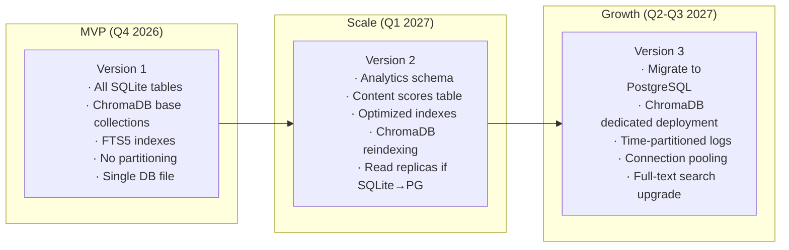
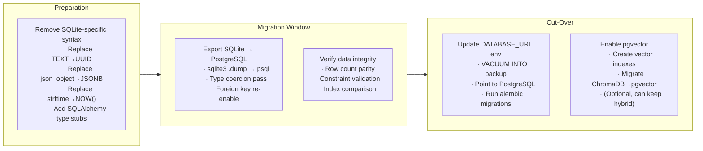

# Database Design: BrandOS

## Document Info

| Field | Value |
|-------|-------|
| **Author** | Architecture Team |
| **Status** | Draft |
| **Created** | 2026-06-26 |
| **Last Updated** | 2026-06-26 |
| **Relational Engine** | SQLite 3.x (WAL mode) |
| **Vector Engine** | ChromaDB (persistent client) |
| **Migration Tool** | Alembic (SQLite) + Python script (ChromaDB) |

---

## Table of Contents

- [Architecture Overview](#1-architecture-overview)
- [SQLite Schema](#2-sqlite-schema)
- [ChromaDB Collections](#3-chromadb-collections)
- [Indexes](#4-indexes)
- [Relationships & ER Diagram](#5-relationships--er-diagram)
- [Query Patterns](#6-query-patterns)
- [Migration Strategy](#7-migration-strategy)
- [Backup & Recovery](#8-backup--recovery)
- [Connection & Session Management](#9-connection--session-management)
- [Future Expansion](#10-future-expansion)

---

## 1. Architecture Overview

### 1.1 Hybrid Engine Decision

BrandOS uses **two database engines** with clear separation of concerns:

| Concern | Engine | Rationale |
|---------|--------|-----------|
| **Relational data** (users, profiles, content, schedules, notifications) | SQLite | Zero-operational overhead, single-file portability, WAL mode for concurrent reads, ACID-compliant. Sufficient for single-user SaaS and small-team MVPs. |
| **Vector data** (embeddings for knowledge items, style profiles, content similarity) | ChromaDB | Purpose-built for vector search with HNSW indexing, metadata filtering, automatic embedding management. Replaces pgvector to decouple vector ops from relational schema. |

**Migration trigger**: When user count exceeds 500 or any table exceeds 1M rows, migrate SQLite to PostgreSQL (see §10.1). When vector count exceeds 100K per tenant, scale ChromaDB to dedicated deployment (see §10.2).

### 1.2 Data Ownership Per Engine

```
┌──────────────────────────────────────────────────┐
│                  SQLite (brandos.db)              │
│                                                   │
│  auth/       → users, sessions, tokens            │
│  profile/    → profiles, expertise, preferences   │
│  github/     → repos, commits, pull_requests      │
│  kb/         → knowledge_items, tags              │
│  trend/      → trending_topics, sources           │
│  content/    → drafts, revisions, briefs, ideas   │
│  style/      → profiles, signals, ratings         │
│  platform/   → connections, schedules, logs       │
│  analytics/  → cache                              │
│  notification/ → logs, preferences                │
└──────────────────────────────────────────────────┘

┌──────────────────────────────────────────────────┐
│               ChromaDB (./chromadb/)               │
│                                                   │
│  kb_embeddings         → Knowledge item vectors   │
│  style_vectors         → Voice fingerprint vectors│
│  content_embeddings    → Draft/idea similarity    │
│  github_code_embeddings → Code understanding      │
└──────────────────────────────────────────────────┘
```

### 1.3 Key Design Decisions

| Decision | Choice | Rationale |
|----------|--------|-----------|
| **SQLite over PostgreSQL for MVP** | SQLite | No server process, zero configuration, single-file backup, ideal for single-user/small-team SaaS. WAL mode provides concurrent reads + single writer. |
| **ChromaDB over pgvector** | ChromaDB | Decouples vector scaling from relational schema. ChromaDB handles embedding storage, HNSW indexing, and metadata filtering natively. Enables independent scaling and future dedicated deployment. |
| **WAL mode** | Enabled | Allows concurrent reads while writing. Critical for brief generation (reads) during background ingestion (writes). |
| **Foreign keys** | Enabled via `PRAGMA foreign_keys = ON` | Referential integrity enforced at the engine level. Must be set per-connection. |
| **Journal mode** | WAL (Write-Ahead Log) | Better concurrent read performance than traditional rollback journal. Crash-safe. |
| **Synchronous setting** | NORMAL | Balances durability vs. performance. WAL mode with NORMAL is crash-safe with ~1s of potential data loss on power failure. |
| **ChromaDB persist** | PersistentClient | Data written to disk immediately. No in-memory-only risk. |

---

## 2. SQLite Schema

### 2.1 Database Configuration

```sql
-- Applied per-connection on session creation
PRAGMA journal_mode = WAL;
PRAGMA synchronous = NORMAL;
PRAGMA foreign_keys = ON;
PRAGMA busy_timeout = 5000;          -- 5 second busy wait
PRAGMA cache_size = -40000;          -- 40MB cache
PRAGMA temp_store = MEMORY;
PRAGMA mmap_size = 268435456;        -- 256MB memory-mapped I/O
```

### 2.2 `auth` — Authentication & Identity

```sql
CREATE TABLE IF NOT EXISTS auth_users (
    id              TEXT PRIMARY KEY DEFAULT (lower(hex(randomblob(16)))),
    email           TEXT NOT NULL UNIQUE,
    password_hash   TEXT,                              -- NULL for OAuth-only users
    display_name    TEXT NOT NULL,
    avatar_url      TEXT,
    email_verified  INTEGER NOT NULL DEFAULT 0,         -- 0 = false, 1 = true
    is_active       INTEGER NOT NULL DEFAULT 1,
    created_at      TEXT NOT NULL DEFAULT (strftime('%Y-%m-%dT%H:%M:%fZ', 'now')),
    last_active_at  TEXT,
    CONSTRAINT email_format CHECK (email LIKE '%@%.%' AND email NOT LIKE '%..%')
);

CREATE TABLE IF NOT EXISTS auth_user_providers (
    id              TEXT PRIMARY KEY DEFAULT (lower(hex(randomblob(16)))),
    user_id         TEXT NOT NULL REFERENCES auth_users(id) ON DELETE CASCADE,
    provider        TEXT NOT NULL,                      -- 'google', 'github', 'linkedin', 'email'
    external_id     TEXT NOT NULL,                      -- Provider's user ID
    UNIQUE (provider, external_id)
);

CREATE TABLE IF NOT EXISTS auth_sessions (
    id              TEXT PRIMARY KEY DEFAULT (lower(hex(randomblob(16)))),
    user_id         TEXT NOT NULL REFERENCES auth_users(id) ON DELETE CASCADE,
    refresh_token   TEXT NOT NULL UNIQUE,
    expires_at      TEXT NOT NULL,
    is_revoked      INTEGER NOT NULL DEFAULT 0,
    created_at      TEXT NOT NULL DEFAULT (strftime('%Y-%m-%dT%H:%M:%fZ', 'now')),
    revoked_at      TEXT
);

CREATE TABLE IF NOT EXISTS auth_platform_tokens (
    id                      TEXT PRIMARY KEY DEFAULT (lower(hex(randomblob(16)))),
    user_id                 TEXT NOT NULL REFERENCES auth_users(id) ON DELETE CASCADE,
    platform                TEXT NOT NULL,               -- 'linkedin', 'github', 'twitter'
    encrypted_access_token  TEXT NOT NULL,
    encrypted_refresh_token TEXT,
    expires_at              TEXT,
    token_metadata          TEXT DEFAULT '{}',            -- JSON string
    created_at              TEXT NOT NULL DEFAULT (strftime('%Y-%m-%dT%H:%M:%fZ', 'now')),
    updated_at              TEXT NOT NULL DEFAULT (strftime('%Y-%m-%dT%H:%M:%fZ', 'now')),
    UNIQUE (user_id, platform)
);
```

### 2.3 `profile` — User Profiles & Preferences

```sql
CREATE TABLE IF NOT EXISTS profile_user_profiles (
    id                  TEXT PRIMARY KEY DEFAULT (lower(hex(randomblob(16)))),
    user_id             TEXT NOT NULL UNIQUE REFERENCES auth_users(id) ON DELETE CASCADE,
    bio                 TEXT,
    avatar_url          TEXT,
    linkedin_url        TEXT,
    github_username     TEXT,
    headline            TEXT,                            -- Professional headline
    onboarding_complete INTEGER NOT NULL DEFAULT 0,
    updated_at          TEXT NOT NULL DEFAULT (strftime('%Y-%m-%dT%H:%M:%fZ', 'now'))
);

CREATE TABLE IF NOT EXISTS profile_expertise_areas (
    id              TEXT PRIMARY KEY DEFAULT (lower(hex(randomblob(16)))),
    user_id         TEXT NOT NULL REFERENCES auth_users(id) ON DELETE CASCADE,
    name            TEXT NOT NULL,
    category        TEXT NOT NULL,                       -- 'ai', 'programming', 'infra', 'research'
    priority        INTEGER NOT NULL DEFAULT 1,
    keywords        TEXT NOT NULL DEFAULT '[]',          -- JSON array
    created_at      TEXT NOT NULL DEFAULT (strftime('%Y-%m-%dT%H:%M:%fZ', 'now')),
    UNIQUE (user_id, name)
);

CREATE TABLE IF NOT EXISTS profile_user_preferences (
    id                  TEXT PRIMARY KEY DEFAULT (lower(hex(randomblob(16)))),
    user_id             TEXT NOT NULL UNIQUE REFERENCES auth_users(id) ON DELETE CASCADE,
    posting_cadence     TEXT NOT NULL DEFAULT 'daily',
    timezone            TEXT NOT NULL DEFAULT 'UTC',
    brief_hour          INTEGER NOT NULL DEFAULT 8,
    default_tone        TEXT NOT NULL DEFAULT 'conversational',
    default_length      TEXT NOT NULL DEFAULT 'medium',
    digest_enabled      INTEGER NOT NULL DEFAULT 1,
    created_at          TEXT NOT NULL DEFAULT (strftime('%Y-%m-%dT%H:%M:%fZ', 'now')),
    updated_at          TEXT NOT NULL DEFAULT (strftime('%Y-%m-%dT%H:%M:%fZ', 'now')),
    CONSTRAINT valid_cadence CHECK (posting_cadence IN ('daily', 'weekdays', 'mon_wed_fri', 'weekly')),
    CONSTRAINT valid_tone CHECK (default_tone IN ('conversational', 'professional', 'technical', 'inspirational')),
    CONSTRAINT valid_length CHECK (default_length IN ('short', 'medium', 'long')),
    CONSTRAINT valid_brief_hour CHECK (brief_hour >= 0 AND brief_hour <= 23)
);
```

### 2.4 `github` — Repository & Activity Data

```sql
CREATE TABLE IF NOT EXISTS github_repositories (
    id              TEXT PRIMARY KEY DEFAULT (lower(hex(randomblob(16)))),
    user_id         TEXT NOT NULL REFERENCES auth_users(id) ON DELETE CASCADE,
    external_id     INTEGER NOT NULL,
    name            TEXT NOT NULL,
    full_name       TEXT NOT NULL,
    description     TEXT,
    url             TEXT NOT NULL,
    language        TEXT,
    languages       TEXT NOT NULL DEFAULT '{}',          -- JSON object
    topics          TEXT NOT NULL DEFAULT '[]',          -- JSON array
    stars           INTEGER NOT NULL DEFAULT 0,
    forks           INTEGER NOT NULL DEFAULT 0,
    is_archived     INTEGER NOT NULL DEFAULT 0,
    is_fork         INTEGER NOT NULL DEFAULT 0,
    last_push_at    TEXT,
    is_analyzed     INTEGER NOT NULL DEFAULT 0,
    created_at      TEXT NOT NULL DEFAULT (strftime('%Y-%m-%dT%H:%M:%fZ', 'now')),
    updated_at      TEXT NOT NULL DEFAULT (strftime('%Y-%m-%dT%H:%M:%fZ', 'now')),
    UNIQUE (user_id, external_id)
);

CREATE TABLE IF NOT EXISTS github_commits (
    id              TEXT PRIMARY KEY DEFAULT (lower(hex(randomblob(16)))),
    user_id         TEXT NOT NULL REFERENCES auth_users(id) ON DELETE CASCADE,
    repo_id         TEXT NOT NULL REFERENCES github_repositories(id) ON DELETE CASCADE,
    sha             TEXT NOT NULL,
    message         TEXT NOT NULL,
    author_name     TEXT NOT NULL,
    author_avatar   TEXT,
    committed_at    TEXT NOT NULL,
    url             TEXT NOT NULL,
    files_changed   TEXT NOT NULL DEFAULT '[]',          -- JSON array
    additions       INTEGER DEFAULT 0,
    deletions       INTEGER DEFAULT 0,
    created_at      TEXT NOT NULL DEFAULT (strftime('%Y-%m-%dT%H:%M:%fZ', 'now')),
    UNIQUE (user_id, sha)
);

CREATE TABLE IF NOT EXISTS github_pull_requests (
    id              TEXT PRIMARY KEY DEFAULT (lower(hex(randomblob(16)))),
    user_id         TEXT NOT NULL REFERENCES auth_users(id) ON DELETE CASCADE,
    repo_id         TEXT NOT NULL REFERENCES github_repositories(id) ON DELETE CASCADE,
    external_id     INTEGER NOT NULL,
    title           TEXT NOT NULL,
    body            TEXT,
    state           TEXT NOT NULL,                        -- 'open', 'merged', 'closed'
    created_at      TEXT NOT NULL,
    merged_at       TEXT,
    url             TEXT NOT NULL,
    labels          TEXT NOT NULL DEFAULT '[]',            -- JSON array
    UNIQUE (user_id, repo_id, external_id)
);
```

### 2.5 `kb` — Knowledge Base

```sql
CREATE TABLE IF NOT EXISTS kb_knowledge_items (
    id                  TEXT PRIMARY KEY DEFAULT (lower(hex(randomblob(16)))),
    user_id             TEXT NOT NULL REFERENCES auth_users(id) ON DELETE CASCADE,
    url                 TEXT,
    title               TEXT NOT NULL,
    summary             TEXT,
    extracted_text      TEXT,
    notes               TEXT,
    source_type         TEXT NOT NULL,                    -- 'url', 'note', 'pdf', 'import'
    content_type        TEXT NOT NULL,                    -- 'article', 'paper', 'tutorial', 'idea', 'reference', 'other'
    metadata            TEXT NOT NULL DEFAULT '{}',       -- JSON object
    reading_time_minutes INTEGER,
    processing_status   TEXT NOT NULL DEFAULT 'pending',  -- 'pending', 'processing', 'completed', 'failed'
    error_message       TEXT,
    saved_at            TEXT NOT NULL DEFAULT (strftime('%Y-%m-%dT%H:%M:%fZ', 'now')),
    updated_at          TEXT NOT NULL DEFAULT (strftime('%Y-%m-%dT%H:%M:%fZ', 'now')),
    CONSTRAINT valid_source_type CHECK (source_type IN ('url', 'note', 'pdf', 'import')),
    CONSTRAINT valid_content_type CHECK (content_type IN ('article', 'paper', 'tutorial', 'idea', 'reference', 'other'))
);

CREATE TABLE IF NOT EXISTS kb_knowledge_tags (
    id                  TEXT PRIMARY KEY DEFAULT (lower(hex(randomblob(16)))),
    knowledge_item_id   TEXT NOT NULL REFERENCES kb_knowledge_items(id) ON DELETE CASCADE,
    tag                 TEXT NOT NULL,
    is_auto_generated   INTEGER NOT NULL DEFAULT 0,
    UNIQUE (knowledge_item_id, tag)
);

-- ChromaDB replaces the kb_knowledge_embeddings table from the PostgreSQL design.
-- Vector data is stored in ChromaDB collection 'kb_embeddings'.
-- The relational metadata (item_id, model_version, created_at) is stored here
-- as a reference pointer to the ChromaDB entry.
CREATE TABLE IF NOT EXISTS kb_embedding_refs (
    id                  TEXT PRIMARY KEY DEFAULT (lower(hex(randomblob(16)))),
    knowledge_item_id   TEXT NOT NULL UNIQUE REFERENCES kb_knowledge_items(id) ON DELETE CASCADE,
    chroma_id           TEXT NOT NULL,                   -- ChromaDB entry ID
    model_version       TEXT NOT NULL,
    created_at          TEXT NOT NULL DEFAULT (strftime('%Y-%m-%dT%H:%M:%fZ', 'now'))
);
```

### 2.6 `trend` — Trending Topics

```sql
CREATE TABLE IF NOT EXISTS trend_trending_topics (
    id                  TEXT PRIMARY KEY DEFAULT (lower(hex(randomblob(16)))),
    title               TEXT NOT NULL,
    description         TEXT,
    source              TEXT NOT NULL,                    -- 'rss', 'arxiv', 'hackernews', 'reddit'
    source_url          TEXT,
    relevance_score     REAL NOT NULL DEFAULT 0.0,
    freshness_score     REAL NOT NULL DEFAULT 0.0,
    engagement_count    INTEGER NOT NULL DEFAULT 0,
    related_keywords    TEXT NOT NULL DEFAULT '[]',       -- JSON array
    first_seen_at       TEXT NOT NULL DEFAULT (strftime('%Y-%m-%dT%H:%M:%fZ', 'now')),
    last_seen_at        TEXT NOT NULL DEFAULT (strftime('%Y-%m-%dT%H:%M:%fZ', 'now'))
);

CREATE TABLE IF NOT EXISTS trend_trend_sources (
    id                  TEXT PRIMARY KEY DEFAULT (lower(hex(randomblob(16)))),
    name                TEXT NOT NULL UNIQUE,
    url                 TEXT NOT NULL,
    source_type         TEXT NOT NULL,                    -- 'rss', 'api', 'scrape'
    is_active           INTEGER NOT NULL DEFAULT 1,
    poll_interval_minutes INTEGER NOT NULL DEFAULT 60,
    last_polled_at      TEXT,
    created_at          TEXT NOT NULL DEFAULT (strftime('%Y-%m-%dT%H:%M:%fZ', 'now'))
);
```

### 2.7 `content` — Drafts, Revisions, Briefs

```sql
CREATE TABLE IF NOT EXISTS content_content_drafts (
    id                  TEXT PRIMARY KEY DEFAULT (lower(hex(randomblob(16)))),
    user_id             TEXT NOT NULL REFERENCES auth_users(id) ON DELETE CASCADE,
    title               TEXT NOT NULL,
    body                TEXT NOT NULL,
    status              TEXT NOT NULL DEFAULT 'draft',    -- 'draft', 'approved', 'scheduled', 'published', 'archived'
    tone                TEXT,
    length              TEXT,
    content_type        TEXT,                             -- ContentCategory enum value
    generation_metadata TEXT NOT NULL DEFAULT '{}',       -- JSON object
    quality_scores      TEXT NOT NULL DEFAULT '{}',       -- JSON object
    source_idea_id      TEXT,                             -- References content_brief_ideas.id
    revision            INTEGER NOT NULL DEFAULT 1,
    word_count          INTEGER,
    created_at          TEXT NOT NULL DEFAULT (strftime('%Y-%m-%dT%H:%M:%fZ', 'now')),
    updated_at          TEXT NOT NULL DEFAULT (strftime('%Y-%m-%dT%H:%M:%fZ', 'now')),
    CONSTRAINT valid_status CHECK (status IN ('draft', 'approved', 'scheduled', 'published', 'archived'))
);

CREATE TABLE IF NOT EXISTS content_draft_revisions (
    id              TEXT PRIMARY KEY DEFAULT (lower(hex(randomblob(16)))),
    draft_id        TEXT NOT NULL REFERENCES content_content_drafts(id) ON DELETE CASCADE,
    body            TEXT NOT NULL,
    diff            TEXT,                                 -- Unified diff from previous revision
    change_source   TEXT NOT NULL,                        -- 'generation', 'user_edit', 'regeneration', 'style_refine'
    created_at      TEXT NOT NULL DEFAULT (strftime('%Y-%m-%dT%H:%M:%fZ', 'now'))
);

CREATE TABLE IF NOT EXISTS content_content_briefs (
    id                  TEXT PRIMARY KEY DEFAULT (lower(hex(randomblob(16)))),
    user_id             TEXT NOT NULL REFERENCES auth_users(id) ON DELETE CASCADE,
    brief_date          TEXT NOT NULL,                    -- ISO date: YYYY-MM-DD
    context_summary     TEXT,
    signal_quality      TEXT NOT NULL DEFAULT '{}',       -- JSON object
    generated_at        TEXT NOT NULL DEFAULT (strftime('%Y-%m-%dT%H:%M:%fZ', 'now')),
    viewed_at           TEXT,
    UNIQUE (user_id, brief_date)
);

CREATE TABLE IF NOT EXISTS content_brief_ideas (
    id                      TEXT PRIMARY KEY DEFAULT (lower(hex(randomblob(16)))),
    brief_id                TEXT NOT NULL REFERENCES content_content_briefs(id) ON DELETE CASCADE,
    title                   TEXT NOT NULL,
    description             TEXT,
    category                TEXT NOT NULL,                 -- 'technical', 'career', 'industry', 'opinion', 'tutorial'
    relevance_score         REAL NOT NULL,
    novelty_score           REAL NOT NULL,
    source_type             TEXT NOT NULL,                 -- 'github', 'knowledge', 'trend', 'mixed'
    source_detail           TEXT,
    source_knowledge_item_id TEXT,                         -- References kb_knowledge_items(id)
    created_at              TEXT NOT NULL DEFAULT (strftime('%Y-%m-%dT%H:%M:%fZ', 'now'))
);
```

### 2.8 `style` — Writing Style & Voice

```sql
CREATE TABLE IF NOT EXISTS style_style_profiles (
    id                  TEXT PRIMARY KEY DEFAULT (lower(hex(randomblob(16)))),
    user_id             TEXT NOT NULL UNIQUE REFERENCES auth_users(id) ON DELETE CASCADE,
    style_params        TEXT NOT NULL DEFAULT '{}',       -- JSON object: { formality, vocab_level, sentence_length, ... }
    learning_rate       REAL NOT NULL DEFAULT 0.1,
    confidence          REAL NOT NULL DEFAULT 0.0,
    total_ratings       INTEGER NOT NULL DEFAULT 0,
    total_edits         INTEGER NOT NULL DEFAULT 0,
    total_approved      INTEGER NOT NULL DEFAULT 0,
    created_at          TEXT NOT NULL DEFAULT (strftime('%Y-%m-%dT%H:%M:%fZ', 'now')),
    updated_at          TEXT NOT NULL DEFAULT (strftime('%Y-%m-%dT%H:%M:%fZ', 'now'))
);

CREATE TABLE IF NOT EXISTS style_style_signals (
    id                  TEXT PRIMARY KEY DEFAULT (lower(hex(randomblob(16)))),
    profile_id          TEXT NOT NULL REFERENCES style_style_profiles(id) ON DELETE CASCADE,
    source_draft_id     TEXT,                             -- References content_content_drafts(id)
    signal_type         TEXT NOT NULL,                     -- 'rating', 'edit', 'approval', 'rejection', 'import'
    signal_data         TEXT NOT NULL,                     -- JSON object
    weight              REAL NOT NULL DEFAULT 1.0,
    recorded_at         TEXT NOT NULL DEFAULT (strftime('%Y-%m-%dT%H:%M:%fZ', 'now'))
);

CREATE TABLE IF NOT EXISTS style_ratings (
    id              TEXT PRIMARY KEY DEFAULT (lower(hex(randomblob(16)))),
    user_id         TEXT NOT NULL REFERENCES auth_users(id) ON DELETE CASCADE,
    draft_id        TEXT NOT NULL REFERENCES content_content_drafts(id) ON DELETE CASCADE,
    score           INTEGER NOT NULL CHECK (score >= 1 AND score <= 5),
    comment         TEXT,
    dimension_scores TEXT,                                -- JSON object: { relevance, clarity, authenticity, ... }
    created_at      TEXT NOT NULL DEFAULT (strftime('%Y-%m-%dT%H:%M:%fZ', 'now')),
    UNIQUE (user_id, draft_id)
);
```

### 2.9 `platform` — Publishing & Scheduling

```sql
CREATE TABLE IF NOT EXISTS platform_platform_connections (
    id              TEXT PRIMARY KEY DEFAULT (lower(hex(randomblob(16)))),
    user_id         TEXT NOT NULL REFERENCES auth_users(id) ON DELETE CASCADE,
    platform        TEXT NOT NULL,                        -- 'linkedin', 'twitter'
    external_user_id TEXT,
    is_active       INTEGER NOT NULL DEFAULT 1,
    connected_at    TEXT NOT NULL DEFAULT (strftime('%Y-%m-%dT%H:%M:%fZ', 'now')),
    last_sync_at    TEXT,
    UNIQUE (user_id, platform)
);

CREATE TABLE IF NOT EXISTS platform_scheduled_posts (
    id                  TEXT PRIMARY KEY DEFAULT (lower(hex(randomblob(16)))),
    draft_id            TEXT NOT NULL REFERENCES content_content_drafts(id) ON DELETE CASCADE,
    user_id             TEXT NOT NULL REFERENCES auth_users(id) ON DELETE CASCADE,
    platform            TEXT NOT NULL,
    scheduled_for       TEXT NOT NULL,
    status              TEXT NOT NULL DEFAULT 'pending',  -- 'pending', 'published', 'failed', 'cancelled'
    external_post_id    TEXT,
    format_params       TEXT NOT NULL DEFAULT '{}',       -- JSON object
    published_at        TEXT,
    created_at          TEXT NOT NULL DEFAULT (strftime('%Y-%m-%dT%H:%M:%fZ', 'now')),
    updated_at          TEXT NOT NULL DEFAULT (strftime('%Y-%m-%dT%H:%M:%fZ', 'now')),
    CONSTRAINT valid_schedule_status CHECK (status IN ('pending', 'published', 'failed', 'cancelled'))
);

CREATE TABLE IF NOT EXISTS platform_publish_logs (
    id                  TEXT PRIMARY KEY DEFAULT (lower(hex(randomblob(16)))),
    scheduled_post_id   TEXT REFERENCES platform_scheduled_posts(id) ON DELETE SET NULL,
    draft_id            TEXT REFERENCES content_content_drafts(id) ON DELETE SET NULL,
    user_id             TEXT NOT NULL REFERENCES auth_users(id) ON DELETE CASCADE,
    platform            TEXT NOT NULL,
    status              TEXT NOT NULL,                    -- 'success', 'failed'
    response            TEXT,                             -- JSON: API response data
    error_message       TEXT,
    attempt_number      INTEGER NOT NULL DEFAULT 1,
    attempted_at        TEXT NOT NULL DEFAULT (strftime('%Y-%m-%dT%H:%M:%fZ', 'now'))
);

CREATE TABLE IF NOT EXISTS platform_analytics_cache (
    id                  TEXT PRIMARY KEY DEFAULT (lower(hex(randomblob(16)))),
    user_id             TEXT NOT NULL REFERENCES auth_users(id) ON DELETE CASCADE,
    platform            TEXT NOT NULL,
    external_post_id    TEXT NOT NULL,
    data                TEXT NOT NULL,                    -- JSON object
    fetched_at          TEXT NOT NULL DEFAULT (strftime('%Y-%m-%dT%H:%M:%fZ', 'now')),
    UNIQUE (user_id, platform, external_post_id)
);
```

### 2.10 `notification` — Notifications

```sql
CREATE TABLE IF NOT EXISTS notification_notification_logs (
    id                  TEXT PRIMARY KEY DEFAULT (lower(hex(randomblob(16)))),
    user_id             TEXT NOT NULL REFERENCES auth_users(id) ON DELETE CASCADE,
    notification_type   TEXT NOT NULL,
    channel             TEXT NOT NULL,                    -- 'in_app', 'email', 'push'
    title               TEXT NOT NULL,
    body                TEXT NOT NULL,
    payload             TEXT,                             -- JSON object
    is_read             INTEGER NOT NULL DEFAULT 0,
    delivered           INTEGER NOT NULL DEFAULT 0,
    sent_at             TEXT NOT NULL DEFAULT (strftime('%Y-%m-%dT%H:%M:%fZ', 'now')),
    read_at             TEXT
);

CREATE TABLE IF NOT EXISTS notification_notification_preferences (
    id                      TEXT PRIMARY KEY DEFAULT (lower(hex(randomblob(16)))),
    user_id                 TEXT NOT NULL UNIQUE REFERENCES auth_users(id) ON DELETE CASCADE,
    email_digest_frequency  TEXT NOT NULL DEFAULT 'daily',
    brief_notifications     INTEGER NOT NULL DEFAULT 1,
    publish_notifications   INTEGER NOT NULL DEFAULT 1,
    engagement_notifications INTEGER NOT NULL DEFAULT 1,
    marketing_emails        INTEGER NOT NULL DEFAULT 0,
    created_at              TEXT NOT NULL DEFAULT (strftime('%Y-%m-%dT%H:%M:%fZ', 'now')),
    updated_at              TEXT NOT NULL DEFAULT (strftime('%Y-%m-%dT%H:%M:%fZ', 'now'))
);
```

### 2.11 `analytics` — Aggregated Analytics

```sql
CREATE TABLE IF NOT EXISTS analytics_daily_metrics (
    id                  TEXT PRIMARY KEY DEFAULT (lower(hex(randomblob(16)))),
    user_id             TEXT NOT NULL REFERENCES auth_users(id) ON DELETE CASCADE,
    date                TEXT NOT NULL,                    -- YYYY-MM-DD
    total_impressions   INTEGER NOT NULL DEFAULT 0,
    total_engagement    INTEGER NOT NULL DEFAULT 0,
    total_posts         INTEGER NOT NULL DEFAULT 0,
    follower_count      INTEGER DEFAULT 0,
    engagement_rate     REAL DEFAULT 0.0,
    top_post_id         TEXT,
    metadata            TEXT NOT NULL DEFAULT '{}',
    UNIQUE (user_id, date)
);

CREATE TABLE IF NOT EXISTS analytics_content_scores (
    id                  TEXT PRIMARY KEY DEFAULT (lower(hex(randomblob(16)))),
    draft_id            TEXT NOT NULL UNIQUE REFERENCES content_content_drafts(id) ON DELETE CASCADE,
    user_id             TEXT NOT NULL REFERENCES auth_users(id) ON DELETE CASCADE,
    authority_score     REAL DEFAULT 0.0,
    engagement_score    REAL DEFAULT 0.0,
    readability_score   REAL DEFAULT 0.0,
    authenticity_score  REAL DEFAULT 0.0,
    calculated_at       TEXT NOT NULL DEFAULT (strftime('%Y-%m-%dT%H:%M:%fZ', 'now'))
);
```

---

## 3. ChromaDB Collections

### 3.1 Collection Architecture

ChromaDB runs as a `PersistentClient` stored at `./chromadb/` in the project root. Each collection stores embeddings and their associated metadata. The metadata field serves as the join key back to SQLite rows.

```
chromadb/
├── chroma.sqlite3            # ChromaDB internal metadata
└── persist/                  # HNSW index + vector storage per collection
    ├── kb_embeddings/
    ├── style_vectors/
    ├── content_embeddings/
    └── github_code_embeddings/
```

### 3.2 Collection Definitions

#### Collection: `kb_embeddings`

**Purpose**: Semantic search over knowledge base items. Powers the hybrid search in §6.3.

| Property | Value |
|----------|-------|
| `name` | `kb_embeddings` |
| `embedding_function` | `text-embedding-3-small` (768-d) or `all-MiniLM-L6-v2` (384-d) |
| `distance_function` | `cosine` |

**Metadata schema** (stored per ChromaDB entry):

| Key | Type | Description |
|-----|------|-------------|
| `knowledge_item_id` | `str` | FK to `kb_knowledge_items.id` |
| `user_id` | `str` | FK to `auth_users.id` |
| `content_type` | `str` | `article`, `paper`, `tutorial`, etc. |
| `source_type` | `str` | `url`, `note`, `pdf`, `import` |
| `title` | `str` | Item title (for display) |
| `tags` | `List[str]` | Auto-generated + user tags |
| `saved_at` | `str` | ISO timestamp |
| `model_version` | `str` | Embedding model ID |

```python
import chromadb

chroma_client = chromadb.PersistentClient(path="./chromadb")

kb_collection = chroma_client.get_or_create_collection(
    name="kb_embeddings",
    metadata={"hnsw:space": "cosine", "hnsw:M": 32, "hnsw:ef_construction": 200}
)

# Add embedding
kb_collection.add(
    ids=["kb_emb_001"],
    embeddings=[[0.1, 0.2, ...]],  # 768-d vector
    metadatas=[{
        "knowledge_item_id": "abc123",
        "user_id": "user_456",
        "content_type": "article",
        "title": "Understanding Attention Mechanisms",
        "tags": ["deep-learning", "nlp", "attention"],
        "saved_at": "2026-06-25T10:00:00Z",
        "model_version": "text-embedding-3-small-v2"
    }],
    documents=["Extracted text or summary of the article"]
)

# Search
results = kb_collection.query(
    query_embeddings=[[0.05, 0.15, ...]],
    n_results=10,
    where={"user_id": "user_456"},           # Metadata filter
    where_document={"$contains": "attention"}  # Document filter
)
```

#### Collection: `style_vectors`

**Purpose**: Voice fingerprint vectors per user. Used to compare drafts against the user's established style for consistency scoring.

| Property | Value |
|----------|-------|
| `name` | `style_vectors` |
| `embedding_function` | Custom (style analysis output) |
| `distance_function` | `cosine` |

**Metadata schema**:

| Key | Type | Description |
|-----|------|-------------|
| `user_id` | `str` | FK to `auth_users.id` |
| `profile_id` | `str` | FK to `style_style_profiles.id` |
| `version` | `int` | Incrementing profile version |
| `confidence` | `float` | Current confidence score |
| `updated_at` | `str` | ISO timestamp |

**Usage**: Each user has exactly one active style vector. When the style profile is updated (after ratings/edits), the old vector is updated in-place or replaced.

```python
style_collection = chroma_client.get_or_create_collection(
    name="style_vectors",
    metadata={"hnsw:space": "cosine"}
)

# Each user has one style vector
style_collection.upsert(
    ids=["style_user_456"],
    embeddings=[[0.3, 0.1, ...]],
    metadatas=[{
        "user_id": "user_456",
        "profile_id": "prof_789",
        "version": 12,
        "confidence": 0.78,
        "updated_at": "2026-06-26T08:00:00Z"
    }]
)
```

#### Collection: `content_embeddings`

**Purpose**: Semantic similarity between drafts and ideas. Used for deduplication during idea generation and "find similar content" features.

| Property | Value |
|----------|-------|
| `name` | `content_embeddings` |
| `embedding_function` | `text-embedding-3-small` (768-d) |
| `distance_function` | `cosine` |

**Metadata schema**:

| Key | Type | Description |
|-----|------|-------------|
| `draft_id` | `str` | FK to `content_content_drafts.id` OR `content_brief_ideas.id` |
| `user_id` | `str` | FK to `auth_users.id` |
| `content_type` | `str` | `draft`, `idea` |
| `status` | `str` | Current draft status |
| `created_at` | `str` | ISO timestamp |

#### Collection: `github_code_embeddings`

**Purpose**: Code understanding for technical content generation. Embedding of repository code context (README files, key code snippets) to help the LLM understand the user's technical stack.

| Property | Value |
|----------|-------|
| `name` | `github_code_embeddings` |
| `embedding_function` | `text-embedding-3-small` (768-d) or `starencoder` (code-specific) |
| `distance_function` | `cosine` |

**Metadata schema**:

| Key | Type | Description |
|-----|------|-------------|
| `repo_id` | `str` | FK to `github_repositories.id` |
| `user_id` | `str` | FK to `auth_users.id` |
| `language` | `str` | Primary language |
| `file_type` | `str` | `readme`, `code_sample`, `api_doc` |
| `stars` | `int` | Repository stars |

### 3.3 Embedding Pipeline

```python
# Pseudocode for the processing pipeline
class EmbeddingPipeline:
    """Handles embedding generation and ChromaDB sync."""

    def __init__(self, chroma_client, embedding_model, llm_client):
        self.kb = chroma_client.get_collection("kb_embeddings")
        self.style = chroma_client.get_collection("style_vectors")
        self.content = chroma_client.get_collection("content_embeddings")
        self.model = embedding_model
        self.llm = llm_client

    async def embed_knowledge_item(self, item: KnowledgeItem) -> str:
        """Generate embedding for a knowledge item and store in ChromaDB."""
        text = f"{item.title}\n\n{item.summary or ''}\n\n{item.extracted_text or ''}"
        embedding = self.model.embed(text)

        chroma_id = f"kb_{item.id}"
        self.kb.upsert(
            ids=[chroma_id],
            embeddings=[embedding],
            metadatas=[{
                "knowledge_item_id": item.id,
                "user_id": item.user_id,
                "content_type": item.content_type,
                "source_type": item.source_type,
                "title": item.title,
                "tags": await self._get_tags(item.id),
                "saved_at": item.saved_at,
                "model_version": self.model.version
            }],
            documents=[text[:1000]]
        )
        return chroma_id

    async def update_style_vector(self, profile: StyleProfile) -> str:
        """Update or create a user's style vector."""
        # Style vector is generated by the style analysis pipeline
        # from aggregated signal data (lexical, syntactic, tonal, structural)
        embedding = self.model.embed(json.dumps(profile.style_params))
        chroma_id = f"style_{profile.user_id}"

        self.style.upsert(
            ids=[chroma_id],
            embeddings=[embedding],
            metadatas=[{
                "user_id": profile.user_id,
                "profile_id": profile.id,
                "version": profile.version,
                "confidence": profile.confidence,
                "updated_at": profile.updated_at
            }]
        )
        return chroma_id
```

---

## 4. Indexes

### 4.1 SQLite Indexes

SQLite automatically creates indexes for `PRIMARY KEY` and `UNIQUE` constraints. Additional indexes are created for query performance.

```sql
-- === AUTH ===
-- Fast user lookup by email (UNIQUE index auto-created)
-- Fast session lookup by refresh token (UNIQUE index auto-created)

CREATE INDEX idx_sessions_user_active ON auth_sessions (user_id)
    WHERE is_revoked = 0;

CREATE INDEX idx_platform_tokens_user_platform ON auth_platform_tokens (user_id, platform);

-- === PROFILE ===
CREATE INDEX idx_expertise_user_id ON profile_expertise_areas (user_id);
CREATE INDEX idx_expertise_user_category ON profile_expertise_areas (user_id, category);

-- === GITHUB ===
CREATE INDEX idx_repositories_user ON github_repositories (user_id);
CREATE INDEX idx_repositories_user_analyzed ON github_repositories (user_id, is_analyzed);

CREATE INDEX idx_commits_user_date ON github_commits (user_id, committed_at DESC);
CREATE INDEX idx_commits_repo_date ON github_commits (repo_id, committed_at DESC);

CREATE INDEX idx_prs_user_state ON github_pull_requests (user_id, state);
CREATE INDEX idx_prs_repo_state ON github_pull_requests (repo_id, state);

-- === KNOWLEDGE BASE ===
CREATE INDEX idx_kb_items_user_date ON kb_knowledge_items (user_id, saved_at DESC);
CREATE INDEX idx_kb_items_user_type ON kb_knowledge_items (user_id, content_type);
CREATE INDEX idx_kb_items_status ON kb_knowledge_items (processing_status);
CREATE INDEX idx_kb_items_user_status ON kb_knowledge_items (user_id, processing_status);

CREATE INDEX idx_kb_tags_tag ON kb_knowledge_tags (tag);
CREATE INDEX idx_kb_tags_item ON kb_knowledge_tags (knowledge_item_id);

CREATE INDEX idx_kb_embedding_refs_item ON kb_embedding_refs (knowledge_item_id);
CREATE INDEX idx_kb_embedding_refs_model ON kb_embedding_refs (model_version);

-- === CONTENT ===
CREATE INDEX idx_drafts_user_status ON content_content_drafts (user_id, status);
CREATE INDEX idx_drafts_user_date ON content_content_drafts (user_id, created_at DESC);
CREATE INDEX idx_drafts_user_status_date ON content_content_drafts (user_id, status, updated_at DESC);
CREATE INDEX idx_drafts_source_idea ON content_content_drafts (source_idea_id);

CREATE INDEX idx_revisions_draft ON content_draft_revisions (draft_id, created_at DESC);

CREATE INDEX idx_briefs_user_date ON content_content_briefs (user_id, brief_date DESC);
CREATE INDEX idx_briefs_generated_at ON content_content_briefs (generated_at);

CREATE INDEX idx_brief_ideas_brief ON content_brief_ideas (brief_id);
CREATE INDEX idx_brief_ideas_category ON content_brief_ideas (brief_id, category);

-- === STYLE ===
CREATE INDEX idx_style_signals_profile ON style_style_signals (profile_id, recorded_at DESC);
CREATE INDEX idx_style_signals_profile_type ON style_style_signals (profile_id, signal_type, recorded_at DESC);

CREATE INDEX idx_ratings_user ON style_ratings (user_id);
CREATE INDEX idx_ratings_draft ON style_ratings (draft_id);

-- === PLATFORM ===
CREATE INDEX idx_scheduled_status_date ON platform_scheduled_posts (status, scheduled_for)
    WHERE status = 'pending';
CREATE INDEX idx_scheduled_user_date ON platform_scheduled_posts (user_id, scheduled_for);
CREATE INDEX idx_scheduled_draft ON platform_scheduled_posts (draft_id);

CREATE INDEX idx_publish_logs_user ON platform_publish_logs (user_id, attempted_at DESC);
CREATE INDEX idx_publish_logs_scheduled ON platform_publish_logs (scheduled_post_id);

CREATE INDEX idx_analytics_cache_user ON platform_analytics_cache (user_id, platform);

-- === ANALYTICS ===
CREATE INDEX idx_daily_metrics_user_date ON analytics_daily_metrics (user_id, date DESC);
CREATE INDEX idx_content_scores_user ON analytics_content_scores (user_id);

-- === NOTIFICATION ===
CREATE INDEX idx_notif_user_unread ON notification_notification_logs (user_id, is_read)
    WHERE is_read = 0;
CREATE INDEX idx_notif_user_date ON notification_notification_logs (user_id, sent_at DESC);
CREATE INDEX idx_notif_type ON notification_notification_logs (notification_type);
```

### 4.2 Full-Text Search (SQLite FTS5)

SQLite has built-in full-text search via FTS5 virtual tables. Content-heavy tables use FTS5 for keyword search.

```sql
-- Knowledge Items FTS
CREATE VIRTUAL TABLE fts_knowledge_items USING fts5(
    title,
    extracted_text,
    summary,
    content='kb_knowledge_items',
    content_rowid='rowid',
    tokenize='porter unicode61'
);

-- Triggers to keep FTS index in sync
CREATE TRIGGER fts_kb_insert AFTER INSERT ON kb_knowledge_items BEGIN
    INSERT INTO fts_knowledge_items(rowid, title, extracted_text, summary)
    VALUES (new.rowid, new.title, new.extracted_text, new.summary);
END;

CREATE TRIGGER fts_kb_delete AFTER DELETE ON kb_knowledge_items BEGIN
    INSERT INTO fts_knowledge_items(fts_knowledge_items, rowid, title, extracted_text, summary)
    VALUES ('delete', old.rowid, old.title, old.extracted_text, old.summary);
END;

CREATE TRIGGER fts_kb_update AFTER UPDATE ON kb_knowledge_items BEGIN
    INSERT INTO fts_knowledge_items(fts_knowledge_items, rowid, title, extracted_text, summary)
    VALUES ('delete', old.rowid, old.title, old.extracted_text, old.summary);
    INSERT INTO fts_knowledge_items(rowid, title, extracted_text, summary)
    VALUES (new.rowid, new.title, new.extracted_text, new.summary);
END;

-- Content Drafts FTS
CREATE VIRTUAL TABLE fts_content_drafts USING fts5(
    title,
    body,
    content='content_content_drafts',
    content_rowid='rowid',
    tokenize='porter unicode61'
);

-- Triggers for content_drafts FTS sync (same pattern)
CREATE TRIGGER fts_content_insert AFTER INSERT ON content_content_drafts BEGIN
    INSERT INTO fts_content_drafts(rowid, title, body)
    VALUES (new.rowid, new.title, new.body);
END;

-- (delete and update triggers mirror the KB pattern)

-- Query examples:
SELECT * FROM fts_knowledge_items WHERE fts_knowledge_items MATCH 'attention transformer';
SELECT * FROM fts_knowledge_items WHERE fts_knowledge_items MATCH 'neural AND network';
SELECT snippet(fts_knowledge_items, 1, '<b>', '</b>', '...', 40)
FROM fts_knowledge_items WHERE fts_knowledge_items MATCH 'deep learning';
```

### 4.3 ChromaDB Indexes

ChromaDB automatically builds HNSW (Hierarchical Navigable Small World) indexes for each collection. Configuration parameters tune the recall-speed trade-off.

```python
# Default HNSW configuration per collection
collection_config = {
    "hnsw:space": "cosine",          # Distance metric
    "hnsw:M": 32,                     # Max connections per layer (higher = better recall, slower build)
    "hnsw:ef_construction": 200,      # Build-time search width (higher = better recall, slower build)
    "hnsw:ef_search": 100,            # Query-time search width (higher = more accurate, slower query)
    "hnsw:num_threads": 4             # Parallel build threads
}
```

**Tuning guidelines**:
- **M=16, ef_construction=100** — Fast build, good for prototyping
- **M=32, ef_construction=200** — Balanced (recommended for production, default)
- **M=64, ef_construction=400** — Maximum recall, ~2× build time
- **ef_search=10** — Fast, approximate (for real-time suggestion)
- **ef_search=100** — Accurate (for search queries)

---

## 5. Relationships & ER Diagram

### 5.1 Entity Relationship Diagram

```mermaid
erDiagram
  User ||--o{ UserAuth : authenticates_via
  User ||--o{ UserProfile : has
  User ||--o{ UserPreference : configures
  User ||--o{ ExpertiseArea : defines
  User ||--o{ StyleProfile : owns
  User ||--o{ KnowledgeItem : curates
  User ||--o{ ContentDraft : creates
  User ||--o{ ContentBrief : receives
  User ||--o{ ScheduledPost : schedules
  User ||--o{ PlatformConnection : connects
  User ||--o{ NotificationLog : receives
  User ||--o{ Rating : gives
  User ||--o{ DailyMetric : tracked_in
  User ||--o{ ContentScore : scores

  PlatformConnection ||--o{ PlatformToken : stores
  PlatformConnection ||--o{ ScheduledPost : publishes_on

  KnowledgeItem ||--o{ KnowledgeTag : tagged_with
  KnowledgeItem ||--o{ EmbeddingRef : references_vector

  ContentDraft ||--o{ DraftRevision : has
  ContentDraft ||--o{ Rating : receives
  ContentDraft ||--o{ ScheduledPost : scheduled_as
  ContentDraft ||--o{ ContentScore : scored_by

  ScheduledPost ||--o{ PublishLog : logged

  StyleProfile ||--o{ StyleSignal : built_from

  ContentBrief ||--o{ BriefIdea : contains

  BriefIdea ||--o{ ContentDraft : source_of

  User {
    text id PK
    text email UK
    text display_name
    integer is_active
    datetime created_at
  }

  UserProfile {
    text id PK
    text user_id FK UK
    text bio
    text headline
    text linkedin_url
    integer onboarding_complete
    datetime updated_at
  }

  UserPreference {
    text id PK
    text user_id FK UK
    text posting_cadence
    text timezone
    int brief_hour
    text default_tone
    text default_length
  }

  ExpertiseArea {
    text id PK
    text user_id FK
    text name
    text category
    int priority
    json keywords
  }

  KnowledgeItem {
    text id PK
    text user_id FK
    text url
    text title
    text summary
    text extracted_text
    text source_type
    text content_type
    json metadata
    text processing_status
    datetime saved_at
  }

  KnowledgeTag {
    text id PK
    text knowledge_item_id FK
    text tag
    integer is_auto_generated
  }

  EmbeddingRef {
    text id PK
    text knowledge_item_id FK UK
    text chroma_id
    text model_version
  }

  ContentDraft {
    text id PK
    text user_id FK
    text title
    text body
    text status
    text tone
    text content_type
    json generation_metadata
    json quality_scores
    text source_idea_id FK
    int revision
    datetime created_at
    datetime updated_at
  }

  DraftRevision {
    text id PK
    text draft_id FK
    text body
    text diff
    text change_source
    datetime created_at
  }

  ContentBrief {
    text id PK
    text user_id FK
    date brief_date UK
    text context_summary
    json signal_quality
    datetime generated_at
  }

  BriefIdea {
    text id PK
    text brief_id FK
    text title
    text description
    text category
    float relevance_score
    float novelty_score
    text source_type
    text source_knowledge_item_id FK
  }

  StyleProfile {
    text id PK
    text user_id FK UK
    json style_params
    float learning_rate
    float confidence
    int total_ratings
    int total_edits
    datetime updated_at
  }

  StyleSignal {
    text id PK
    text profile_id FK
    text source_draft_id FK
    text signal_type
    json signal_data
    float weight
    datetime recorded_at
  }

  Rating {
    text id PK
    text user_id FK
    text draft_id FK
    int score
    text comment
    json dimension_scores
    datetime created_at
  }

  ScheduledPost {
    text id PK
    text draft_id FK
    text user_id FK
    text platform
    datetime scheduled_for
    text status
    text external_post_id
    datetime published_at
  }

  PublishLog {
    text id PK
    text scheduled_post_id FK
    text draft_id FK
    text user_id FK
    text platform
    text status
    json response
    int attempt_number
    datetime attempted_at
  }

  PlatformConnection {
    text id PK
    text user_id FK
    text platform
    text external_user_id
    integer is_active
    datetime connected_at
  }

  PlatformToken {
    text id PK
    text connection_id FK
    text encrypted_access_token
    text encrypted_refresh_token
    datetime expires_at
  }

  NotificationLog {
    text id PK
    text user_id FK
    text notification_type
    text channel
    text title
    text body
    integer is_read
    integer delivered
    datetime sent_at
  }

  DailyMetric {
    text id PK
    text user_id FK
    date date UK
    int total_impressions
    int total_engagement
    int total_posts
    float engagement_rate
  }

  ContentScore {
    text id PK
    text draft_id FK UK
    text user_id FK
    float authority_score
    float engagement_score
    float readability_score
    float authenticity_score
  }
```

### 5.2 ChromaDB ↔ SQLite Relationship Map

```
SQLite Table              ChromaDB Collection        Join Key
─────────────────────     ─────────────────────      ─────────────────────
kb_knowledge_items    →   kb_embeddings              kb_embedding_refs.chroma_id
style_style_profiles  →   style_vectors              style_style_profiles.user_id
content_content_drafts →  content_embeddings         (metadata.draft_id)
github_repositories   →   github_code_embeddings     (metadata.repo_id)
```

ChromaDB does not enforce foreign key relationships — referential integrity is maintained at the application layer. The `kb_embedding_refs` table serves as an explicit link between SQLite items and their ChromaDB vector representations.

### 5.3 Foreign Key Summary

| Parent Table | Child Table | Column | On Delete |
|-------------|------------|--------|-----------|
| `auth_users` | `auth_user_providers` | `user_id` | CASCADE |
| `auth_users` | `auth_sessions` | `user_id` | CASCADE |
| `auth_users` | `auth_platform_tokens` | `user_id` | CASCADE |
| `auth_users` | `profile_user_profiles` | `user_id` | CASCADE |
| `auth_users` | `profile_expertise_areas` | `user_id` | CASCADE |
| `auth_users` | `profile_user_preferences` | `user_id` | CASCADE |
| `auth_users` | `github_repositories` | `user_id` | CASCADE |
| `auth_users` | `github_commits` | `user_id` | CASCADE |
| `auth_users` | `github_pull_requests` | `user_id` | CASCADE |
| `auth_users` | `kb_knowledge_items` | `user_id` | CASCADE |
| `auth_users` | `content_content_drafts` | `user_id` | CASCADE |
| `auth_users` | `content_content_briefs` | `user_id` | CASCADE |
| `auth_users` | `style_style_profiles` | `user_id` | CASCADE |
| `auth_users` | `style_ratings` | `user_id` | CASCADE |
| `auth_users` | `platform_platform_connections` | `user_id` | CASCADE |
| `auth_users` | `platform_scheduled_posts` | `user_id` | CASCADE |
| `auth_users` | `platform_publish_logs` | `user_id` | CASCADE |
| `auth_users` | `platform_analytics_cache` | `user_id` | CASCADE |
| `auth_users` | `notification_notification_logs` | `user_id` | CASCADE |
| `auth_users` | `notification_notification_preferences` | `user_id` | CASCADE |
| `auth_users` | `analytics_daily_metrics` | `user_id` | CASCADE |
| `auth_users` | `analytics_content_scores` | `user_id` | CASCADE |
| `github_repositories` | `github_commits` | `repo_id` | CASCADE |
| `github_repositories` | `github_pull_requests` | `repo_id` | CASCADE |
| `kb_knowledge_items` | `kb_knowledge_tags` | `knowledge_item_id` | CASCADE |
| `kb_knowledge_items` | `kb_embedding_refs` | `knowledge_item_id` | CASCADE |
| `content_content_drafts` | `content_draft_revisions` | `draft_id` | CASCADE |
| `content_content_drafts` | `style_ratings` | `draft_id` | CASCADE |
| `content_content_drafts` | `analytics_content_scores` | `draft_id` | CASCADE |
| `content_content_briefs` | `content_brief_ideas` | `brief_id` | CASCADE |
| `content_brief_ideas` | `content_content_drafts` | `source_idea_id` | SET NULL |
| `style_style_profiles` | `style_style_signals` | `profile_id` | CASCADE |
| `platform_scheduled_posts` | `platform_publish_logs` | `scheduled_post_id` | SET NULL |

---

## 6. Query Patterns

### 6.1 Daily Brief Generation

```sql
-- Get all context for a user's daily brief generation
WITH user_data AS (
    SELECT u.id, u.display_name, up.headline, up.bio
    FROM auth_users u
    LEFT JOIN profile_user_profiles up ON up.user_id = u.id
    WHERE u.id = :user_id AND u.is_active = 1
),
recent_commits AS (
    SELECT c.message, c.committed_at, c.files_changed, r.full_name AS repo_name
    FROM github_commits c
    JOIN github_repositories r ON r.id = c.repo_id
    WHERE c.user_id = :user_id
      AND c.committed_at >= datetime('now', '-7 days')
    ORDER BY c.committed_at DESC
    LIMIT 20
),
recent_prs AS (
    SELECT pr.title, pr.body, pr.state, r.full_name AS repo_name
    FROM github_pull_requests pr
    JOIN github_repositories r ON r.id = pr.repo_id
    WHERE pr.user_id = :user_id
      AND pr.created_at >= datetime('now', '-7 days')
    ORDER BY pr.created_at DESC
    LIMIT 10
),
recent_kb AS (
    SELECT ki.title, ki.summary, ki.content_type, ki.saved_at,
           group_concat(kt.tag, ', ') AS tags
    FROM kb_knowledge_items ki
    LEFT JOIN kb_knowledge_tags kt ON kt.knowledge_item_id = ki.id
    WHERE ki.user_id = :user_id
      AND ki.saved_at >= datetime('now', '-14 days')
    GROUP BY ki.id
    ORDER BY ki.saved_at DESC
    LIMIT 20
),
expertise AS (
    SELECT name, category, keywords
    FROM profile_expertise_areas
    WHERE user_id = :user_id
    ORDER BY priority ASC
)
SELECT 'user' AS source, * FROM user_data
UNION ALL SELECT 'commits' AS source, * FROM recent_commits
UNION ALL SELECT 'prs' AS source, * FROM recent_prs
UNION ALL SELECT 'kb' AS source, * FROM recent_kb
UNION ALL SELECT 'expertise' AS source, * FROM expertise;
```

### 6.2 Style Profile Update Query

```sql
-- Update style profile after receiving a rating
-- SQLite uses UPSERT and window functions

INSERT INTO style_ratings (user_id, draft_id, score, comment, dimension_scores)
VALUES (:user_id, :draft_id, :score, :comment, :dimensions)
ON CONFLICT(user_id, draft_id) DO UPDATE SET
    score = :score,
    comment = :comment,
    dimension_scores = :dimensions;

UPDATE style_style_profiles
SET
    total_ratings = total_ratings + 1,
    confidence = MIN(1.0, (total_ratings + 1) / 50.0),
    learning_rate = MAX(0.01, 0.1 * (1.0 - (total_ratings + 1) / 100.0)),
    style_params = :updated_params,
    updated_at = strftime('%Y-%m-%dT%H:%M:%fZ', 'now')
WHERE user_id = :user_id;

INSERT INTO style_style_signals (profile_id, source_draft_id, signal_type, signal_data, weight)
VALUES (
    (SELECT id FROM style_style_profiles WHERE user_id = :user_id),
    :draft_id,
    'rating',
    json_object('score', :score, 'dimensions', json(:dimensions)),
    :weight
);
```

### 6.3 Hybrid Search (SQLite FTS5 + ChromaDB)

Hybrid search combines SQLite full-text search with ChromaDB semantic search. The application layer merges and re-ranks results.

```python
# PSEUDOCODE: Application-layer hybrid search
class HybridSearch:
    """Combines SQLite FTS5 keyword search with ChromaDB semantic search."""

    def __init__(self, db, chroma_collection):
        self.db = db
        self.kb_collection = chroma_collection

    async def search(self, user_id: str, query: str, limit: int = 20) -> list[dict]:
        # Step 1: Keyword search via FTS5
        keyword_results = await self.db.fetch_all(
            """SELECT ki.id, ki.title, ki.summary, ki.content_type,
                      rank AS keyword_score
               FROM fts_knowledge_items fts
               JOIN kb_knowledge_items ki ON ki.rowid = fts.rowid
               WHERE fts MATCH :query AND ki.user_id = :user_id
               ORDER BY rank
               LIMIT :limit""",
            {"query": query, "user_id": user_id, "limit": limit}
        )
        keyword_map = {r["id"]: r for r in keyword_results}

        # Step 2: Semantic search via ChromaDB
        query_embedding = self.embedding_model.embed(query)
        semantic_results = self.kb_collection.query(
            query_embeddings=[query_embedding],
            n_results=limit,
            where={"user_id": user_id}
        )

        # Step 3: Merge with Reciprocal Rank Fusion (RRF)
        all_ids = set()
        for i, result in enumerate(keyword_results):
            all_ids.add(result["id"])
            result["keyword_rank"] = i + 1
            result["semantic_rank"] = len(semantic_results["ids"][0]) + 1  # penalty for no match

        for i, chroma_id in enumerate(semantic_results["ids"][0]):
            item_id = semantic_results["metadatas"][0][i]["knowledge_item_id"]
            all_ids.add(item_id)
            if item_id not in keyword_map:
                keyword_map[item_id] = {"id": item_id, "keyword_score": 0.0}
            keyword_map[item_id].setdefault("semantic_rank", i + 1)
            keyword_map[item_id"]["semantic_score"] = semantic_results["distances"][0][i]

        # RRF score: sum(1 / (k + rank)) for each result list
        k = 60  # RRF constant
        scored = []
        for item_id in all_ids:
            record = keyword_map[item_id]
            rrf_score = 0.0
            if "keyword_rank" in record:
                rrf_score += 1.0 / (k + record["keyword_rank"])
            if "semantic_rank" in record:
                rrf_score += 1.0 / (k + record["semantic_rank"])
            scored.append({
                "id": item_id,
                "title": record.get("title", ""),
                "summary": record.get("summary", ""),
                "score": rrf_score,
                "keyword_score": record.get("keyword_score", 0.0),
                "semantic_score": record.get("semantic_score", 0.0),
            })

        scored.sort(key=lambda x: x["score"], reverse=True)
        return scored[:limit]
```

### 6.4 Pending Scheduled Posts Query

```sql
-- Worker query: find scheduled posts due for publishing
SELECT
    sp.id AS schedule_id,
    sp.draft_id,
    sp.user_id,
    sp.platform,
    sp.format_params,
    cd.body AS draft_body,
    cd.title AS draft_title,
    cd.content_type,
    apt.encrypted_access_token,
    apt.encrypted_refresh_token,
    apt.expires_at AS token_expires_at
FROM platform_scheduled_posts sp
JOIN content_content_drafts cd ON cd.id = sp.draft_id
JOIN auth_platform_tokens apt ON apt.user_id = sp.user_id AND apt.platform = sp.platform
WHERE sp.status = 'pending'
  AND sp.scheduled_for <= datetime('now')
  AND sp.scheduled_for >= datetime('now', '-1 hour')
ORDER BY sp.scheduled_for ASC
LIMIT 10;
```

### 6.5 Analytics Overview Query

```sql
-- Aggregate post performance for dashboard (last 30 days)
WITH post_stats AS (
    SELECT
        sp.user_id,
        COUNT(*) AS total_posts,
        COUNT(*) FILTER (WHERE sp.status = 'published') AS total_published,
        COUNT(*) FILTER (WHERE sp.status = 'failed') AS total_failed,
        MAX(sp.published_at) AS last_publish_at
    FROM platform_scheduled_posts sp
    WHERE sp.user_id = :user_id
      AND sp.created_at >= datetime('now', '-30 days')
    GROUP BY sp.user_id
),
daily_agg AS (
    SELECT
        SUM(dm.total_impressions) AS total_impressions,
        SUM(dm.total_engagement) AS total_engagement,
        AVG(dm.engagement_rate) AS avg_engagement_rate,
        MAX(dm.follower_count) AS current_followers
    FROM analytics_daily_metrics dm
    WHERE dm.user_id = :user_id
      AND dm.date >= date('now', '-30 days')
)
SELECT
    COALESCE(ps.total_published, 0) AS total_published,
    COALESCE(da.total_impressions, 0) AS total_impressions,
    COALESCE(da.total_engagement, 0) AS total_engagement,
    COALESCE(da.avg_engagement_rate, 0.0) AS avg_engagement_rate,
    COALESCE(da.current_followers, 0) AS current_followers,
    ps.last_publish_at
FROM post_stats ps
CROSS JOIN daily_agg da;
```

### 6.6 Knowledge Base Tag Cloud

```sql
-- Get top tags for a user (for brief context and discovery)
SELECT
    kt.tag,
    COUNT(*) AS item_count,
    MAX(ki.saved_at) AS last_saved_at
FROM kb_knowledge_tags kt
JOIN kb_knowledge_items ki ON ki.id = kt.knowledge_item_id
WHERE ki.user_id = :user_id
  AND ki.processing_status = 'completed'
GROUP BY kt.tag
ORDER BY item_count DESC, last_saved_at DESC
LIMIT 30;
```

---

## 7. Migration Strategy

### 7.1 SQLite Schema Migrations (Alembic)

SQLite has limited ALTER TABLE support — it can only `ADD COLUMN` and `RENAME COLUMN` (SQLite 3.25+). For complex migrations (DROP COLUMN, ADD CONSTRAINT, CHANGE TYPE), we use a **recreate strategy**:

```python
# alembic/env.py
from alembic import context
from sqlalchemy import create_engine

config = context.config
engine = create_engine(config.get_main_option("sqlalchemy.url"))

# Enable WAL mode and foreign keys
@context.event.listens_for(engine, "connect")
def set_sqlite_pragma(dbapi_connection, connection_record):
    cursor = dbapi_connection.cursor()
    cursor.execute("PRAGMA journal_mode=WAL")
    cursor.execute("PRAGMA foreign_keys=ON")
    cursor.execute("PRAGMA busy_timeout=5000")
    cursor.close()

# Support for batch migrations (recreate strategy)
with context.begin_transaction():
    context.run_migrations()
```

```python
# migrations/versions/0001_initial_schema.py
"""initial schema

Revision ID: 0001
Create Date: 2026-06-26 00:00:00
"""
revision = '0001'
down_revision = None

def upgrade():
    # Create tables in dependency order
    op.create_table('auth_users',
        sa.Column('id', sa.Text(), nullable=False),
        sa.Column('email', sa.Text(), nullable=False),
        sa.Column('password_hash', sa.Text(), nullable=True),
        sa.Column('display_name', sa.Text(), nullable=False),
        sa.Column('avatar_url', sa.Text(), nullable=True),
        sa.Column('email_verified', sa.Integer(), server_default='0', nullable=False),
        sa.Column('is_active', sa.Integer(), server_default='1', nullable=False),
        sa.Column('created_at', sa.Text(), server_default=sa.text("(strftime('%Y-%m-%dT%H:%M:%fZ', 'now'))"), nullable=False),
        sa.Column('last_active_at', sa.Text(), nullable=True),
        sa.PrimaryKeyConstraint('id'),
        sa.UniqueConstraint('email')
    )
    # ... remaining tables follow same pattern

def downgrade():
    # Drop in reverse dependency order
    op.drop_table('analytics_content_scores')
    op.drop_table('analytics_daily_metrics')
    op.drop_table('notification_notification_preferences')
    op.drop_table('notification_notification_logs')
    op.drop_table('platform_analytics_cache')
    op.drop_table('platform_publish_logs')
    op.drop_table('platform_scheduled_posts')
    op.drop_table('platform_platform_connections')
    op.drop_table('style_ratings')
    op.drop_table('style_style_signals')
    op.drop_table('style_style_profiles')
    op.drop_table('content_brief_ideas')
    op.drop_table('content_content_briefs')
    op.drop_table('content_draft_revisions')
    op.drop_table('content_content_drafts')
    op.drop_table('trend_trend_sources')
    op.drop_table('trend_trending_topics')
    op.drop_table('kb_embedding_refs')
    op.drop_table('kb_knowledge_tags')
    op.drop_table('kb_knowledge_items')
    op.drop_table('github_pull_requests')
    op.drop_table('github_commits')
    op.drop_table('github_repositories')
    op.drop_table('profile_user_preferences')
    op.drop_table('profile_expertise_areas')
    op.drop_table('profile_user_profiles')
    op.drop_table('auth_platform_tokens')
    op.drop_table('auth_sessions')
    op.drop_table('auth_user_providers')
    op.drop_table('auth_users')
```

#### Complex Migration Pattern (Recreate Strategy)

For schema changes that SQLite cannot do in-place:

```python
# migrations/versions/0002_add_headline_to_profiles.py
"""add headline to user profiles

Revision ID: 0002
Revises: 0001
"""

def upgrade():
    # Simple add column (supported natively by SQLite 3.25+)
    op.add_column('profile_user_profiles',
        sa.Column('headline', sa.Text(), nullable=True)
    )

def upgrade_complex():
    # Complex change example: add NOT NULL constraint
    # Uses batch mode with table recreation
    with op.batch_alter_table('profile_user_profiles') as batch_op:
        batch_op.alter_column('bio',
            existing_type=sa.Text(),
            nullable=False,
            server_default=''
        )
```

### 7.2 ChromaDB Migration Strategy

ChromaDB migrations are handled at the application level:

```python
# scripts/migrate_chromadb.py
"""ChromaDB schema migration tool."""

class ChromaDBMigration:
    def __init__(self, chroma_client):
        self.client = chroma_client

    def list_collections(self) -> list[str]:
        return [c.name for c in self.client.list_collections()]

    def create_collection(self, name: str, metadata: dict | None = None):
        """Create a new collection if it doesn't exist."""
        existing = self.list_collections()
        if name not in existing:
            self.client.create_collection(name=name, metadata=metadata)
            print(f"Created collection: {name}")

    def rename_collection(self, old_name: str, new_name: str):
        """ChromaDB does not support rename. Copy and delete."""
        old = self.client.get_collection(old_name)
        new = self.client.create_collection(name=new_name, metadata=old.metadata)

        # Batch copy (ChromaDB get/ add chunking)
        offset = 0
        batch_size = 100
        while True:
            batch = old.get(offset=offset, limit=batch_size)
            if not batch["ids"]:
                break
            new.add(
                ids=batch["ids"],
                embeddings=batch["embeddings"],
                metadatas=batch["metadatas"],
                documents=batch["documents"]
            )
            offset += batch_size

        self.client.delete_collection(old_name)
        print(f"Renamed {old_name} → {new_name}")

    def reindex_collection(self, name: str, new_metadata: dict):
        """Rebuild HNSW index with new parameters."""
        old = self.client.get_collection(name)
        self.client.delete_collection(name)
        new = self.client.create_collection(name=name, metadata=new_metadata)

        # Re-add all data (triggers new index build)
        offset = 0
        batch_size = 100
        while True:
            batch = old.get(offset=offset, limit=batch_size)
            if not batch["ids"]:
                break
            new.add(
                ids=batch["ids"],
                embeddings=batch["embeddings"],
                metadatas=batch["metadatas"],
                documents=batch["documents"]
            )
            offset += batch_size
        print(f"Reindexed collection: {name}")
```

### 7.3 Migration Phasing



### 7.4 Migration Automation Scripts

```bash
#!/bin/bash
# scripts/migrate.sh — Run database migrations

echo "=== Running Alembic migrations ==="
alembic upgrade head

echo "=== Applying SQLite PRAGMAs ==="
sqlite3 data/brandos.db "PRAGMA journal_mode=WAL; PRAGMA foreign_keys=ON;"

echo "=== Verifying ChromaDB collections ==="
python -c "
import chromadb
client = chromadb.PersistentClient(path='./data/chromadb')
expected = {'kb_embeddings', 'style_vectors', 'content_embeddings', 'github_code_embeddings'}
existing = {c.name for c in client.list_collections()}
missing = expected - existing
if missing:
    print(f'Creating missing collections: {missing}')
    for name in missing:
        client.create_collection(name=name)
else:
    print('All ChromaDB collections present')
"

echo "=== Migration complete ==="
```

---

## 8. Backup & Recovery

### 8.1 SQLite Backup

#### Online Backup (WAL mode compatible)

```bash
#!/bin/bash
# scripts/backup-db.sh — Backup SQLite database

TIMESTAMP=$(date -u +"%Y%m%d_%H%M%S")
DB_PATH="data/brandos.db"
BACKUP_DIR="data/backups"
BACKUP_FILE="${BACKUP_DIR}/brandos_full_${TIMESTAMP}.sqlite"
S3_PATH="s3://brandos-backups/sqlite/"

mkdir -p "$BACKUP_DIR"

echo "=== Creating backup: ${BACKUP_FILE} ==="

# Method 1: VACUUM INTO (SQLite 3.27+, recommended)
# Creates a consistent snapshot without locking for long
sqlite3 "$DB_PATH" "VACUUM INTO '${BACKUP_FILE}';"

# Method 2: .backup command (alternative, also safe with WAL)
# sqlite3 "$DB_PATH" ".backup '${BACKUP_FILE}'"

# Compress
gzip -f "$BACKUP_FILE"

# Upload to S3 (if configured)
if [ -n "$AWS_ACCESS_KEY_ID" ]; then
    aws s3 cp "${BACKUP_FILE}.gz" "${S3_PATH}"
    echo "Uploaded to S3"
fi

# Cleanup local backups older than 7 days
find "$BACKUP_DIR" -name "brandos_full_*.sqlite*" -mtime +7 -delete

# Cleanup S3 backups older than 30 days
if [ -n "$AWS_ACCESS_KEY_ID" ]; then
    aws s3 ls "${S3_PATH}" | while read -r line; do
        createDate=$(echo "$line" | awk '{print $1" "$2}')
        createDate=$(date -d "$createDate" +%s)
        olderThan=$(date -d "-30 days" +%s)
        if [[ $createDate -lt $olderThan ]]; then
            fileName=$(echo "$line" | awk '{print $4}')
            aws s3 rm "${S3_PATH}${fileName}"
        fi
    done
fi

echo "=== Backup complete ==="
```

#### Incremental WAL Checkpointing

```sql
-- Force WAL checkpoint to main database file
PRAGMA wal_checkpoint(TRUNCATE);

-- Check WAL file size
PRAGMA wal_checkpoint;
```

### 8.2 ChromaDB Backup

```python
# scripts/backup_chromadb.py
"""Export ChromaDB collections to JSON for backup."""

import json
import chromadb
from pathlib import Path
from datetime import datetime

BACKUP_DIR = Path("data/backups/chromadb")
BACKUP_DIR.mkdir(parents=True, exist_ok=True)

client = chromadb.PersistentClient(path="./data/chromadb")

for collection in client.list_collections():
    name = collection.name
    print(f"Backing up collection: {name}")

    # Export all data in batches
    all_ids = []
    all_embeddings = []
    all_metadatas = []
    all_documents = []

    offset = 0
    batch_size = 100

    while True:
        batch = collection.get(offset=offset, limit=batch_size)
        if not batch["ids"]:
            break
        all_ids.extend(batch["ids"])
        all_embeddings.extend([e.tolist() for e in batch["embeddings"]])
        all_metadatas.extend(batch["metadatas"])
        all_documents.extend(batch["documents"] or [None] * len(batch["ids"]))
        offset += batch_size

    backup_data = {
        "name": name,
        "metadata": collection.metadata,
        "count": len(all_ids),
        "ids": all_ids,
        "embeddings": all_embeddings,
        "metadatas": all_metadatas,
        "documents": all_documents,
        "exported_at": datetime.utcnow().isoformat()
    }

    timestamp = datetime.utcnow().strftime("%Y%m%d_%H%M%S")
    backup_file = BACKUP_DIR / f"{name}_{timestamp}.json"
    with open(backup_file, "w") as f:
        json.dump(backup_data, f, indent=2)

    print(f"  → {len(all_ids)} vectors exported to {backup_file}")
```

#### ChromaDB Restore

```python
# scripts/restore_chromadb.py
"""Import ChromaDB collections from JSON backup."""

import json
import chromadb
from pathlib import Path

BACKUP_DIR = Path("data/backups/chromadb")
client = chromadb.PersistentClient(path="./data/chromadb")

for backup_file in sorted(BACKUP_DIR.glob("*.json")):
    with open(backup_file) as f:
        data = json.load(f)

    name = data["name"]
    print(f"Restoring collection: {name}")

    # Delete existing if reimporting
    try:
        client.delete_collection(name)
    except ValueError:
        pass  # Doesn't exist yet

    collection = client.create_collection(
        name=name,
        metadata=data["metadata"]
    )

    # Re-add in batches
    batch_size = 100
    for i in range(0, len(data["ids"]), batch_size):
        end = i + batch_size
        collection.add(
            ids=data["ids"][i:end],
            embeddings=data["embeddings"][i:end],
            metadatas=data["metadatas"][i:end],
            documents=[d for d in data["documents"][i:end] if d is not None] or None
        )

    print(f"  → {data['count']} vectors restored")
```

### 8.3 Backup Schedule

| Data | Type | Frequency | Retention | Method |
|------|------|-----------|-----------|--------|
| **SQLite (full)** | Full | Daily | 30 days | `VACUUM INTO` + gzip → S3 |
| **SQLite (WAL)** | Continuous | Real-time | N/A | WAL file (crash recovery) |
| **ChromaDB** | Full export | Daily | 30 days | JSON export → S3 |
| **ChromaDB** | Snapshot | On HNSW reindex | Until next reindex | Copy `chroma.sqlite3` + index files |

### 8.4 Recovery Procedures

```bash
#!/bin/bash
# scripts/restore-db.sh — Restore SQLite database

RESTORE_POINT="${1:-latest}"

echo "=== Restoring database to: ${RESTORE_POINT} ==="

if [ "$RESTORE_POINT" = "latest" ]; then
    # Find latest backup
    LATEST=$(ls -t data/backups/brandos_full_*.sqlite.gz 2>/dev/null | head -1)
    if [ -z "$LATEST" ]; then
        echo "ERROR: No backup files found"
        exit 1
    fi
    RESTORE_FILE="$LATEST"
else
    RESTORE_FILE="data/backups/brandos_full_${RESTORE_POINT}.sqlite.gz"
fi

echo "Restoring from: ${RESTORE_FILE}"

# 1. Stop application
# 2. Decompress backup
gunzip -k "$RESTORE_FILE"
UNCOMPRESSED="${RESTORE_FILE%.gz}"

# 3. Restore (copy to data directory)
cp "$UNCOMPRESSED" "data/brandos.db"

# 4. Enable WAL mode and verify integrity
sqlite3 "data/brandos.db" "PRAGMA journal_mode=WAL;"
sqlite3 "data/brandos.db" "PRAGMA integrity_check;"

echo "=== Restore complete ==="
echo "Next steps:"
echo "  1. Restore ChromaDB: python scripts/restore_chromadb.py"
echo "  2. Start application"
echo "  3. Verify data integrity via health endpoint"
```

---

## 9. Connection & Session Management

### 9.1 SQLAlchemy Async Engine (SQLite)

```python
# Module: app/core/db.py

from sqlalchemy.ext.asyncio import create_async_engine, AsyncSession
from sqlalchemy.orm import sessionmaker
from sqlalchemy import event

# SQLite connection URI (using aiosqlite for async)
DATABASE_URL = "sqlite+aiosqlite:///./data/brandos.db"

engine = create_async_engine(
    DATABASE_URL,
    echo=False,
    connect_args={
        "check_same_thread": False,   # Allow access from multiple threads
        "timeout": 5,                 # Busy timeout in seconds
    },
    poolclass=None,                   # SQLite doesn't need a connection pool
    # For concurrent access use:
    # pool_size=1,
    # max_overflow=2,
)

# PRAGMAs applied per connection via event listener
@event.listens_for(engine.sync_engine, "connect")
def set_sqlite_pragma(dbapi_connection, connection_record):
    cursor = dbapi_connection.cursor()
    cursor.execute("PRAGMA journal_mode=WAL")
    cursor.execute("PRAGMA synchronous=NORMAL")
    cursor.execute("PRAGMA foreign_keys=ON")
    cursor.execute("PRAGMA busy_timeout=5000")
    cursor.execute("PRAGMA cache_size=-40000")
    cursor.execute("PRAGMA temp_store=MEMORY")
    cursor.close()

async_session = sessionmaker(engine, class_=AsyncSession, expire_on_commit=False)

async def get_session() -> AsyncSession:
    async with async_session() as session:
        try:
            yield session
        finally:
            await session.close()
```

### 9.2 ChromaDB Client Singleton

```python
# Module: app/core/vector_db.py

import chromadb
from chromadb.config import Settings

_chroma_client: chromadb.PersistentClient | None = None

def get_chroma_client() -> chromadb.PersistentClient:
    global _chroma_client
    if _chroma_client is None:
        _chroma_client = chromadb.PersistentClient(
            path="./data/chromadb",
            settings=Settings(
                anonymized_telemetry=False,
                allow_reset=False,
            )
        )
    return _chroma_client

def get_collection(name: str):
    client = get_chroma_client()
    return client.get_or_create_collection(name=name)
```

### 9.3 WAL Mode Concurrency Model

```
┌──────────────────────────────────────────────────┐
│                 WAL Mode Behavior                 │
├──────────────────────────────────────────────────┤
│                                                    │
│  Reader 1 ────┐                                   │
│  Reader 2 ────┼─── SQLite WAL ───► Unlimited      │
│  Reader N ────┘                  concurrent reads │
│                                                    │
│  Writer ───────────────────────► Single writer     │
│                                  (serialized)      │
│                                                    │
│  Busy timeout ─────────────────► 5 second wait     │
│                                  before SQLITE_BUSY│
│                                                    │
│  Checkpoint ───────────────────► Auto (WAL mode)   │
│                                  or manual trigger │
└──────────────────────────────────────────────────┘
```

**Rules**:
- Content generation (reads + single write) is safe under WAL.
- Background workers (ingestion) should retry on `SQLITE_BUSY` with exponential backoff.
- Analytics queries (read-only) never block writers.
- Manual checkpoint after bulk imports to keep WAL file size manageable.

---

## 10. Future Expansion

### 10.1 PostgreSQL Migration Path

When user count exceeds 500 or any table exceeds 1M rows:



**Key changes when migrating SQLite → PostgreSQL**:

| Feature | SQLite | PostgreSQL |
|---------|--------|-----------|
| UUID PK | `TEXT DEFAULT (lower(hex(randomblob(16))))` | `UUID DEFAULT gen_random_uuid()` |
| Timestamps | `TEXT` with `strftime` | `TIMESTAMPTZ` with `NOW()` |
| JSON | `TEXT` with `json_extract` | `JSONB` with native operators |
| Boolean | `INTEGER 0/1` | `BOOLEAN` |
| Full-text | FTS5 virtual table | GIN index with `to_tsvector` |
| Vector | ChromaDB (separate) | pgvector extension |
| ID generation | Application/DB (hex UUID) | DB-native (`gen_random_uuid()`) |

### 10.2 ChromaDB → Dedicated Vector Store Path

When total vectors exceed 100K per tenant:

| Phase | Configuration | Capacity |
|-------|---------------|----------|
| MVP | `PersistentClient` (embedded) | < 100K vectors |
| Scale-up | `HttpClient` (dedicated Chroma server) | < 1M vectors |
| Enterprise | Pinecone / Weaviate / Qdrant (managed) | > 1M vectors |

The `IEmbeddingStore` interface abstracts this:

```python
# Abstract interface for vector storage
class IEmbeddingStore(ABC):
    @abstractmethod
    async def upsert(self, collection: str, ids: list[str],
                     embeddings: list[list[float]], metadatas: list[dict]) -> None: ...

    @abstractmethod
    async def query(self, collection: str, embedding: list[float],
                    n_results: int = 10, where: dict | None = None) -> list[dict]: ...

    @abstractmethod
    async def delete(self, collection: str, ids: list[str]) -> None: ...

    @abstractmethod
    async def collection_info(self, name: str) -> dict: ...


# ChromaDB implementation (MVP)
class ChromaDBEmbeddingStore(IEmbeddingStore):
    def __init__(self, client: chromadb.PersistentClient):
        self.client = client

    async def upsert(self, collection, ids, embeddings, metadatas):
        coll = self.client.get_or_create_collection(collection)
        coll.upsert(ids=ids, embeddings=embeddings, metadatas=metadatas)

    async def query(self, collection, embedding, n_results=10, where=None):
        coll = self.client.get_collection(collection)
        results = coll.query(
            query_embeddings=[embedding],
            n_results=n_results,
            where=where
        )
        return [
            {"id": results["ids"][0][i], "metadata": results["metadatas"][0][i],
             "distance": results["distances"][0][i]}
            for i in range(len(results["ids"][0]))
        ]

    async def delete(self, collection, ids):
        coll = self.client.get_collection(collection)
        coll.delete(ids=ids)

    async def collection_info(self, name):
        coll = self.client.get_collection(name)
        return {"name": coll.name, "count": coll.count(), "metadata": coll.metadata}
```

### 10.3 Sharding Strategy

When a single SQLite file exceeds 10 GB:

```
brandos.db → per-user shards: data/users/{user_id_prefix}/{user_id}.db
```

Shard key: `user_id` (first 2 hex chars for directory partitioning).

```python
# Pseudocode for shard routing
class ShardRouter:
    def get_db_path(self, user_id: str) -> str:
        prefix = user_id[:2]
        return f"data/users/{prefix}/{user_id}.db"

    def get_session(self, user_id: str) -> AsyncSession:
        db_path = self.get_db_path(user_id)
        engine = create_async_engine(f"sqlite+aiosqlite:///{db_path}")
        # Apply PRAGMAs
        return sessionmaker(engine, class_=AsyncSession)()
```

**Per-user shard benefits**:
- Complete data isolation between users
- Independent backup/restore per user
- Horizontal scaling by adding storage nodes
- No noisy-neighbor problems

**Per-user shard costs**:
- Cross-user analytics require aggregation queries
- Schema migrations must run per-shard
- More file handles in use
- Shared reference data (trending topics) needs a separate global DB

### 10.4 Partitioning Strategy (PostgreSQL Phase)

When migrating to PostgreSQL, these tables benefit from partitioning:

| Table | Partition Key | Trigger | Count |
|-------|---------------|---------|-------|
| `content_content_drafts` | HASH (`user_id`) | > 500K rows | 8 |
| `content_draft_revisions` | HASH (`draft_id`) | > 5M rows | 8 |
| `platform_scheduled_posts` | HASH (`user_id`) | > 100K rows | 4 |
| `platform_publish_logs` | RANGE (`attempted_at`) | > 500K rows | Monthly |
| `notification_notification_logs` | RANGE (`sent_at`) | > 1M rows | Monthly |
| `kb_knowledge_items` | HASH (`user_id`) | > 2M rows | 12 |

### 10.5 Read Replicas & Caching

| Layer | Cache | Strategy | TTL |
|-------|-------|----------|-----|
| **Application** | Redis | User profile, preferences, expertise | 5 min |
| **Application** | Redis | Daily brief (generated) | 1 hour |
| **Application** | Redis | Trending topics (global) | 15 min |
| **Database** | SQLite page cache | PRAGMA `cache_size=-40000` (40MB) | Session |
| **Database** | WAL | Write-ahead log | Until checkpoint |
| **CDN** | Vercel Edge | Public API responses, static assets | Varies |

---

## Change History

| Version | Date | Author | Changes |
|---------|------|--------|---------|
| 0.1 | 2026-06-26 | Architecture Team | Initial draft (SQLite + ChromaDB hybrid) |

---

*This document defines the complete database design for BrandOS using SQLite as the relational engine and ChromaDB for vector storage. The design follows MVP constraints — single SQLite file with WAL mode, embedded ChromaDB — scaling to PostgreSQL and dedicated vector stores as data volume grows.*
